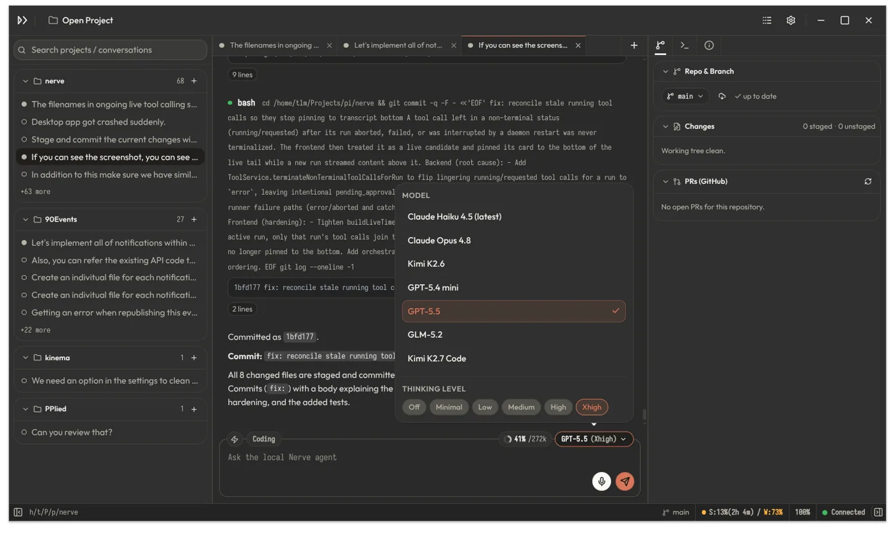

# nerve



Nerve is a UI-first local AI coding harness with an Electron desktop app, local daemon, and Web UI.

## Use Nerve

The desktop app is the primary way to use Nerve locally. It starts an owned local daemon, opens the Electron shell, and serves the bundled Web UI.

Run the beta desktop app with your package runner:

```sh
npx @nervekit/desktop
pnpm dlx @nervekit/desktop
```

The first run may download Electron's platform binary through npm or pnpm; subsequent runs use the package manager cache.

### Corporate proxy / Electron desktop troubleshooting

This applies on Linux, Windows, and macOS. `pnpm install` can succeed while the
Electron platform binary is still missing; in that case `pnpm desktop` (or
`pnpm run desktop`) may fail when the `electron` package tries to download from
Electron's release host.

If your network requires a corporate proxy, configure the Electron downloader and
then rebuild Electron:

```sh
export ELECTRON_GET_USE_PROXY=true
export HTTPS_PROXY=http://proxy.example.com:8080
export HTTP_PROXY=$HTTPS_PROXY
export NO_PROXY=localhost,127.0.0.1,::1
export NODE_EXTRA_CA_CERTS=/path/to/corporate-ca.pem  # only for TLS interception
pnpm --filter @nervekit/desktop-shell rebuild electron
pnpm desktop
```

PowerShell:

```powershell
$env:ELECTRON_GET_USE_PROXY = "true"
$env:HTTPS_PROXY = "http://proxy.example.com:8080"
$env:HTTP_PROXY = $env:HTTPS_PROXY
$env:NO_PROXY = "localhost,127.0.0.1,::1"
$env:NODE_EXTRA_CA_CERTS = "C:\path\to\corporate-ca.pem" # only for TLS interception
pnpm --filter @nervekit/desktop-shell rebuild electron
pnpm desktop
```

If you keep proxy settings in pnpm config, use user-level config rather than a
repo `.npmrc` with secrets:

```sh
pnpm config set proxy http://proxy.example.com:8080
pnpm config set https-proxy http://proxy.example.com:8080
pnpm config set cafile /path/to/corporate-ca.pem
```

If your company mirrors Electron artifacts, set `ELECTRON_MIRROR` to that mirror
before rebuilding. If a partial download was cached, clear Electron's cache and
rebuild. Cache locations are `~/.cache/electron` on Linux,
`~/Library/Caches/electron` on macOS, and `%LOCALAPPDATA%\electron\Cache` on
Windows.

The desktop launcher also forces loopback proxy bypass for the local daemon. If
macOS System Settings uses a corporate proxy or PAC file, keep `NO_PROXY` set to
include `localhost,127.0.0.1,::1` for shell-launched development, then run with
redacted proxy diagnostics when needed:

```sh
NERVE_DEBUG_PROXY=1 pnpm desktop
```

Desktop logs are written to `~/.nerve/logs/desktop-YYYY-MM-DD.jsonl`; crash
reports are written to `~/.nerve/crashes`.

Source development via `pnpm desktop` is supported on macOS. A signed/notarized
macOS `.app` or DMG release package is not configured yet.

Pass desktop/daemon options after `--`:

```sh
npx @nervekit/desktop -- --host 0.0.0.0 --allow-remote
npx @nervekit/desktop -- --connect http://127.0.0.1:3747 --token <token>
pnpm dlx @nervekit/desktop -- --host 0.0.0.0 --allow-remote
```

For opt-in LAN remote access plus self-signed HTTPS for mobile browsers, run with:

```sh
npx @nervekit/desktop -- --host 0.0.0.0 --allow-remote --mobile-https
```

### Linux Wayland troubleshooting

Electron may emit Chromium/Ozone Wayland messages such as `Frame latency is negative` or `Invalid state when trying to start drag`. If native Wayland also causes copy/drag freezes on your desktop environment, run the desktop shell through XWayland:

```sh
NERVE_ELECTRON_OZONE_PLATFORM=x11 npx @nervekit/desktop
```

Supported values are `x11`, `wayland`, and `auto`. Leave it unset for Electron's default platform selection.

## Develop from source

Requirements:

- Node.js `>=24.0.0`
- pnpm `11.x` (`packageManager` pins `pnpm@11.8.0`)

Install dependencies once:

```sh
pnpm install
```

Run the desktop app from a source checkout:

```sh
pnpm desktop
```

Pass desktop/daemon options after `--`:

```sh
pnpm desktop -- --host 0.0.0.0 --allow-remote
pnpm desktop -- --connect http://127.0.0.1:3747 --token <token>
```

For opt-in LAN remote access plus self-signed HTTPS for mobile browsers
(binds to `0.0.0.0`, allows remote clients, and enables self-signed HTTPS):

```sh
pnpm desktop:remote-enabled
```

### Browser and daemon usage from source

Run the daemon and Web UI dev servers together:

```sh
pnpm dev
```

Run only the Web UI dev server and connect it to an existing daemon:

```sh
pnpm dev:ui
```

Run the sandbox manager and sandbox manager UI dev servers together:

```sh
pnpm dev:sandbox
```

For lower-level source development, use workspace filters directly.

Run only the daemon:

```sh
pnpm --filter @nervekit/workbench-server dev
```

Crash diagnostics are written under `~/.nerve/crashes`. The daemon records
structured reports for handled fatal errors, enables Node diagnostic reports for
native/runtime fatal errors, and writes a fallback report on next start if the
previous daemon exited without a graceful shutdown. Daemon logs are written
under `~/.nerve/logs`.

## Root scripts

Top-level scripts are kept to user-facing desktop launchers, common validation,
and release commands used by CI:

```sh
pnpm desktop                  # run the Electron desktop app from source
pnpm desktop:remote-enabled   # run desktop with LAN/mobile HTTPS flags
pnpm dev                      # run daemon and Web UI in dev mode
pnpm dev:ui                   # run Web UI in dev mode against an existing daemon
pnpm dev:sandbox              # run sandbox manager and sandbox manager UI in dev mode
pnpm build                    # build all packages
pnpm fix                      # apply ESLint fixes and format the repository
pnpm check                    # verify formatting, lint, and package checks
pnpm test                     # run package tests
pnpm release:verify-tag       # validate the release tag against package versions
pnpm release:build            # build release artifacts
```

Release details are documented in `docs/release.md`.

## Resource directories

Nerve loads project resources from `.nerve/` and shared agent skills from `.agents/skills/` in the current directory or its ancestors.

Global Nerve resources live under `<NERVE_HOME>/agent/` (`~/.nerve/agent/` by default). Global shared agent skills live under `~/.agents/skills/`.

Legacy `.pi` directories are not loaded. Move old resources to `.nerve/` for Nerve-specific files or `.agents/skills/` for portable skills.

## Architecture and packages

Nerve Protocol v1 connects the local workbench UI to `workbench_server`, the sandbox manager UI to `sandbox_manager`, and each `sandbox_agent` to its manager. All three links share strict envelopes, catalog RPC/events, session lifecycle, replay/processed ACK, flow control, and snapshot recovery. The local event stream is `local`; manager lifecycle is `manager`; each sandbox writes `sandbox:<id>`.

Shared foundations:

- `packages/contracts` — transport-neutral API, operation, event, policy, and storage schemas.
- `packages/protocol` — protocol codec, HTTP mapping, client/server sessions, replay, ACK, and queues.
- `packages/harness` — model conversation and agent execution harness.
- `packages/tools` — coding tools and policy enforcement.
- `packages/host-runtime` — environment-neutral Git, task, tool, and run composition.
- `packages/ui-kit` — contract-free shadcn-svelte primitives, theme, and generic renderers.
- `packages/workbench-ui` — app-neutral workbench, conversation, Git, and task feature hosts.

Local workbench:

- `packages/workbench-server` — local HTTP/WebSocket server, persistence, auth, and built web assets.
- `packages/workbench-app` — Svelte browser host and thin shared-feature adapters.
- `packages/desktop-shell` — Electron launcher and local-server owner.

Sandbox system:

- `packages/sandbox-manager` — PostgreSQL-backed manager, runtime drivers, protocol routing, and static UI host.
- `packages/sandbox-manager-app` — Svelte manager browser host and thin shared-feature adapters.
- `packages/sandbox-agent` — isolated daemon with file-first `/state`, tools, tasks, Git, and runs.

See `docs/nerve-protocol/v1/`, `docs/nerve-sandbox/v1/`, and `docs/release.md`.

## License

Apache-2.0. See `LICENSE` and `NOTICE`.
