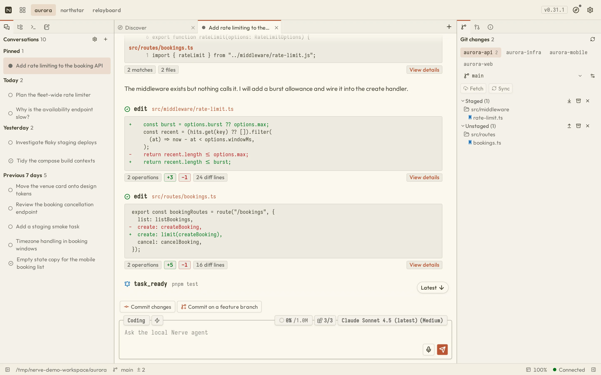

# Nerve

[](https://github.com/ThilinaTLM/nerve/actions/workflows/ci.yml)
[](https://github.com/ThilinaTLM/nerve/actions/workflows/release.yml)
[](https://www.npmjs.com/package/@nervekit/desktop)
[](LICENSE)

**A free, open-source coding workbench for AI agents — built to get more work out of every token.**

Run it on the AI subscription you already pay for, or your own API key. The harness keeps its own footprint small: a 363-character generated base prompt, only the tools a run can actually use, tool results capped before they reach the model, and automatic compaction before the window runs out.

Everything else — conversations, context, permissions, Git, pull requests, and background tasks — lives in one window, visible and steerable while it runs, and stays on your disk.

[Website](https://nerve.tlmtech.dev/) · [Documentation](https://nerve.tlmtech.dev/start/) · [Install guide](https://nerve.tlmtech.dev/start/install/) · [Contributing](CONTRIBUTING.md) · [Security](SECURITY.md)

<picture>
  <source media="(prefers-color-scheme: dark)" srcset="packages/website/src/assets/screenshots/desktop/conversation-dark.webp">
  
</picture>

> [!NOTE]
> Nerve is beta software. It runs on Linux, Windows 11, and macOS and is distributed under the [Apache-2.0 license](LICENSE).

## Quick start

Nerve requires Node.js 24 or newer. Launch the latest published desktop app directly from npm:

```sh
npx @nervekit/desktop@latest
# or
pnpm dlx @nervekit/desktop@latest
```

The first launch may download Electron's platform binary. Nerve starts a local loopback daemon by default, and its application data stays under `~/.nerve`.

## Highlights

- **A lean harness.** The generated base prompt is one 363-character block; tool rules, planning instructions, and project context are appended only when they apply, and gated tools never reach the request at all.
- **Bounded context, not a dead end.** Tool results reaching the model are capped at 24,000 bytes while the complete output stays retrievable on disk, and long conversations compact automatically instead of ending.
- **Use the AI access you already have.** Sign in to a supported provider subscription over OAuth, or paste an API key. Credentials are stored encrypted on your machine and the model catalog comes from the provider.
- **Steerable, branchable conversations.** Change the model, thinking level, agent mode, or permission rule set mid-conversation — it applies from the next provider request — and fork from any earlier entry without losing the original lineage.
- **Permissions enforced in policy, not prompts.** Read-only, supervised, and autonomous levels, planning mode, rule sets, and per-project or per-conversation overlays, evaluated before a tool runs.
- **Multiple projects and repositories.** Repositories are discovered beneath a workspace root, each with its own branch and working-tree state, Git operations, and GitHub pull requests.
- **Delegation with oversight.** Supervised background tasks with retained logs, and bounded read-only Explore sub-agents that research in parallel and report back.

Permission policy is Nerve's tool authorization and review layer, not an OS or container sandbox. Local-first is not offline-only: provider, Git, voice, web, and integration calls leave your machine when you use them.

## Documentation

The website is the primary source for product and developer documentation:

- [Get started](https://nerve.tlmtech.dev/start/)
- [Use the workbench](https://nerve.tlmtech.dev/guides/workbench/)
- [Configure and operate Nerve](https://nerve.tlmtech.dev/operations/configuration/)
- [Troubleshoot installation and runtime issues](https://nerve.tlmtech.dev/troubleshooting/)
- [Understand the architecture](https://nerve.tlmtech.dev/developers/architecture/)
- [Read the Protocol v1 reference](https://nerve.tlmtech.dev/developers/protocol/v1/)

## Develop from source

The repository requires Node.js 24 or newer, pnpm 11.20.0, and rustup; the Rust version is pinned in `rust-toolchain.toml`.

```sh
pnpm install
pnpm desktop
```

Use `pnpm dev` for the daemon and browser UI development servers. See the [development guide](https://nerve.tlmtech.dev/developers/development/) and [`CONTRIBUTING.md`](CONTRIBUTING.md) for the complete workflow. Release engineering details remain in [`docs/runbooks/release.md`](docs/runbooks/release.md).

## Support

If Nerve is useful to you, starring the repository is the cheapest way to help other developers find it. You can also [support its continued development on Patreon](https://www.patreon.com/cw/thilinatlm).

## Contributing, security, and license

Contributions are welcome. Read [`CONTRIBUTING.md`](CONTRIBUTING.md) before opening a change, and report vulnerabilities through the private channels in [`SECURITY.md`](SECURITY.md).

Nerve is licensed under Apache-2.0. See [`LICENSE`](LICENSE) and [`NOTICE`](NOTICE).

## Acknowledgements

Nerve's model routing, provider integrations, and streaming are built on
[@earendil-works/pi-ai](https://github.com/earendil-works/pi), a unified LLM API
client by Mario Zechner (MIT license).
