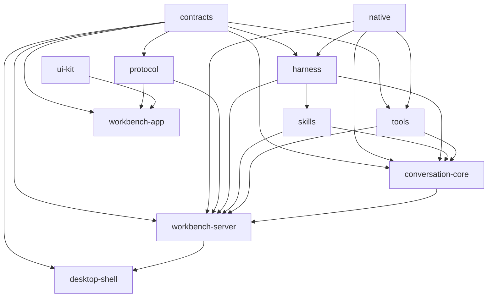

# Codebase architecture

> **Status:** Current implementation. [`scripts/shared/workspace-architecture.mjs`](../../scripts/shared/workspace-architecture.mjs), package manifests, export surfaces, and boundary checks are authoritative.

Nerve is a twelve-package pnpm workspace. Paths communicate ownership: domain contracts are separate from runtime mechanics, product runtimes compose reusable libraries, and platform shells sit at the edge.

Arrows in the diagram mean “is consumed by.” `website` is standalone.

| Package             | Ownership                                                                                     |
| ------------------- | --------------------------------------------------------------------------------------------- |
| `contracts`         | Transport-neutral schemas, events, operations, snapshots, and domain records                  |
| `protocol`          | Sessions, RPC, replay, streams, backpressure, reconnect, and transport adapters               |
| `native`            | Normalized Git and managed-process N-API capabilities                                         |
| `harness`           | Agent loop, conversation harness, compaction, models, resources, and execution environment    |
| `skills`            | Built-in skills and harness resource integration                                              |
| `conversation-core` | Portable conversation storage, context, tool lifecycle, inputs, async bash and runtime        |
| `tools`             | Canonical tool catalog, execution, policy, result projection, and Git services                |
| `ui-kit`            | Contract-free shadcn primitives, generic composites, renderers, display helpers, and styles   |
| `workbench-server`  | Host ports for core, bootstrap, channels, authentication/configuration and workbench services |
| `workbench-app`     | Svelte composition, application workflows, vertical features, platform adapters, and UI       |
| `desktop-shell`     | Electron lifecycle, daemon supervision, IPC, windows, tray, and packaging                     |
| `website`           | Standalone Astro marketing and documentation site                                             |

## Naming

- TypeScript paths are kebab-case; Svelte/Astro components are PascalCase; Rust modules are snake_case.
- Name files for concepts, not merely `types`, `state`, `helpers`, `utils`, or `operations`.
- `*.service.ts` is a cohesive multi-operation domain/application service.
- `*.repository.ts` owns authoritative record access; `*.store.ts` owns mutable in-memory/client state.
- `*.adapter.ts` translates across a boundary; `*.policy.ts` makes pure decisions.
- `index.ts` is a curated public boundary, never an internal import shortcut.
- Avoid `common`, `shared`, and broad `utils` directories. Reusable code belongs to a named technical or domain area.
- Small domains remain flat; add layer subdirectories only when they improve navigation.
- Cohesive exceptions remain intentional: UI-kit `utils.ts`, domain-local `operations.ts`, curated `index.ts` boundaries, test-support helpers, narrowly scoped tools/server contract modules, and the desktop daemon composition boundary. `scripts/checks/source-naming-policy.mjs` is the complete authoritative inventory for production `types.ts`, `state.ts`, `helpers.ts`, `utils.ts`, `operations.ts`, and `composition.ts` exceptions; every new occurrence requires architecture review and an explicit inventory update.

## Runtime composition boundaries

- `conversation-core` depends on contracts, native, harness, skills and tools, never on workbench-server, protocol or UI. [`ConversationCore`](../../packages/conversation-core/src/core.ts) is its facade; [`ports.ts`](../../packages/conversation-core/src/ports.ts) isolates model resolution, turn resources, permissions, tool execution and processes. Core schemas belong in `contracts/src/domains/core`, not transport adapters.
- `workbench-server` composes the core in [`app/bootstrap`](../../packages/workbench-server/src/app/bootstrap/) and implements its environment ports in [`core-host`](../../packages/workbench-server/src/core-host/). `RuntimeLifecycle` starts recovery and closes services. Adapters receive prebound capability contexts, not a runtime service locator.
- [`adapters/protocol`](../../packages/workbench-server/src/adapters/protocol/) exposes independent `/ws/conversations` and `/ws/workbench` sessions. Conversation events replay directly from core SQLite; workbench notices are in-memory snapshot invalidations. The old `/ws` endpoint, journal and agent/run domains are gone. See [channels](conversation-core/channels.md) and [storage](storage.md).
- `workbench-app` keeps mutable feature stores private. Workspace workflows consume application-owned readonly feature ports and named commands; composition installs and unregisters concrete implementations plus reverse selection/tab inputs. Presentation remains stateless and isolated from application, feature, and platform state.
- `desktop-shell/main.ts` performs bootstrap safety, single-instance acquisition, and concrete runtime construction. `DesktopRuntime` owns Electron/daemon lifetime state and listener disposal through injected ports with idempotent `start()`/`dispose()`; window policy, network configuration, direct process spawning, systemd policy, and diagnostic capture live in focused adapters.

## Enforced surfaces

Package export allowlists live in [`scripts/checks/package-export-surfaces.mjs`](../../scripts/checks/package-export-surfaces.mjs). Contracts, protocol, harness, skills and tools expose curated boundaries; conversation-core exposes a curated package-root API. `pnpm build` verifies every declared concrete build target and each wildcard target after production artifacts are generated. Website token parity is checked at build/check time without adding a runtime UI-kit dependency.

The canonical package inventory and allowed workspace dependencies live in [`scripts/shared/workspace-architecture.mjs`](../../scripts/shared/workspace-architecture.mjs). Package-specific `AGENTS.md` and README files define stricter local ownership rules. [`scripts/checks/check-package-boundaries.mjs`](../../scripts/checks/check-package-boundaries.mjs) is the runner for package, workbench, UI-style, and retired-surface checks in `scripts/checks/*-checks.mjs`, alongside the contracts, naming, server-test, and export policies. They share one repository source inventory and cached reads, covering tracked and non-ignored untracked files while excluding deleted paths. The command emits one sorted diagnostic report.

## Cohesive implementation owners

- Tool-result policies choose profiles and strategies; `tools/src/result-projection/candidates/` owns candidate construction by semantic family. Artifact accounting, continuation metadata, semantic text, and terminal-resource selection have named owners rather than a general common module.
- Conversation rendering projects core snapshots, selected history and live deltas through `features/conversations/adapters/core-transcript.adapter.ts`. Retained detail stores are shared by panes and read-only child peeks; project list stores consume summary notices only. Snapshot `lastSequence` fences replay recovery without reading the entire durable tail.
- Git PR filters live in `features/git/pr-filters.ts`, independent of views. `PrResourceLoader` owns projection coalescing and initial-bundle/section version claims; QueryClient owns network results and freshness. The refresh coordinator binds endpoints, view projections, and polling demand. Discovery, overview, and PR-list request bookkeeping is grouped separately from rendered loading and mutation state.
- Conversation-core owns tool-call durable transitions, waiters and recovery. Core delegation and async-bash handlers are registered through the facade; core-host supplies local environment executors. UI launch instances are a separate workbench service, not agent task state.
