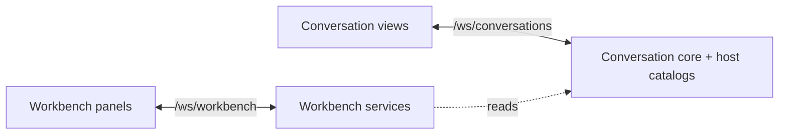

# Channels

Part of the [conversation core redesign](README.md).

## Boundary

Two independent Protocol v1 connections replace the old `/ws` endpoint:



Each connection has its own session, send buffer and reconnect lifecycle. Workbench traffic does not share the token-streaming buffer. The workbench may read core state; core never depends on workbench services. Agents reach files and git through host tools.

## Conversation channel

The [owning catalog](../../../packages/contracts/src/domains/core/channel.ts) defines 33 operations; [core operation schemas](../../../packages/contracts/src/domains/core/core-operations.ts) own request/result shapes:

```text
project.create project.list project.get project.update project.delete
trust.list trust.decide trust.delete
conversation.create conversation.list conversation.getSnapshot
conversation.getHistory conversation.getTree conversation.getEventsSince
conversation.configure conversation.update conversation.selectHead
conversation.compact conversation.delete conversation.pause conversation.resume
conversation.stop conversation.forcePush conversation.continue
input.submit input.cancel interaction.resolve asyncBash.cancel
model.list permissionRuleSet.list skill.list tool.list completion.slash.list
```

Prompt suggestions use the workbench channel (`promptSuggestion.*`) because they also need git state.

| Surface                   | Initial state                                                                 | Updates                                        | Replay                |
| ------------------------- | ----------------------------------------------------------------------------- | ---------------------------------------------- | --------------------- |
| Project conversation list | Summaries including `childCount`                                              | `conversation.changed`, `conversation.deleted` | Re-fetch on reconnect |
| Conversation detail       | Conversation, config, tool calls, queue, async bash, children, `lastSequence` | Head/config/tool-call/queue/async-bash notices | Re-fetch on reconnect |
| Durable history           | Selected-head history or events since sequence                                | `conversation.event`                           | Core event sequence   |
| Live progress             | None                                                                          | `conversation.live`                            | None                  |

Clients subscribe to the stream `conv/<conversationId>`, passing the last event sequence they processed (`processedSeq`, 0 for everything). The server first sends the events after that sequence, then new events as they are appended. Each `conversation.event` carries a full `ConversationEvent`, and its envelope sequence is the event's own sequence. A snapshot's `lastSequence` is the newest sequence at the time it was read, so a client can load a snapshot and then subscribe from that point. Subscribing to a deleted or unknown conversation fails for that stream only.

Replay covers every branch in sequence order; the transcript shows only the path back from the selected head. Events are read straight from `CONVERSATION_EVENT`; there is no separate notification store. Live deltas may be merged or dropped under backpressure, because the next durable event or snapshot replaces them.

Ephemeral events, defined alongside the operations:

- `conversation.changed`, `conversation.deleted`: project-scoped list notices.
- `conversation.head`, `conversation.config`, `conversation.toolCall`, `conversation.queue`, `conversation.asyncBash`, `conversation.live`: limited to active conversation subscriptions.

A connection receives a project's list notices after it lists, reads or creates conversations in that project, or subscribes to one of its conversations. There is no separate project-subscription operation and no durable workspace stream. After a reconnect the client replays durable events, re-fetches list and detail snapshots, and starts with empty live state.

Children are separate conversations. Parent snapshots contain child summaries; opening or peeking a child retains its own shared detail store/subscription. `parentToolCallId` associates it with its delegation card.

## Workbench channel

Files, git/GitHub, scratch notes, launch configurations and instances, settings, maintenance and usage use the workbench operations and in-memory notices listed in [`workbench-events.ts`](../../../packages/contracts/src/events/workbench-events.ts).

Panels load snapshots and refresh on scoped resource-change notices. There are no durable streams or replay; reconnect re-snapshots and restores monitor demand. Launch instance RPCs use `launch.*`; saved definitions retain `taskDefinition.*`.

## Client state

Conversation and workbench stores do not share live reactive state. Streaming updates affect only retained conversation detail stores. Sidebar, title bar and project switcher consume summaries, never live transcript state. The app connects conversations before workbench recovery so workbench panels can resolve core projects.
