# Data model

Part of the [conversation core redesign](README.md).

## Tables by layer

| Layer             | Tables                                                                                                         | Notes                                                 |
| ----------------- | -------------------------------------------------------------------------------------------------------------- | ----------------------------------------------------- |
| Foundation        | `PROJECT`, `TRUSTED_RESOURCE`, `SCHEMA_MIGRATIONS`                                                             | Used by both layers above                             |
| Conversation core | `CONVERSATION`, `CONVERSATION_CONFIG`, `CONVERSATION_EVENT`, `TOOL_CALL`, `INPUT_QUEUE`, `ASSET`, `ASYNC_BASH` | Portable agent runtime                                |
| Workbench         | `SCRATCH_NOTE`                                                                                                 | IDE features; most workbench state is files or memory |

Outside SQLite:

- Launch configurations: project file, see [async bash and launch configurations](async-bash-and-launches.md).
- Permission rule sets and overlays: user, project (`.nerve/`) and conversation data directory files.
- Daemon, harness and integration config; secrets; provider usage caches.
- Large content (tool output, images, plans, reports): managed files tracked by `ASSET`.
- Live progress, launch instances, workbench change notices: memory only.

`enum` denotes a closed, validated set. `json` denotes a schema-validated structure, not arbitrary data. IDs use prefixed `createId` identities; timestamps are ISO strings stored as TEXT. Nullable references must stay within the appropriate conversation or parent relationship.

## ER diagram

```mermaid
erDiagram
    PROJECT {
        string id PK "Stable project identity"
        string name "Display name"
        string directory "Project root directory"
        datetime created_at "Creation time"
        datetime updated_at "Last change"
    }

    TRUSTED_RESOURCE {
        string id PK "Stable identity"
        enum kind "prompt_suggestion | skill | project_permissions | project_capabilities"
        string project_id FK "Nullable; null for user-level resources"
        string path "Resource location"
        string name "Nullable; display name"
        string content_digest "Hash of the approved content; a changed resource needs approval again"
        enum status "trusted | rejected"
        datetime created_at "Decision time"
        datetime updated_at "Last decision change"
    }

    SCHEMA_MIGRATIONS {
        int version PK "Applied schema version"
        string name "Migration name"
        string checksum "Migration SQL checksum"
        datetime applied_at "Application time"
    }

    CONVERSATION {
        string id PK "Stable identity for navigation, history ownership and addressing"
        string project_id FK "Owning project"
        string parent_conversation_id FK "Nullable; null identifies a top-level conversation"
        string parent_tool_call_id "Nullable; delegation call that created this child"
        string head_event_id FK "Nullable; current branch head; null selects empty context"
        string title "Navigation label"
        enum status "idle | running | waiting | failed | interrupted; rebuildable cache"
        bigint status_event_sequence "Latest event incorporated into the status cache"
        datetime status_cleared_at "Nullable; user dismissal of a failed or interrupted status"
        boolean paused "Explicit pause; blocks automatic processing"
        bigint next_input_sequence "Allocates queue acceptance order"
        datetime pinned_at "Nullable; null means unpinned; orders pinned conversations"
        datetime completed_at "Nullable; user marked done"
        datetime last_user_message_at "Nullable; latest delivered user_message, human or parent"
        datetime created_at "Creation time"
        datetime updated_at "Recent-activity ordering"
    }

    CONVERSATION_CONFIG {
        string conversation_id PK,FK "Exactly one current configuration per conversation"
        json model "Provider and model ID"
        enum reasoning_level "off | minimal | low | medium | high | xhigh | max"
        string system_prompt "Nullable; null selects the generated default"
        string permission_rule_set_id "Baseline rule set; overlays apply on top; not a database foreign key"
        enum mode "planning | coding"
        json enabled_tools "Nullable tool-name list; availability, not authorization; empty disables all"
        json enabled_skills "Nullable skill-name list; empty disables all"
        string working_directory "Start directory for commands and relative paths; not an access boundary"
    }

    CONVERSATION_EVENT {
        string id PK "Stable identity for references and branch navigation"
        string conversation_id FK "Owning conversation"
        bigint sequence "Append order; replay cursor and pagination key"
        string previous_event_id FK "Nullable; predecessor of every event, including operational facts"
        enum event_type "user_message | assistant_message | system_event | tool_call_response | compaction"
        enum llm_representation "none | user | assistant | tool_result; canonical context contribution"
        string turn_id "Nullable; groups one model invocation with its tool processing"
        string input_id "Nullable; queued input delivered by this event"
        json payload "Validated content per event type"
        datetime created_at "Persistence time"
    }

    TOOL_CALL {
        string id PK "Internal tool_ ID; pairs with the eventual tool_call_response"
        string provider_call_id "Nullable; provider call ID for model calls"
        string conversation_id FK "Executing conversation"
        string turn_id "Turn barrier for the next model request"
        string assistant_event_id FK "Nullable; null for direct user commands"
        int content_index "Nullable; position in the assistant message"
        enum origin "model | user"
        string tool_name "Tool implementation"
        json arguments "Final arguments"
        enum state "supervising | awaiting_approval | ready | running | awaiting_input"
        json supervision "Nullable; decision, matched rule, captured authority"
        json interaction "Nullable; approval, user_input or plan_review request and resolution"
        string execution_claim "Nullable; fences stale workers"
        datetime updated_at "Latest durable transition"
    }

    INPUT_QUEUE {
        string input_id PK "Submission ID supplied by the sender"
        string conversation_id FK "Receiving conversation"
        bigint acceptance_sequence "Acceptance order across all sources"
        enum source "user | parent_conversation | system"
        string sender_conversation_id FK "Nullable; submitting parent"
        json content "Prompt text or typed notice"
        enum delivery_target "next_turn | specific_execution | next_execution"
        string target_execution_id "Nullable; execution-start event"
        json command_preparation "Nullable; per-block command progress for prompts"
        string prepared_text "Nullable; prompt after command-block replacement"
        boolean wake_when_idle "Whether acceptance starts idle processing; never overrides pause"
        datetime accepted_at "Acceptance time"
    }

    ASSET {
        string id PK "Identity referenced from payloads"
        string conversation_id FK "Owning conversation; drives deletion"
        string event_id FK "Nullable; referencing event; null while the producer is unfinished"
        string tool_call_id "Nullable; producing tool call"
        string async_bash_id FK "Nullable; producing async bash"
        enum category "payload | report | image | plan | bash_output"
        string logical_path "Managed storage location"
        string digest "Nullable; content hash"
        bigint byte_length "Stored size"
        string media_type "Nullable; content type"
        datetime created_at "Supports orphan cleanup"
    }

    ASYNC_BASH {
        string id PK "Stable identity reported to the conversation"
        string conversation_id FK "Owning conversation"
        string tool_call_id "Promoted tool call"
        string command "Executed command"
        string working_directory "Execution directory"
        enum status "running | completed | failed | timed_out | cancelled | lost"
        string process_ref "Nullable; host process reference for verified reattachment"
        int exit_code "Nullable; process exit code"
        datetime started_at "Process start"
        datetime finished_at "Nullable; terminal time"
    }

    SCRATCH_NOTE {
        string id PK "Stable identity"
        string project_id FK "Owning project"
        string title "Note title"
        string content "Note body"
        datetime created_at "Creation time"
        datetime updated_at "Last edit"
    }

    PROJECT ||--o{ CONVERSATION : "contains"
    PROJECT ||--o{ SCRATCH_NOTE : "contains"
    PROJECT o|--o{ TRUSTED_RESOURCE : "scopes"
    CONVERSATION o|--o{ CONVERSATION : "parent of"
    CONVERSATION ||--|| CONVERSATION_CONFIG : "has current configuration"
    CONVERSATION ||--o{ CONVERSATION_EVENT : "owns"
    CONVERSATION_EVENT o|--o{ CONVERSATION_EVENT : "event predecessor"
    CONVERSATION o|--o| CONVERSATION_EVENT : "selected branch head"
    CONVERSATION ||--o{ TOOL_CALL : "executes unfinished"
    CONVERSATION_EVENT o|--o{ TOOL_CALL : "assistant message issues"
    CONVERSATION ||--o{ INPUT_QUEUE : "receives"
    CONVERSATION o|--o{ INPUT_QUEUE : "parent submits"
    CONVERSATION ||--o{ ASYNC_BASH : "owns"
    CONVERSATION ||--o{ ASSET : "owns"
    CONVERSATION_EVENT o|--o{ ASSET : "references"
    ASYNC_BASH o|--o{ ASSET : "produces"
```

The physical schema and migrations live in [`conversation-core/src/storage`](../../../packages/conversation-core/src/storage/); wire shapes live in [`contracts/core`](../../../packages/contracts/src/domains/core/).

## Conversation columns

- Summaries add `childCount`; snapshots include `lastSequence` (the replay high-water mark, independent of the selected head) and child summaries.
- `parent_tool_call_id` associates children with the delegation call, including while it is unfinished.
- `paused` is separate from derived status: idle does not tell the scheduler whether it may start queued work. Pause is a current control, not a rewindable event.
- `status` is rebuilt from `execution_state` events and unfinished tool calls. A rebuilt failed or interrupted status is shown only when its event is newer than `status_cleared_at`; the next execution start supersedes it anyway.
- `last_user_message_at` changes only when a `user_message` event is delivered. Compaction summaries, tool results and notices never update it, even though some reach providers as user-role messages.
- Configuration has no revision. Edits are schema-validated current values; rewinding does not restore them. Permission supervision is recorded on each tool call.

## Trusted resources

A resource is trusted for the exact content that was approved. When the file at `path` changes, its digest no longer matches and the user is asked again. Uniqueness is `(kind, project_id, path)`, treating null `project_id` as user level. The `prompt_suggestion` trust kind remains in the schema/importer, but suggestion discovery, evaluation and UI are removed pending redesign.

## Idempotency without a receipt table

| Mutation                                              | Why a retry is harmless                                                                          |
| ----------------------------------------------------- | ------------------------------------------------------------------------------------------------ |
| Submit prompt or notice                               | `input_id`; see [input queue](input-queue.md)                                                    |
| Create project, conversation, note                    | Caller-supplied ID; a retry finds the existing row                                               |
| Approve, deny, answer                                 | `resolution_request_id` on the `TOOL_CALL` row, preserved in the response payload after deletion |
| Stop, pause, resume, configure, pin, complete, delete | Set semantics; repeating gives the same result                                                   |

A queued input cancelled and then retried with the same ID can be accepted again; see [input queue](input-queue.md#cancellation).

## Deletion

Deleting a conversation deletes its children recursively. For each affected conversation:

1. Stop processing and settle unfinished tool calls and async bash as cancelled.
2. Delete asset files and the conversation data directory, which also holds the conversation-level permission overlay.
3. Delete asset, async bash, tool-call, queue, event and configuration rows, then the conversation.

Asset rows with null `event_id` whose producer no longer exists are orphans and may be cleaned up at any time. Deleting a project deletes its conversations, scratch notes and project-scoped trusted resources; project files on disk are untouched.

## Durability and access paths

- Commit event appends, head updates, status cache updates, tool-call row deletion and queue deletion in one transaction.
- One active model execution per conversation; `execution_claim` fences stale workers.
- Unique `(conversation_id, sequence)` on events; index non-null `input_id` for delivered-input lookup.
- Conversations: `(project_id, parent_conversation_id, updated_at, id)` for root lists and child navigation; `pinned_at` for pinned lists.
- Queue: `(conversation_id, acceptance_sequence)`.
- Tool calls: `(conversation_id, turn_id)` for the turn barrier; `state` for pending approvals and inputs across conversations.
- Assets: `conversation_id` for deletion; `event_id`.
- Async bash: `(conversation_id, status)`.
- Index event predecessors. History reads walk the selected head; sequence reads replay all branches. No checkpoint/journal tables remain.
