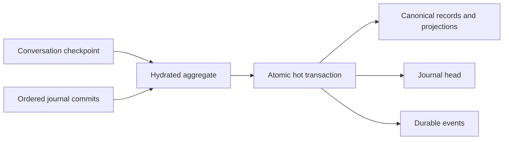

# Storage architecture

> **Status:** Current implementation. Owning paths, schemas, repositories, and tests remain authoritative.

Nerve separates portable configuration, secrets, canonical application data, user-authored agent resources, and disposable state. `NERVE_HOME` defaults to `~/.nerve`; tests and diagnostics must use an isolated home under `/tmp` rather than the live home.

## Home boundaries

The path inventory is owned by [`storage-bootstrap/paths.ts`](../../packages/workbench-server/src/infrastructure/storage-bootstrap/paths.ts).

```text
<NERVE_HOME>/
├── manifest.json
├── daemon.json
├── config/
│   ├── daemon.json
│   ├── harness.json
│   ├── ui.json
│   ├── permissions.json
│   ├── providers.json
│   └── integrations.json
├── secrets/
│   ├── master.key
│   ├── credentials.enc
│   └── daemon-token
├── data/
│   ├── nerve.sqlite
│   ├── conversations/
│   ├── tasks/
│   ├── reports/
│   ├── images/
│   └── plans/
├── agent/
├── tls/
├── tmp/
├── cache/
├── logs/
├── crashes/
├── migrations/
└── backups/
```

`manifest.json` version 2 identifies the home as `standard` or `disposable`. Version-1 manifests remain valid and are classified as standard without being rewritten. A disposable marker is never accepted at the default `~/.nerve` path. Optional directories are created lazily. Electron's `userData` profile is outside `NERVE_HOME` and must be isolated separately in desktop tests that require full browser-state isolation.

### Ownership

- `config/` contains versioned, human-readable portable settings. Writers validate and atomically replace these files.
- `secrets/` contains the restricted master key, encrypted credentials, and daemon token. Plaintext secret values do not belong in configuration or SQLite.
- `data/nerve.sqlite` is authoritative for relational, historical, transactional, and internal state.
- `data/conversations/` contains owner-scoped complete tool-result payloads and managed tool-call files.
- `data/tasks/` contains append-heavy task output bundles; task identity and lifecycle metadata remain in SQLite.
- `data/reports/`, `data/images/`, and `data/plans/` hold durable files authored or imported for those explicit categories.
- `agent/` contains user-authored harness resources such as instructions, skills, and suggestions.
- `cache/` and `tmp/` are rebuildable or disposable. Logs, crash reports, migrations, and backups have separate retention and cleanup rules.

Persisted records use logical home-relative references. Runtime code resolves those references against the active `NERVE_HOME`, so moving a complete home does not preserve obsolete absolute paths.

## Canonical SQLite

The physical schema is owned by [`canonical-sqlite/schema.ts`](../../packages/workbench-server/src/infrastructure/persistence/canonical-sqlite/schema.ts). Its main tables are:

| Table                                              | Role                                                                                |
| -------------------------------------------------- | ----------------------------------------------------------------------------------- |
| `storage_migrations`                               | Unified ordered schema/data/file/config migration ledger.                           |
| `storage_read_sweeps`                              | Persisted-reader compatibility identities already verified against this home.       |
| `storage_quarantine`                               | Retained originals and visibility flags for isolated malformed records.             |
| `schema_migrations`                                | Read-only compatibility evidence for pre-framework homes during rollout.            |
| `conversation_records`                             | Ordered, versioned messages, summaries, runs, tool calls, and tool batches.         |
| `conversation_record_projections`                  | Query projections for message, summary, and run records.                            |
| `tool_call_projections`                            | Queryable tool-call status, interaction, and ownership fields.                      |
| `agent_context_leaves`                             | Active branch leaf for each conversation agent.                                     |
| `durable_event_stream_counters` / `durable_events` | Ordered reliable notification streams; events are not canonical conversation state. |
| `file_assets`                                      | Logical path, owner, category, size, digest, and media metadata for managed files.  |
| `rpc_idempotency`                                  | Bounded RPC outcomes for safe retries.                                              |
| `domain_documents`                                 | Versioned domain records that do not require dedicated relational tables.           |

Projects, conversations, agents, settings, tasks, and other domain state use repositories backed by `domain_documents` where a dedicated query table is unnecessary. The older conceptual `PROJECT`/`CONVERSATION`/`AGENT` ERD is therefore not the physical database model.

### Additive deletion access paths

Unified step `0010-deletion-indexes` installs and verifies
`durable_events_record(record_id)` and
`agent_context_leaves_active_record(active_record_id)`. These indexes prevent
foreign-key checks from scanning unrelated history for every deleted record.
Existing definitions are adopted only when they match exactly; an incompatible
index fails planning before the active database is replaced.

Conversation deletion uses bounded writer commands and yields between them. A
`conversation_deletion` document records committed deletion intent before the
first destructive chunk. Startup finishes pending deletions before hydrating
runtime projections; it does not resume the remaining bulk cleanup candidates.
The intent remains until stream and payload cleanup succeeds. A failed recovery
blocks startup instead of hydrating a partially deleted journal as healthy data.

## Conversation journal

A conversation is hydrated from a checkpoint plus ordered journal commits:

- `conversation_state` documents are full checkpoints used for cold hydration, import, and repair.
- `conversation_journal_head` documents hold the current revision and checksum for compare-and-swap.
- `conversation_journal_commit` documents hold validated revision-keyed deltas.
- A hot transaction appends the delta, advances the head, updates affected records and context leaves, and appends its durable notification atomically.
- Graceful checkpointing folds loaded deltas into a new checkpoint and deletes only covered commits. Interrupted checkpointing leaves retained commits available for recovery.

These names are `domain_documents` namespaces, not standalone SQL tables. Hot commits must remain proportional to the current change and affected records rather than unrelated conversation history.



## Generalized agent runtime authority and failure windows

These are implementation notes, not evidence that issue #402's whole acceptance gate has passed.

Agent identity/configuration/activation are persisted by the agent repository in canonical domain documents. Accepted configuration and effective turn configuration are distinct: resolved snapshots live in persisted execution transitions (`execution.effectiveTurnConfigurations`), not an `agent_effective_turn` document namespace. The agent's effective revision is an adoption marker, not the complete snapshot. The narrow `agent_inputs` canonical document stores each agent's durable accepted inputs, ordering, eligibility, activation and delivery state; it is **not** a projection rebuilt from the conversation journal. The common input service is its sole queue writer. Existing run/work/interaction records own execution admission, attempts, checkpoints and settlement. Events and in-memory harness/runtime views do not replace these authorities.

User/parent input and trusted notifications use the common admission and turn-preparation pipeline. Their logical role lanes share per-agent acceptance sequence; role grants neither priority nor authority. Caller idempotency keys correlate repeated acceptance without inventing another input. Eligibility is independent of activation: `queue_only` does not itself admit an idle agent, and explicit pause fences automatic wakes until resume or interrupt-and-replace.

The existing conversation journal owns model context and transcript records. Immutable `contextOwnerAgentId` bindings select the historical lead partition (`null`) or an identity-scoped model-tree/leaf partition, including children, additional roots and historical orphans. Common execution, compaction and checkpoint reads use that owner; settled run references retain their captured checkpoint rather than a later leaf.

On first historical-root binding, existing persisted/explicit lead bindings win, then a valid persisted conversation `activeAgentId`, then the deterministic oldest-root fallback. Subsequent selection changes/deletion/restart cannot reassign the lead. Before unbound secondary historical roots with only the old shared layout bind to themselves, migration freezes and copies the complete shared model tree, IDs, parent links, detached branches and exact leaf. Existing owned trees are preserved; fresh additional roots stay empty. Frozen migration state and deterministic batch/completion receipts resume interrupted copies without following newer lead writes or duplicating entries. [Copied-old-SQLite crash/restart regressions](../../packages/workbench-server/test/domains/agents/agent-blueprint-persistence.test.ts) cover partial-copy and copy-before-binding failures and independent later writes; this scoped evidence is not the entire acceptance gate. No physical per-agent conversation or canonical timeline migration is implied.

Acceptance is durable before acknowledgement. Context insertion, queue delivery and provider dispatch have separate failure windows: restart/retry must reconcile stable input/context IDs and undispatched context rather than blindly inserting twice. A settings commit can succeed while turn adoption is pending; matching effective snapshots are recorded at the provider boundary, not by a speculative final-output-only check. Report files are written separately from child settlement; an Explore report-persistence failure does not undo the completed child run and is surfaced as a failed report. These are real failure windows, not atomic journal-projection guarantees.

Tool permission is captured for the originating turn and persisted as its ordinary approval decision, normalized targets and ToolAuthoritySnapshot. The snapshot retains full ordinary configuration, its revision/provenance, and original logical/physical roots and targets. Host requests capture accepted selections; model turns capture resolved settings. Legacy scope-only configuration-sensitive operations require explicit reissue rather than filling missing settings from the latest agent. Execution claim rechecks explicit stop/immutable read-only fences and pinned physical target boundaries; it does not adopt a changed scope or rebind an original root to a later symlink target. A later ordinary settings edit does not invalidate the earlier tool batch, including after approval/restart. Legacy path/command approvals without reconstructable original physical authority remain stored with a visible predispatch blocker and require explicit reissue; they are not silently reauthorized against current settings. Claim is not proof an external effect happened, and a missing terminal result after dispatch is not proof it did not happen. Recovery must retain uncertainty rather than replay effects automatically. Broader emergency revocation requires a separately explicit authority, not reinterpreting every mutable policy edit as a kill switch.

Graceful shutdown explicitly settles teams by cancelling active child runs and tasks. Preserving accepted settings/general input is not a guarantee that every pending approval/question survives graceful restart unchanged; crash recovery and shutdown cancellation require separate evidence.

Unified conversation/configuration/input/lifecycle facts, coordinated parent/child rewind, communication-delivery rollback and interest-driven delivery remain future proposal work. These runtime path/authority fences are not an OS sandbox or a guarantee of rollback or exactly-once external effects.

## Complete tool results and task output

Tool execution has separate complete-result, agent-projection, and transcript-preview concerns. When the complete result needs externalization, the server prepares and validates an owner-scoped payload beneath `data/conversations/`, records its logical reference and integrity metadata, and only then exposes bounded projections. See [Tool-result projection](../decisions/tool-result-projection.md).

Task output is byte-faithful and append-heavy, so bundles live beneath `data/tasks/<task-id>/`. SQLite remains authoritative for task definitions, execution state, and ownership.

## Migration boundary

Ordinary startup acquires one PID-aware home lock, recovers any interrupted promotion, and plans against SQLite read-only. Schema, data, managed-file, and cross-document configuration changes share the ordered registry and `storage_migrations` ledger under [`infrastructure/storage-migrations/`](../../packages/workbench-server/src/infrastructure/storage-migrations/).

Pending work runs against `migrations/work/<run-id>/nerve.sqlite`, created with `VACUUM INTO`, plus staged configuration and additive managed files. Verification runs SQLite integrity/foreign-key checks, step invariants, descriptor coverage, and the current payload readers. Promotion is journaled; the replaced database and configuration become `backups/storage/<timestamp>-before-<step>/`. A pre-commit failure discards the workspace and leaves active storage unchanged.

Every persisted JSON/BLOB location is registered by [`persistence/payloads/descriptors.ts`](../../packages/workbench-server/src/infrastructure/persistence/payloads/descriptors.ts). Versioned codecs upgrade old payloads on read and preserve unknown fields through known-field updates. Build sweeps decode registered records once per build. Isolated malformed derived records can be quarantined; user content and configuration require exact fingerprinted approval, and impact thresholds stop unexpectedly broad quarantine.

Released/final steps are immutable. Draft steps run only on explicitly disposable homes. Homes upgraded by unknown newer steps fail closed. Standard-home restore is an explicit CLI action with export and confirmation, not an automatic startup fallback.

The one offline legacy import path remains separate: it accepts only the released `nerve-workbench-state` version `2` layout with its checksummed ledger through `0012-remove-workers`, imports into staging, validates, promotes, and retains the original tree under `backups/`. Logs, caches, task runtime state, daemon metadata, TLS identity, and generated diagnostics are regenerated rather than imported.

## Public guidance

- [Storage, cleanup, and migration](https://nerve.tlmtech.dev/operations/storage-migration/)
- [Data formats and locations](https://nerve.tlmtech.dev/reference/data-formats/)
- [Persistence and security boundaries](https://nerve.tlmtech.dev/developers/persistence-security/)
