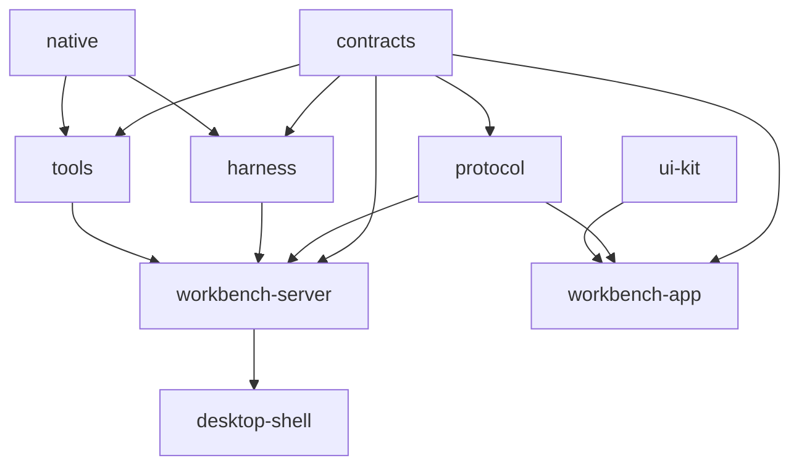

# Codebase architecture

Nerve is a ten-package pnpm workspace. Paths communicate ownership: domain contracts are separate from runtime mechanics, product runtimes compose reusable libraries, and platform shells sit at the edge.

Arrows in the diagram mean “is consumed by.” `website` is standalone.

| Package            | Ownership                                                                                   |
| ------------------ | ------------------------------------------------------------------------------------------- |
| `contracts`        | Transport-neutral schemas, events, operations, snapshots, and domain records                |
| `protocol`         | Sessions, RPC, replay, streams, backpressure, reconnect, and transport adapters             |
| `native`           | Normalized Git and managed-process N-API capabilities                                       |
| `harness`          | Agent loop, conversation harness, compaction, models, resources, and execution environment  |
| `tools`            | Canonical tool catalog, execution, policy, result projection, and Git services              |
| `ui-kit`           | Contract-free shadcn primitives, generic composites, renderers, display helpers, and styles |
| `workbench-server` | HTTP/WebSocket adapters, persistence, host use cases, tasks, tools, and run coordination    |
| `workbench-app`    | Svelte composition, application workflows, vertical features, platform adapters, and UI     |
| `desktop-shell`    | Electron lifecycle, daemon supervision, IPC, windows, tray, and packaging                   |
| `website`          | Standalone Astro marketing and documentation site                                           |

## Naming

- TypeScript paths are kebab-case; Svelte/Astro components are PascalCase; Rust modules are snake_case.
- Name files for concepts, not merely `types`, `state`, `helpers`, `utils`, or `operations`.
- `*.service.ts` is a cohesive multi-operation domain/application service.
- `*.repository.ts` owns authoritative record access; `*.store.ts` owns mutable in-memory/client state.
- `*.adapter.ts` translates across a boundary; `*.policy.ts` makes pure decisions.
- `index.ts` is a curated public boundary, never an internal import shortcut.
- Avoid `common`, `shared`, and broad `utils` directories. Reusable code belongs to a named technical or domain area.
- Small domains remain flat; add layer subdirectories only when they improve navigation.

The canonical package inventory and allowed workspace dependencies live in `scripts/lib/workspace-architecture.mjs`. Package-specific `AGENTS.md` and README files define stricter local ownership rules.
