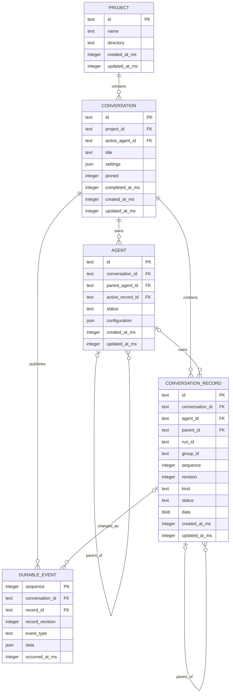
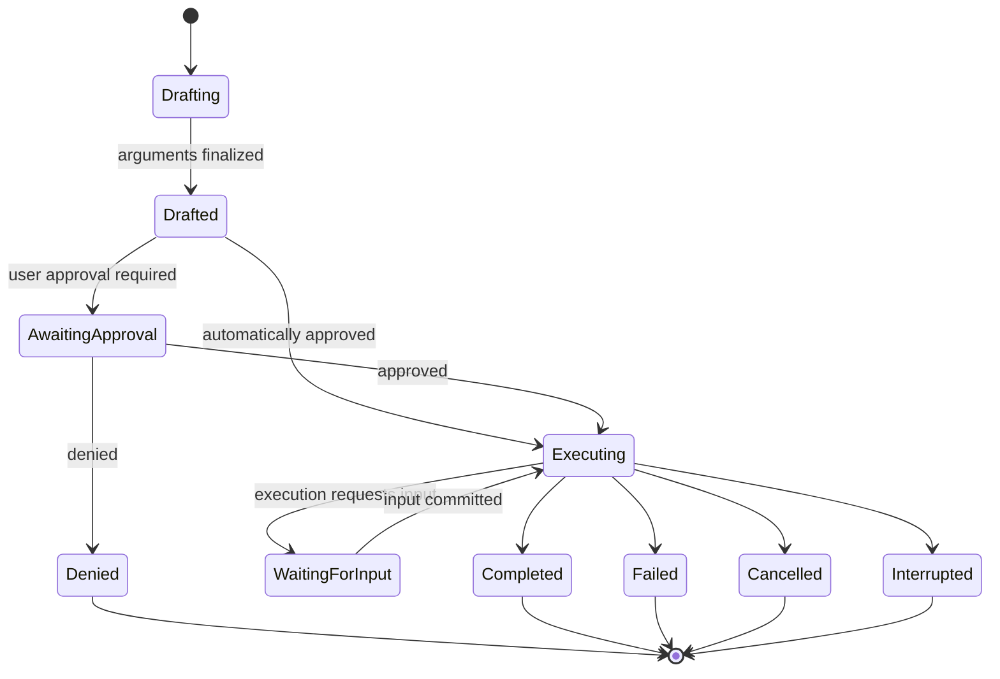
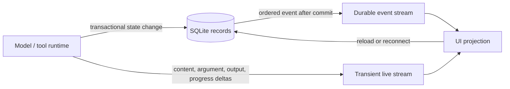

# Conversation storage model

> **Status:** Normative storage design. Contracts and migrations implement the SQLite record model plus file-backed complete tool results described below.

## Design

Use canonical SQLite conversation records. A conversation is a stable container; every durable lifecycle transition is a typed conversation record. Complete tool-result bytes that exceed the agent preview contract are stored as owner-scoped payload files, while SQLite remains canonical for their identity, projections, ownership, and integrity reference.

## Journal persistence and performance

The in-memory conversation aggregate is persisted as a checkpoint plus ordered canonical deltas:

- `conversation_state` is a full checkpoint used only for cold hydration, import, and repair. Normal tool/message lifecycle commits do not rewrite it.
- `conversation_journal_head` stores the current revision and checksum for SQLite-side compare-and-swap.
- `conversation_journal_commit` stores one validated, revision-keyed commit. A hot transaction appends this delta, advances the head, updates only affected conversation records/context leaves, and appends its durable notification event atomically.
- Graceful shutdown folds loaded deltas into a new checkpoint and deletes only commits covered by that checkpoint in the same transaction. If checkpointing is interrupted, the retained deltas remain the recovery source.

Hot commit CPU, worker IPC, serialization, and SQLite writes must be proportional to the current commit and affected records, never to unrelated conversation history. Full-history work is permitted only during cold hydration, explicit export/repair, compaction generation, or shutdown checkpointing. Model-provider payload cost still scales with retained context until compaction; after compaction, local context projection traverses only the retained segment and post-compaction entries.

This keeps the storage model small:

- `CONVERSATION` stores stable metadata.
- `AGENT` stores parent/sub-agent identity, configuration, and active context leaf.
- `CONVERSATION_RECORD` stores messages, summaries, runs, tool calls, and optional tool batches through one versioned payload abstraction.
- `DURABLE_EVENT` provides ordered, reliable UI notification without being the canonical state.

## ERD



`data` is a discriminated, versioned payload validated by the shared contracts and storage package. Frequently queried envelope fields remain relational and indexed. A tool-call payload stores its bounded agent result, six-line/item UI preview, and—only when the agent result truncates—a validated descriptor for `<NERVE_HOME>/data/payloads/conversations/<conversationId>/tool-calls/<toolCallId>.json`. There is no byte-size placement threshold and no payload metadata table or join.

## Record kinds

```text
RecordKind
  message | summary | run | tool_call | tool_batch
```

- `message` contains its role, ordered content blocks, model-context visibility, usage, and queued/delivered state when applicable.
- `summary` represents conversation compaction or a branch summary.
- `run` contains current execution state, retry count, failure, and latest recovery checkpoint. Attempts and checkpoints do not require separate tables unless they become independently queried product data.
- `tool_call` contains arguments, result, supervision decision, execution state, human interaction, errors, and execution identity.
- `tool_batch` is optional and is used only when a batch has its own lifecycle or one batch-wide supervision decision. Otherwise `group_id` is sufficient.

`parent_id` forms the conversation/context tree. Each agent's `active_record_id` identifies its active branch leaf. Conversation metadata remains separate so it is not repeated on every record.

### Tool-result projections

Tool results have independent durable projections:

- The agent projection keeps at most 200 logical lines and then at most 24,000 UTF-8 bytes, with no per-line character cap. If it truncates, the final output reserves room for exactly `Output truncated. Full output: <resolved path>` and the complete result is written to the payload file first.
- The UI transcript projection keeps at most six tool-appropriate lines/items and exposes a details action.
- Public events carry only the UI projection.
- Details reads return the complete canonical value from inline SQLite data when it fit or from the verified payload file when it truncated.
- Every sequential, parallel, or batched tool call receives its own independent budgets; there is no batch-wide output allowance.

## Tool-call lifecycle

Supervision is a gate between drafting and execution. Human-in-the-loop interaction occurs during execution.



`AwaitingApproval` is represented by `phase = drafted` with pending supervision. `WaitingForInput` is represented by `phase = executing` with a pending execution interaction.

### Tool enums

```text
ToolPhase
  drafting | drafted | executing | completed | failed | denied | cancelled | interrupted

SupervisionStatus
  pending | approved | denied

SupervisionDecisionSource
  automatic | user | policy

ExecutionStatus
  running | waiting_for_input

ExecutionInteractionStatus
  pending | resolved | cancelled

ExecutionInteractionKind
  user_input | plan_review

ToolExecutionKind
  local | host

ToolRisk
  read | workspace_write | command | network | secret | destructive
  agent_spawn | deployment | interaction
```

`tool_name`, model IDs, providers, and event types remain open strings so new implementations do not require database enum migrations.

### Durable transition rules

1. Finalized arguments are committed before supervision begins.
2. Approval or denial is committed before any side effect starts.
3. The executor revision-checks and commits `drafted -> executing` before claiming the tool.
4. A human-input request is committed as `executing/waiting_for_input` before showing an actionable UI.
5. The answer is committed before execution resumes or completes.
6. Completion, failure, cancellation, denial, and interruption are durable terminal states.

Waiting states restore exactly after restart. A running external process is reattached only when a durable host/task handle supports it; otherwise it becomes `interrupted` and is never blindly rerun after an ambiguous crash.

## Parallel tool calls

Parallel calls are independent `tool_call` records sharing `run_id` and `group_id`. At the same time, one call may be awaiting supervision, another executing, another waiting for human input, and another completed.

The aggregate run state is derived as follows:

- if any call is executable or executing, the run remains active;
- if none can run and one or more calls await approval/input, the run is waiting;
- once all calls are terminal, the run may continue to the next model step.

Whether unsupervised siblings execute while another call awaits approval is a scheduling policy, not a storage limitation. Multiple individual approvals can be resolved atomically; a `tool_batch` record is reserved for genuinely batch-wide decisions.

## Durable and transient events



### Durable events

Durable events are inserted in the same transaction as their record change. They carry the record ID and revision and support reconnect sequencing. They are notification history, not canonical state, and may be pruned after the supported replay window.

Examples:

```text
tool.drafted | tool.approval_requested | tool.approved | tool.denied
tool.started | tool.input_requested | tool.input_resolved | tool.completed
run.waiting | run.completed | compaction.completed
```

### Transient events

Transient events are sent over the live protocol and are not stored:

```text
message.content.delta | message.thinking.delta
tool.arguments.delta | tool.output.delta
compaction.summary.delta
```

They carry `conversation_id`, `run_id`, `record_id` or `draft_id`, stream kind, and a monotonic stream sequence. The UI overlays them on durable records and removes the overlay when final durable state arrives. A terminated provider stream resumes from the last durable boundary rather than pretending partial generation can continue.

## Compaction

Compaction writes one `summary` record containing the generated summary, covered record range, first retained record, and token information. Original records remain available for history and branching; model-context construction replaces only the compacted prefix.

Summary generation progress is transient. On success, one transaction inserts the summary, advances the agent's active leaf/context metadata, and emits `compaction.completed`.

## Other enums

```text
Mode
  planning | coding

PermissionLevel
  autonomous | supervised | read_only

AgentStatus
  idle | running | awaiting_user | aborted | error

MessageRole
  user | assistant | system | tool

MessageBlockKind
  text | thinking | image | tool_call | tool_result

RunStatus
  starting | running | retrying | waiting | cancelling
  completed | failed | cancelled | interrupted

RunRecoverability
  checkpoint | retryable | manual | none
```

Closed enums use readable SQLite `TEXT` with `CHECK` constraints. IDs remain prefixed text IDs, booleans use constrained integers, timestamps use Unix epoch milliseconds, and every mutable record uses an integer revision for compare-and-swap updates.

## Performance approach

The database stores durable boundaries, not streaming deltas. Token generation, argument drafting, command output, and compaction progress stay on the transient event path, so they do not create database writes per chunk.

SQLite uses WAL mode with one short-transaction writer and concurrent readers. The storage package should own the writer queue, prepared statements, and read connections off the UI/runtime event loop. Parallel conversations and sub-agents may prepare work concurrently; SQLite serializes only their brief commits.

Important practices:

- commit related records and durable events in one transaction;
- batch parallel tool-call creation and terminal updates when they share one model boundary;
- use `synchronous = FULL` for approval-before-side-effect durability unless measurements establish another safe contract;
- select only envelope columns for lists and decode record payloads lazily;
- paginate conversation history and never replay or hydrate every conversation at startup;
- keep indexes limited to actual envelope queries;
- prune delivered durable events and superseded recovery data;
- checkpoint WAL deliberately and use SQLite's backup API for consistent live backups;
- measure commit latency, WAL growth, payload decode time, and UI event-loop delay before adding physical payload splitting or compression.

Tool results retain one domain abstraction. Results that fit the agent contract remain unchanged inline. Truncated results keep their complete readable JSON in the owner-scoped payload file and their two bounded projections in SQLite. The descriptor path is derived from validated owner IDs under the active `NERVE_HOME`; absolute paths are never persisted.

## Core indexes and invariants

```text
conversation_records(conversation_id, sequence)
conversation_records(conversation_id, agent_id, kind, status)
conversation_records(parent_id)
conversation_records(run_id, group_id, kind, status)
durable_events(conversation_id, sequence)
```

- Record sequence is unique within a conversation.
- Parent records belong to the same conversation and valid agent context.
- Record updates require the expected revision.
- Durable state and its durable event commit atomically.
- Only durably approved calls may enter execution.
- At most one unresolved execution interaction exists per tool call.
- Conversation-owned records and events cascade on conversation deletion.
