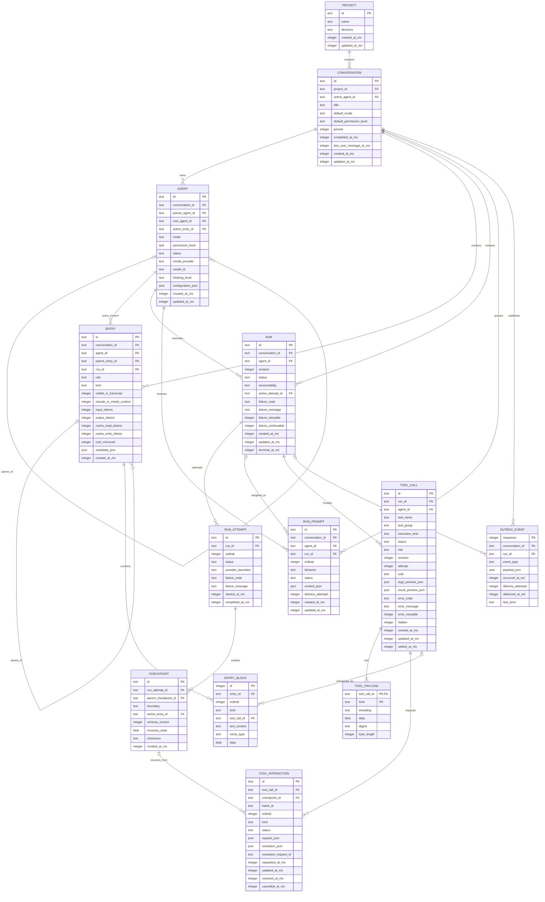

# Conversation storage ERD (brainstorm)

> **Status:** Non-normative design exploration. This describes a possible replacement for the current conversation journals; it is not an implementation plan or product contract.

## Direction

Use one canonical SQLite database for all projects, conversations, agents, entries, runs, and tool calls. Current state is directly queryable. A bounded outbox supports reliable event delivery, but the outbox is not the canonical state and is not an indefinitely retained event-sourcing journal.

The design aims to:

- store each piece of authoritative data once;
- use one conversation/model-context entry tree rather than separate display and model copies;
- store all tool arguments and results through one transactional payload abstraction, regardless of size;
- represent approvals, user questions, and plan review with one interaction model;
- preserve branching, sub-agent isolation, retries, recovery checkpoints, and reliable event delivery;
- keep frequently queried fields relational while allowing JSON at genuinely extensible boundaries.

## Entity relationship diagram



## Entity responsibilities

### Conversation entries

`ENTRY` is the canonical conversation and model-context tree. `parent_entry_id` provides branching, while `agent_id` gives each parent or sub-agent an isolated context. The agent's `active_entry_id` identifies its current leaf.

`visible_in_transcript` and `include_in_model_context` are independent because visibility and model inclusion are orthogonal. This supports ordinary messages, UI-only notices, model-only context, and private sub-agent context without copying content.

`ENTRY_BLOCK` preserves ordered structured content. Text, thinking, images, tool invocations, and tool results are blocks of the same entry. Tool blocks reference canonical `TOOL_CALL` rows rather than embedding another tool record.

### Runs and recovery

`RUN` contains the latest durable run state. `RUN_ATTEMPT` records each execution or retry without repeatedly serializing a cumulative run snapshot.

`CHECKPOINT` contains a versioned, checksummed recovery payload at a defined provider boundary. Recovery checkpoints should have a bounded retention policy; they are not permanent audit history.

`RUN_PROMPT` owns queued, steered, and follow-up prompts. A prompt may exist before assignment to a run, so `run_id` is nullable.

### Tool calls and interactions

`TOOL_CALL` contains lifecycle and queryable metadata. `tool_name` is an open string so adding a tool does not require a database migration. Group, execution kind, and risk are recorded as the values effective when the call was created.

`TOOL_PAYLOAD` is the uniform storage path for every tool argument and result. `(tool_call_id, kind)` is the composite primary key. Arguments exist from creation; results are added when available. Small and large payloads have identical transactional behavior, with no filesystem threshold or artifact marker.

`TOOL_INTERACTION` is the sole canonical model for approval, user input, and plan review. Kind-specific request and resolution objects are discriminated JSON contracts. `batch_id` groups interactions when the UI resolves several together; no separate suspension copy is required. A run is suspended when it has pending interactions and resumes from the referenced checkpoint.

### Outbox

`OUTBOX_EVENT` provides atomic event publication: state changes and their outward-facing events are inserted in the same transaction. Delivered rows can be pruned after the required reconnect/replay window. Domain state never has to be reconstructed from this table.

## Enum catalogue

SQLite has no native enum type. Closed enums are stored as readable `TEXT` with `CHECK` constraints. Integer ordinals are avoided because they are difficult to inspect and evolve.

### Conversation and agent

```text
Mode
  planning | coding

PermissionLevel
  autonomous | supervised | read_only

AgentStatus
  idle | running | awaiting_user | aborted | error
```

Conversation completion is represented by nullable `completed_at_ms`, and pinning is an independent boolean. A conversation status enum would duplicate those fields.

### Entries

```text
EntryRole
  user | assistant | system | tool

EntryKind
  message | compaction | branch_summary | explore_report

EntryBlockKind
  text | thinking | image | tool_call | tool_result
```

Run status and task activity are projected from their canonical tables rather than copied into entries.

### Runs and recovery

```text
RunStatus
  starting
  running
  retrying
  waiting
  suspended
  cancellation_requested
  cancellation_failed
  interrupted
  completed
  failed
  cancelled

RunRecoverability
  not_needed | checkpoint | retryable | manual | none

RunAttemptStatus
  starting | streaming | waiting | completed | failed | cancelled | superseded

CheckpointBoundary
  before_provider_request
  after_provider_response
  after_tool_result
  suspension

PromptBehavior
  steer | follow-up

PromptStatus
  queued | accepted | delivered | cancelled | failed
```

### Tool calls

```text
ToolCallStatus
  committed | waiting | running | completed | denied | failed | cancelled

ToolExecutionKind
  local | host

ToolRisk
  read
  workspace_write
  command
  network
  secret
  destructive
  agent_spawn
  deployment
  interaction

ToolGroup
  fileInspection
  fileEditing
  shell
  python
  web
  vision
  jira
  confluence
  input
  todos
  taskManagement
  explore
  planMode

ToolPayloadKind
  args | result

ToolPayloadEncoding
  json_utf8 | json_zstd
```

`tool_name`, model provider, model ID, and event type are intentionally open strings rather than enums.

### Tool interactions

```text
ToolInteractionKind
  approval | user_input | plan_review

ToolInteractionStatus
  pending | resolved | cancelled

ApprovalAction
  allow | deny

ApprovalScope
  single_call
  same_tool_same_args
  run
  always
  always_project
  always_user

UserInputAction
  answer | dismiss

PlanReviewAction
  accept
  accept_in_new_chat
  request_changes
  reject
  discard
```

Kind-specific actions and fields are validated by the shared discriminated request/resolution contracts.

## SQLite type conventions

| Domain value               | SQLite representation                                                                   |
| -------------------------- | --------------------------------------------------------------------------------------- |
| IDs                        | `TEXT`, retaining the existing prefixed IDs such as `conv_`, `run_`, and `tool_`        |
| Closed enums               | `TEXT NOT NULL` with `CHECK` constraints                                                |
| Extensible discriminators  | Unconstrained `TEXT` validated at the contract boundary                                 |
| Booleans                   | `INTEGER` constrained to `0` or `1`                                                     |
| Timestamps                 | Unix epoch milliseconds in `INTEGER` columns; API contracts may expose ISO 8601 strings |
| Token counts and revisions | Non-negative `INTEGER`                                                                  |
| Cost                       | Integer micro-USD to avoid floating-point accumulation errors                           |
| Flexible metadata          | JSON text with `json_valid(...)` constraints where supported                            |
| Potentially large payloads | `BLOB`, with an explicit encoding and byte length                                       |
| Digests                    | Lowercase SHA-256 text or fixed-width bytes, chosen consistently                        |

The shared contracts remain the semantic source of truth. Database constraints protect durable invariants and reject corrupt writes close to storage.

## Key constraints

- Foreign keys are enabled and conversation-owned rows cascade on conversation deletion.
- Entry parents must belong to the same conversation and agent context.
- `(entry_id, ordinal)` is unique for entry blocks.
- `(run_id, ordinal)` is unique for run attempts and assigned prompts.
- `(tool_call_id, kind)` is unique for tool payloads.
- `(tool_call_id, ordinal)` is unique for tool interactions.
- Terminal runs, attempts, and tool calls require their corresponding terminal timestamp.
- A waiting tool call has exactly one pending interaction; batch membership does not change per-call ownership.
- Tool results and interactions reference the same canonical tool call revision where stale-resolution protection is required.
- Outbox `sequence` is globally monotonic; `delivered_at_ms IS NULL` identifies pending delivery.

## Initial index shape

Indexes should follow actual query paths rather than index every field. The likely baseline is:

```text
conversations(project_id, updated_at_ms DESC)
entries(conversation_id, agent_id, created_at_ms)
entries(parent_entry_id)
entry_blocks(entry_id, ordinal)
runs(conversation_id, status, updated_at_ms DESC)
run_attempts(run_id, ordinal)
run_prompts(agent_id, status, created_at_ms)
tool_calls(run_id, status, updated_at_ms DESC)
tool_interactions(status, requested_at_ms) WHERE status = 'pending'
outbox_events(sequence) WHERE delivered_at_ms IS NULL
```

Whether `conversation_id` should also be copied onto `TOOL_CALL` for a direct covering index is a measurement-driven denormalization decision. It is not required for correctness.
