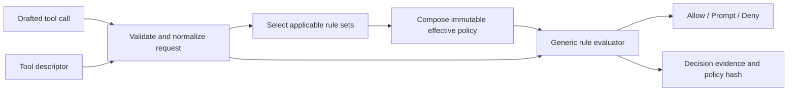
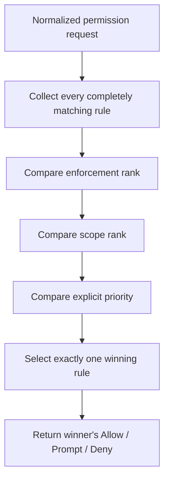
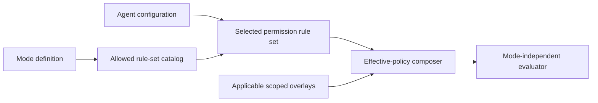
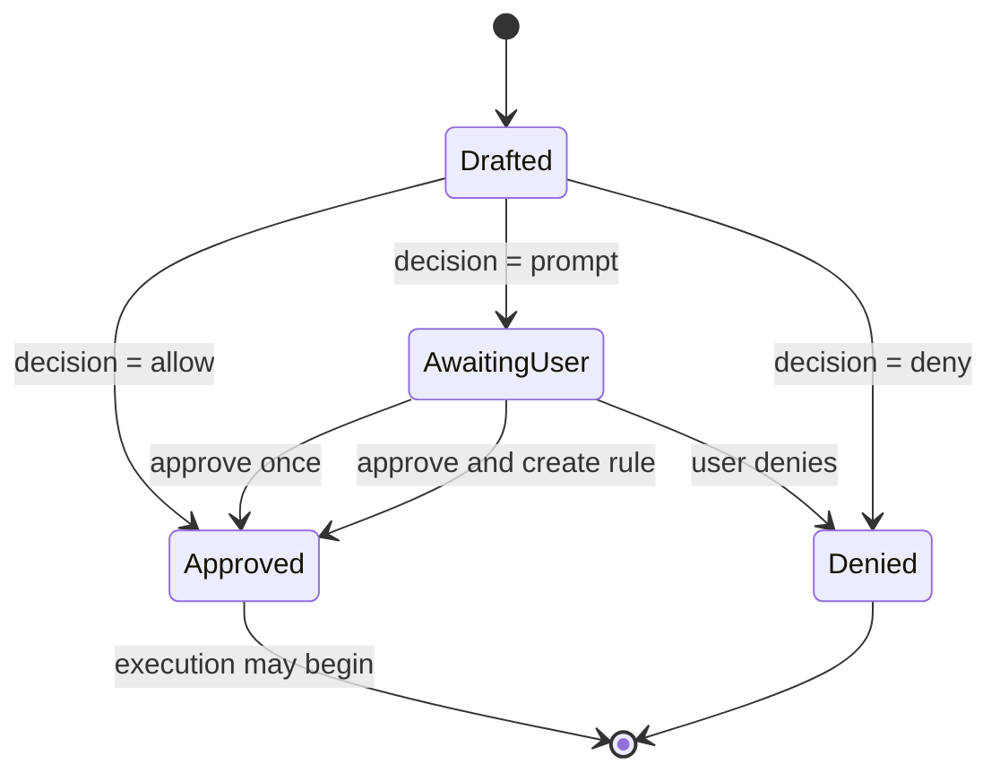

# Permission rules and rule sets

> **Status:** Authoritative functional requirements for the proposed permission system. This document defines the target behavior and data model; it does not describe the current implementation or an implementation plan.

## Purpose

Nerve must use one generic permission framework for every agent-callable tool. The framework decides whether a drafted tool call may execute automatically, requires a user decision, or must not execute.

Permission behavior must be expressed through composable **permission rules** collected into named **permission rule sets**. Product concepts such as Read only, Supervised, Autonomous, Planning, and future custom agents select or compose rule sets; they must not introduce special decision branches inside the rule evaluator.

The system must be:

- deterministic and fail-closed;
- independent of tool execution;
- independent of coding, planning, or other agent modes;
- argument- and target-aware;
- explainable from a durable policy snapshot;
- configurable at user, project, and conversation scopes;
- portable across machines and `NERVE_HOME` locations;
- extensible to future tools, modes, and sub-agent types.

## Terminology

| Term                    | Meaning                                                                                                                                                                          |
| ----------------------- | -------------------------------------------------------------------------------------------------------------------------------------------------------------------------------- |
| **Permission rule**     | One set of filters and one `allow`, `prompt`, or `deny` decision.                                                                                                                |
| **Permission rule set** | A named, versioned collection of permission rules with a purpose, source, and compatibility metadata.                                                                            |
| **Built-in rule set**   | An immutable, application-owned permission rule set. Baseline, Read only, Supervised, Autonomous, and Planning are built-in rule sets.                                           |
| **Permission overlay**  | A scoped collection of ad hoc permission rules applied above the selected rule set. User and project overlays are JSON files; conversation overlays are conversation-owned data. |
| **Guardrail**           | A non-overridable rule that restricts maximum authority and may not force a less restrictive decision.                                                                           |
| **Effective policy**    | The immutable composition of Baseline, one selected rule set, and all applicable scoped overlays for one drafted tool call.                                                      |
| **Tool descriptor**     | Static catalog metadata describing a tool's identity, kinds, groups, base risks, arguments, and permission targets.                                                              |
| **Base risk**           | The immutable catalog risk assigned to a tool without interpreting an individual call's arguments.                                                                               |
| **Permission target**   | A normalized structured resource affected by a call, such as a path, URL, agent, or whole tool.                                                                                  |
| **Primary argument**    | The catalog-declared main validated argument used for convenient equality or glob matching, such as a path, URL, command, or script.                                             |
| **Primary target**      | The main normalized structured target used for convenient matching and display. It does not automatically represent every effect of a multi-target call.                         |

## Decisions

Every successfully evaluated request produces exactly one decision:

```ts
type PermissionDecision = "allow" | "prompt" | "deny";
```

- `allow`: execution may proceed without a new user decision.
- `prompt`: execution must wait for an explicit user decision.
- `deny`: execution must not proceed and cannot be approved through the pending-call prompt.

Built-in rule sets automatically allow tools with the `interaction` base risk because their execution is itself the human-interaction boundary. The system must also avoid recursively prompting for permission to display the permission prompt itself.

## Conceptual architecture



Validation, canonicalization, and target extraction are prerequisites to policy matching, not mode-specific permission behavior. A malformed request or a request whose required security targets cannot be derived must fail closed.

## Tool and request model

### Tool identity

Each tool descriptor must provide stable metadata that rules can match:

```ts
type ToolKind =
  | "filesystem"
  | "command"
  | "code"
  | "network"
  | "interaction"
  | "orchestration"
  | "deployment"
  | "integration"
  | "other";

type ToolRisk =
  | "read"
  | "write"
  | "network"
  | "secret"
  | "destructive"
  | "deployment"
  | "agent_spawn"
  | "interaction"
  | "unknown";

interface ToolDescriptor {
  name: string;
  kind: ToolKind;
  groups: string[];
  baseRisk: ToolRisk;
  /** Ordered selectors; the first present validated value is primary. */
  primaryArguments: string[];
  targetKinds: PermissionTargetKind[];
}
```

Tool groups are catalog-owned identifiers for matching related tools. The ordered `primaryArguments` list supports conditional tools such as Python (`code`, then `path`) and resource-management tools whose identifier differs by action. The first present validated value becomes `request.primaryArgument`; an empty list means that the request has no primary argument.

### Static base risk

Each tool has exactly one immutable base risk declared by the tool catalog. Nerve does not calculate argument-sensitive risk. In particular, it does not parse Bash commands or Python programs to claim that one invocation is safer than another.

The base-risk categories mean:

| Tool capability                          | Base risk     |
| ---------------------------------------- | ------------- |
| Local file inspection and local search   | `read`        |
| File creation and modification           | `write`       |
| Web access and remote read integrations  | `network`     |
| Secret retrieval                         | `secret`      |
| Explicit destructive operations          | `destructive` |
| Deployment operations                    | `deployment`  |
| Sub-agent creation, including Explore    | `agent_spawn` |
| User-question and interaction tools      | `interaction` |
| Bash, Python, and other opaque execution | `unknown`     |

### Authoritative tool metadata

The following table is the required V1 policy metadata for the complete 50-tool catalog. Primary arguments separated by `→` are checked in order and the first present validated value becomes the primary argument. `whole_tool` means that no narrower structured permission target represents the tool's complete authority; argument filters remain available.

| Tool                            | Group            | Kind            | Base risk     | Primary arguments                                    | Normalized targets                                        |
| ------------------------------- | ---------------- | --------------- | ------------- | ---------------------------------------------------- | --------------------------------------------------------- |
| `read`                          | `fileInspection` | `filesystem`    | `read`        | `path`                                               | `path/read/exact`                                         |
| `bash`                          | `shell`          | `command`       | `unknown`     | `command`                                            | `whole_tool`                                              |
| `python_exec`                   | `python`         | `code`          | `unknown`     | `code` → `path`                                      | `whole_tool`                                              |
| `edit`                          | `fileEditing`    | `filesystem`    | `write`       | `path`                                               | `path/write/exact`                                        |
| `write`                         | `fileEditing`    | `filesystem`    | `write`       | `path`                                               | `path/write/exact`                                        |
| `grep`                          | `fileInspection` | `filesystem`    | `read`        | `paths` → `path`                                     | `path/read/tree`                                          |
| `find`                          | `fileInspection` | `filesystem`    | `read`        | `path`                                               | `path/read/tree`                                          |
| `ls`                            | `fileInspection` | `filesystem`    | `read`        | `path`                                               | `path/read/tree`                                          |
| `ask_user`                      | `input`          | `interaction`   | `interaction` | `question`                                           | `whole_tool`                                              |
| `todos_set`                     | `todos`          | `interaction`   | `interaction` | —                                                    | `whole_tool`                                              |
| `todos_get`                     | `todos`          | `interaction`   | `read`        | —                                                    | `whole_tool`                                              |
| `web_search`                    | `web`            | `network`       | `network`     | `query`                                              | `whole_tool`                                              |
| `web_fetch`                     | `web`            | `network`       | `network`     | `url`                                                | `url`                                                     |
| `explain_image`                 | `vision`         | `network`       | `network`     | `path`                                               | `path/read/exact`                                         |
| `jira_search_users`             | `jira`           | `integration`   | `network`     | `query`                                              | `whole_tool`                                              |
| `jira_search_issues`            | `jira`           | `integration`   | `network`     | `jql`                                                | `whole_tool`                                              |
| `jira_get_issue`                | `jira`           | `integration`   | `network`     | `issue_key`                                          | `whole_tool`                                              |
| `jira_get_project`              | `jira`           | `integration`   | `network`     | `project_key`                                        | `whole_tool`                                              |
| `jira_search_boards`            | `jira`           | `integration`   | `network`     | `project_key` → `name`                               | `whole_tool`                                              |
| `jira_get_board`                | `jira`           | `integration`   | `network`     | `board_id`                                           | `whole_tool`                                              |
| `jira_get_sprint`               | `jira`           | `integration`   | `network`     | `sprint_id`                                          | `whole_tool`                                              |
| `jira_download_attachment`      | `jira`           | `integration`   | `network`     | `attachment_id`                                      | `whole_tool`                                              |
| `jira_create_issue`             | `jira`           | `integration`   | `write`       | `project_key`                                        | `whole_tool`                                              |
| `jira_update_issue`             | `jira`           | `integration`   | `write`       | `issue_key`                                          | `whole_tool`                                              |
| `jira_transition_issue`         | `jira`           | `integration`   | `write`       | `issue_key`                                          | `whole_tool`                                              |
| `jira_manage_comment`           | `jira`           | `integration`   | `destructive` | `comment_id` → `issue_key`                           | `whole_tool`                                              |
| `jira_manage_worklog`           | `jira`           | `integration`   | `destructive` | `worklog_id` → `issue_key`                           | `whole_tool`                                              |
| `jira_manage_issue_link`        | `jira`           | `integration`   | `destructive` | `link_id` → `issue_key`                              | `whole_tool`                                              |
| `jira_manage_attachment`        | `jira`           | `integration`   | `destructive` | `attachment_id` → `issue_key`                        | `path/read/exact` for upload; otherwise `whole_tool`      |
| `jira_manage_sprint`            | `jira`           | `integration`   | `destructive` | `sprint_id` → `board_id`                             | `whole_tool`                                              |
| `jira_manage_backlog`           | `jira`           | `integration`   | `write`       | `issue_key`                                          | `whole_tool`                                              |
| `confluence_search_spaces`      | `confluence`     | `integration`   | `network`     | `keys` → `ids`                                       | `whole_tool`                                              |
| `confluence_search_pages`       | `confluence`     | `integration`   | `network`     | `cql` → `query` → `space_key` → `space_id` → `title` | `whole_tool`                                              |
| `confluence_get_page`           | `confluence`     | `integration`   | `network`     | `page_id`                                            | `whole_tool`                                              |
| `confluence_download_page`      | `confluence`     | `integration`   | `network`     | `page_id`                                            | `whole_tool`                                              |
| `confluence_create_page`        | `confluence`     | `integration`   | `write`       | `space_id` → `space_key` → `parent_id` → `page_file` | `path/read/exact` for file inputs; otherwise `whole_tool` |
| `confluence_update_page`        | `confluence`     | `integration`   | `write`       | `page_id` → `page_file`                              | `path/read/exact` for file inputs; otherwise `whole_tool` |
| `confluence_manage_comment`     | `confluence`     | `integration`   | `destructive` | `comment_id` → `page_id`                             | `whole_tool`                                              |
| `confluence_manage_page`        | `confluence`     | `integration`   | `destructive` | `page_id`                                            | `whole_tool`                                              |
| `confluence_manage_label`       | `confluence`     | `integration`   | `write`       | `page_id`                                            | `whole_tool`                                              |
| `confluence_manage_restriction` | `confluence`     | `integration`   | `destructive` | `page_id`                                            | `whole_tool`                                              |
| `confluence_manage_attachment`  | `confluence`     | `integration`   | `destructive` | `attachment_id` → `page_id`                          | `path/read/exact` for upload; otherwise `whole_tool`      |
| `task_start`                    | `taskManagement` | `orchestration` | `unknown`     | `command`                                            | `whole_tool`                                              |
| `task_status`                   | `taskManagement` | `orchestration` | `read`        | `tasks` → `status`                                   | `whole_tool`                                              |
| `task_logs`                     | `taskManagement` | `orchestration` | `read`        | `task`                                               | `whole_tool`                                              |
| `task_control`                  | `taskManagement` | `orchestration` | `unknown`     | `task`                                               | `whole_tool`                                              |
| `explore`                       | `explore`        | `orchestration` | `agent_spawn` | —                                                    | `agent` (`explore`)                                       |
| `plan_mode_enter`               | `planMode`       | `orchestration` | `interaction` | `reason`                                             | `whole_tool`                                              |
| `plan_mode_present`             | `planMode`       | `orchestration` | `interaction` | `file_path`                                          | `path/read/exact` under `plans`                           |
| `plan_mode_force_exit`          | `planMode`       | `orchestration` | `interaction` | `reason`                                             | `whole_tool`                                              |

Mixed-operation tools that can delete or permanently remove remote content use the conservative static `destructive` risk for every call. Bash, Python, task startup, and task restart remain `unknown` regardless of their arguments. No current tool uses the reserved `secret` or `deployment` base risk. Argument-sensitive risk classification is outside this specification. Any tool addition or metadata change must update this table and the tool catalog together.

### Normalized request

Rules must evaluate validated, canonical values rather than untrusted raw payload text.

```ts
type PermissionTargetKind = "path" | "url" | "agent" | "whole_tool";

type PermissionTarget =
  | {
      kind: "path";
      access: "read" | "write";
      scope: "exact" | "tree";
      root: PathRoot;
      relativePath: string;
    }
  | {
      kind: "path";
      access: "read" | "write";
      scope: "exact" | "tree";
      absolutePath: string;
    }
  | {
      kind: "url";
      normalizedUrl: string;
      access: "read" | "write";
    }
  | {
      kind: "agent";
      agentId: string;
    }
  | {
      kind: "whole_tool";
    };

interface PermissionRequest {
  tool: ToolDescriptor;
  args: Record<string, unknown>;
  primaryArgument?: unknown;
  primaryTarget?: PermissionTarget;
  targets: PermissionTarget[];
  projectId?: string;
  conversationId: string;
}
```

Tools with structured resources must expose every security-relevant path, URL, or agent target. Paths inside an application-owned symbolic root use the portable rooted form. Paths elsewhere use the canonical absolute runtime form and remain valid permission targets; they are not discarded merely because they are outside the project or Nerve home. Persisted rooted path patterns never contain these machine-specific absolute values. An `all` target matcher requires at least one extracted target and every relevant target must match; an empty target collection never satisfies `all`.

Bash and Python remain opaque. Nerve does not extract command segments or infer script effects. Rules for these tools match the complete validated argument value, such as `args.command` or `args.code`. String equality and glob operators are anchored to the complete value. Automatically suggested rules use exact equality by default; broad globs require an explicit user choice and are presented without any claim that the matched command or program is safe.

## Permission rules

### Data shape

```ts
type RuleDecision = "allow" | "prompt" | "deny";
type RuleEnforcement = "overridable" | "guardrail";

type PrimitiveValue = string | number | boolean;
type ComparableValue = PrimitiveValue | PrimitiveValue[];

type ValueMatcher =
  | { operator: "equals" | "not_equals"; value: ComparableValue }
  | { operator: "in"; value: PrimitiveValue[] }
  | { operator: "glob"; value: string }
  | { operator: "exists"; value: boolean };

type ArgumentMatcher = ValueMatcher & {
  /** Dot path rooted at validated args, for example `args.path`. */
  path: `args.${string}`;
};

interface TargetMatcher {
  kind?: PermissionTargetKind;
  access?: "read" | "write";
  scope?: "exact" | "tree";
  root?: PathRoot;
  pattern?: string;
}

interface PermissionRuleFilter {
  toolNames?: string[];
  toolKinds?: ToolKind[];
  toolGroups?: string[];
  baseRisks?: ToolRisk[];
  primaryArgument?: ValueMatcher;
  primaryTarget?: TargetMatcher;
  targets?: {
    quantifier: "any" | "all";
    matcher: TargetMatcher;
  };
  arguments?: ArgumentMatcher[];
}

interface PermissionRule {
  id: string;
  description?: string;
  enabled: boolean;
  priority: number;
  enforcement: RuleEnforcement;
  when: PermissionRuleFilter;
  decision: RuleDecision;
}
```

### Matching requirements

- Filters within one rule are combined with logical AND.
- Values within plural filters such as `toolNames`, `toolKinds`, and `baseRisks` match any listed value.
- Primary-argument and argument-path matchers operate only on schema-validated canonical arguments.
- `equals` performs exact typed equality; string equality is case-sensitive.
- `not_equals` requires the selected value to exist and differ by exact typed equality. A missing value does not match.
- `in` requires an existing scalar value equal to one configured primitive member.
- `glob` accepts strings only, is case-sensitive, and is anchored to the complete canonical string rather than a substring.
- `exists` is the only operator that matches a missing value and takes a boolean expectation.
- Dot paths may select object fields but must not execute expressions or functions. Missing paths do not satisfy `equals`, `not_equals`, `in`, or `glob`.
- Path globs are case-sensitive, use normalized root-relative POSIX paths, and are anchored to the complete path. `*` does not cross `/`; `**` matches across path segments; `?` matches one non-`/` character.
- Rule matching must be deterministic and independent of JSON object key order.
- Unknown tool names or obsolete groups remain readable in stored configuration but do not make unavailable tools executable.
- `overridable` rules participate in normal scope precedence.
- `guardrail` rules are protected user rules and may use only `prompt` or `deny`; a non-overridable `allow` is invalid because more specific policy must remain free to restrict authority.
- The rule decision never affects precedence. `allow`, `prompt`, and `deny` are returned only after enforcement, scope, and explicit priority select the winning rule.

### Primary-argument and primary-target matching

A primary-argument filter is an ergonomic matcher for the catalog-declared main validated argument. It is useful for paths, URLs, Bash commands, Python programs, and agent identifiers. A primary-target filter provides structured matching when that argument resolves to a path, URL, agent, or whole-tool target.

A primary-target match alone must not be treated as complete allow coverage when the request contains additional security-relevant targets. An `allow` decision requires one of the following:

- the tool descriptor guarantees that the primary target represents the complete effect;
- the rule applies to the whole request without target narrowing; or
- the rule's `all` target matcher covers every required target.

Allow coverage is never assembled from multiple lower-precedence rules because exactly one matching rule wins. A deny may match any affected target. This prevents a compound call from hiding a denied operation behind an allowed primary argument.

### Priority within one source

Rules with the same enforcement and source are ordered only by their explicit numeric priority. Greater priority wins. Matcher specificity, decision kind, and creation time do not affect ordering.

Priority should use a bounded signed range such as `-1000` through `1000`. Priorities must be unique within each enforcement class of one rule set or overlay so two matching rules cannot tie. Scope authority must not be encoded into numeric priority bands.

## Permission rule sets

### Data shape

```ts
type RuleSetSource = "builtin" | "user";
type AgentModeId = string;

type PathRoot = "project" | "nerve_home" | "nerve_data" | "plans";

interface PermissionRuleSet {
  schemaVersion: 1;
  id: string;
  name: string;
  description?: string;
  source: RuleSetSource;
  enabled: boolean;
  compatibleModes?: AgentModeId[];
  rules: PermissionRule[];
}

interface PermissionOverlay {
  schemaVersion: 1;
  rules: PermissionRule[];
}
```

Requirements:

- Rule sets exist only as immutable built-ins or user-scoped JSON files. Projects and conversations cannot define selectable rule sets.
- Rule-set IDs must be stable, unique within their source, and safe for use as file names.
- `schemaVersion` is mandatory.
- Exactly one mode-compatible rule set is selected for an agent invocation.
- The always-active Baseline rule set contains a catch-all overridable `prompt` rule so every valid request has at least one match.
- Built-in and custom rule sets may contain only `overridable` rules.
- The user overlay may contain both `overridable` rules and `guardrail` rules.
- Project and conversation overlays may contain only `overridable` rules.
- User and project overlays use the same `PermissionRule` representation but are not selectable rule sets and have no identity, inheritance, compatibility, or fallback behavior of their own.
- Compatibility metadata controls rule-set discovery and selection but does not authorize a mode to bypass its required policy.

### JSON example

```json
{
  "schemaVersion": 1,
  "id": "development",
  "name": "Development",
  "description": "Allow reads and workspace edits; supervise commands.",
  "source": "user",
  "enabled": true,
  "compatibleModes": ["coding"],
  "rules": [
    {
      "id": "allow-reads",
      "description": "Allow read-only requests.",
      "enabled": true,
      "priority": 100,
      "enforcement": "overridable",
      "when": {
        "baseRisks": ["read"]
      },
      "decision": "allow"
    },
    {
      "id": "allow-source-writes",
      "enabled": true,
      "priority": 90,
      "enforcement": "overridable",
      "when": {
        "baseRisks": ["write"],
        "targets": {
          "quantifier": "all",
          "matcher": {
            "kind": "path",
            "access": "write",
            "root": "project",
            "pattern": "src/**"
          }
        }
      },
      "decision": "allow"
    }
  ]
}
```

A user overlay can mix overridable defaults and guardrails. For example, this user guardrail blocks writes to environment files across projects:

```json
{
  "schemaVersion": 1,
  "rules": [
    {
      "id": "block-environment-file-writes",
      "description": "Never write environment files.",
      "enabled": true,
      "priority": 100,
      "enforcement": "guardrail",
      "when": {
        "baseRisks": ["write"],
        "targets": {
          "quantifier": "any",
          "matcher": {
            "kind": "path",
            "access": "write",
            "root": "project",
            "pattern": "**/.env*"
          }
        }
      },
      "decision": "deny"
    }
  ]
}
```

## Built-in rule sets

Built-in permission rule sets are versioned, immutable JSON resources. They use the same rule representation and precedence semantics as custom rule sets. Every built-in rule is `overridable`; built-in rule sets contain no guardrails. User, project, and conversation overlays may therefore replace a built-in decision according to normal precedence, while user guardrails remain able to protect an explicit restriction across primary-agent projects and conversations.

The built-in behavior is:

| Rule set   | Stable ID    | Availability  | `interaction` | `read` | Explore | Plan-directory `write` or `edit` | Other base risk |
| ---------- | ------------ | ------------- | ------------- | ------ | ------- | -------------------------------- | --------------- |
| Baseline   | `baseline`   | Always active | Allow         | Allow  | Prompt  | Prompt                           | Prompt          |
| Read only  | `read_only`  | Coding        | Allow         | Allow  | Allow   | Deny                             | Deny            |
| Supervised | `supervised` | Coding        | Allow         | Allow  | Prompt  | Prompt                           | Prompt          |
| Autonomous | `autonomous` | Coding        | Allow         | Allow  | Allow   | Allow                            | Allow           |
| Planning   | `planning`   | Planning      | Allow         | Allow  | Allow   | Allow                            | Deny            |

User-question and interaction tools are automatically allowed because their execution is itself a human-interaction boundary. Remote reads retain the static `network` base risk and therefore follow the non-read column.

### Baseline

Baseline is always active at the lowest scope rank and guarantees a total result. It allows interaction and read-risk tools, including filesystem reads outside managed roots, and prompts for everything else:

```json
[
  {
    "id": "allow-interaction",
    "enabled": true,
    "priority": 200,
    "enforcement": "overridable",
    "when": { "baseRisks": ["interaction"] },
    "decision": "allow"
  },
  {
    "id": "allow-read",
    "enabled": true,
    "priority": 100,
    "enforcement": "overridable",
    "when": { "baseRisks": ["read"] },
    "decision": "allow"
  },
  {
    "id": "prompt-everything-else",
    "enabled": true,
    "priority": 0,
    "enforcement": "overridable",
    "when": {},
    "decision": "prompt"
  }
]
```

Baseline is distinct from every selectable rule set.

### Read only

Read only never prompts from its own rules. It automatically allows interaction tools, `read` tools, and the Explore tool, then denies every other request, including `write`, `network`, and opaque execution. Explore remains statically classified as `agent_spawn`; this is an explicit tool-name allowance rather than a risk reclassification:

```json
[
  {
    "id": "allow-interaction",
    "enabled": true,
    "priority": 200,
    "enforcement": "overridable",
    "when": { "baseRisks": ["interaction"] },
    "decision": "allow"
  },
  {
    "id": "allow-explore",
    "enabled": true,
    "priority": 150,
    "enforcement": "overridable",
    "when": { "toolNames": ["explore"] },
    "decision": "allow"
  },
  {
    "id": "allow-read",
    "enabled": true,
    "priority": 100,
    "enforcement": "overridable",
    "when": { "baseRisks": ["read"] },
    "decision": "allow"
  },
  {
    "id": "deny-everything-else",
    "enabled": true,
    "priority": 0,
    "enforcement": "overridable",
    "when": {},
    "decision": "deny"
  }
]
```

### Supervised

Supervised automatically allows interaction and `read` tools, then prompts for every other base risk, including `write`, `network`, `agent_spawn`, and `unknown`:

```json
[
  {
    "id": "allow-interaction",
    "enabled": true,
    "priority": 200,
    "enforcement": "overridable",
    "when": { "baseRisks": ["interaction"] },
    "decision": "allow"
  },
  {
    "id": "allow-read",
    "enabled": true,
    "priority": 100,
    "enforcement": "overridable",
    "when": { "baseRisks": ["read"] },
    "decision": "allow"
  },
  {
    "id": "prompt-everything-else",
    "enabled": true,
    "priority": 0,
    "enforcement": "overridable",
    "when": {},
    "decision": "prompt"
  }
]
```

### Autonomous

Autonomous automatically allows every valid tool request:

```json
{
  "id": "allow-all",
  "enabled": true,
  "priority": 0,
  "enforcement": "overridable",
  "when": {},
  "decision": "allow"
}
```

Autonomous includes valid filesystem requests outside the project and Nerve home, so its filesystem tools may read, edit, and write arbitrary host paths. It does not make malformed, invalid, or unavailable tool calls executable.

### Planning

Planning automatically allows interaction tools, `read` tools, and the Explore tool. It also allows the `write` and `edit` tools when at least one write target exists and every affected write target is under the global plans directory. It denies every other request without prompting, including writes outside the plans directory and opaque execution. Explore remains statically classified as `agent_spawn`; this is an explicit tool-name allowance:

```json
[
  {
    "id": "allow-interaction",
    "enabled": true,
    "priority": 300,
    "enforcement": "overridable",
    "when": { "baseRisks": ["interaction"] },
    "decision": "allow"
  },
  {
    "id": "allow-plan-file-writes",
    "enabled": true,
    "priority": 200,
    "enforcement": "overridable",
    "when": {
      "toolNames": ["write", "edit"],
      "baseRisks": ["write"],
      "targets": {
        "quantifier": "all",
        "matcher": {
          "kind": "path",
          "access": "write",
          "scope": "exact",
          "root": "plans",
          "pattern": "**"
        }
      }
    },
    "decision": "allow"
  },
  {
    "id": "allow-explore",
    "enabled": true,
    "priority": 150,
    "enforcement": "overridable",
    "when": { "toolNames": ["explore"] },
    "decision": "allow"
  },
  {
    "id": "allow-read",
    "enabled": true,
    "priority": 100,
    "enforcement": "overridable",
    "when": { "baseRisks": ["read"] },
    "decision": "allow"
  },
  {
    "id": "deny-everything-else",
    "enabled": true,
    "priority": 0,
    "enforcement": "overridable",
    "when": {},
    "decision": "deny"
  }
]
```

Legacy persisted `permissionLevel` fields map directly to built-in permission rule-set IDs and remain compatibility data only. User interfaces present permission rule sets rather than a separate permission-level concept.

## Effective-policy composition

### Active policy sources

An effective policy contains, from least to most specific:

1. the always-active built-in Baseline rule set;
2. exactly one mode- or agent-selected built-in or user rule set;
3. the user overlay from `<NERVE_HOME>/config/permissions.json`, when present;
4. the project overlay from `<project>/.nerve/config/permissions.json`, when present;
5. the active conversation overlay, when present.

There is only one selected permission rule set. User, project, and conversation overlays are scoped rule collections rather than additional selectable rule sets. This composition applies to primary-agent threads only; sub-agent threads use only their configured rule set, without Baseline or overlays.

Project configuration is repository-controlled input. A discovered project overlay is inactive until the user explicitly trusts the complete `permissions.json` content digest. Any external content change invalidates that trust and requires renewed approval before any project rule becomes active. When the user saves a project-scoped decision through Nerve's permission prompt, Nerve updates the overlay and its trusted digest atomically, because that exact change was explicitly approved. All active project rules must remain visible and removable by the user who controls the project.

### Rule precedence

Every matching rule participates in one precedence ordering. The evaluator does not combine decisions and does not rank `allow`, `prompt`, or `deny` by restrictiveness.

A matching rule receives a lexicographic precedence key:

```ts
type RuleOrigin = "baseline" | "rule_set" | "user" | "project" | "conversation";

interface RulePrecedence {
  enforcementRank: number;
  scopeRank: number;
  priority: number;
}
```

The ranks are:

| Enforcement   | Enforcement rank |
| ------------- | ---------------: |
| `guardrail`   |                1 |
| `overridable` |                0 |

| Overridable origin   | Scope rank |
| -------------------- | ---------: |
| Conversation overlay |          4 |
| Project overlay      |          3 |
| User overlay         |          2 |
| Selected rule set    |          1 |
| Baseline             |          0 |

Guardrails currently have only one valid origin: the user overlay. Their scope rank is therefore `0`; their higher enforcement rank still places every matching user guardrail above every matching overridable rule. Rule sets, project overlays, and conversation overlays must reject guardrail rules during validation.

Rules are compared in this exact order:

1. greater enforcement rank;
2. greater scope rank;
3. greater explicit rule priority.

The highest-precedence matching rule wins, and its decision is returned unchanged. A rule's decision, matcher specificity, file order, and creation time do not affect precedence.

Examples:

| Matching rules                                                                        | Winner                                           |
| ------------------------------------------------------------------------------------- | ------------------------------------------------ |
| User guardrail `deny`, priority 10; project overridable `allow`, priority 1000        | User guardrail `deny`                            |
| User guardrail `prompt`, priority 10; conversation overridable `allow`, priority 1000 | User guardrail `prompt`                          |
| User overridable `deny`, priority 1000; project overridable `allow`, priority 10      | Project `allow`                                  |
| Two user guardrails at priorities 100 and 200                                         | Priority 200 rule, regardless of either decision |
| Two project overridable rules at priorities 100 and 200                               | Priority 200 rule, regardless of either decision |



## Conversation rules

When a call produces `prompt`, the user may choose among outcomes such as:

- approve this call only;
- deny this call only;
- allow similar calls for this conversation;
- deny or require prompting for similar calls for this conversation;
- promote a suggested rule into persistent project or user configuration.

Conversation-wide choices create a conversation overlay. They must:

- contain only `overridable` rules and never define guardrails;
- be scoped to one conversation;
- be persisted at `<NERVE_HOME>/data/payloads/conversations/<conversation-id>/permissions.json` so it survives application and daemon restarts;
- have stable IDs and creation metadata;
- be visible and revocable;
- use canonical matchers derived from the approved request;
- never bypass user guardrails;
- expire when the conversation is deleted, or earlier if the user selects a shorter lifetime.

Approving one drafted call changes only that call unless the user explicitly chooses a conversation-wide or durable option.

## Saving prompted decisions

A prompted decision may create a canonical rule at one of three scopes without creating or selecting another rule set:

| User choice                | Destination                                                                   | Effect                                                                 |
| -------------------------- | ----------------------------------------------------------------------------- | ---------------------------------------------------------------------- |
| Apply to this conversation | `<NERVE_HOME>/data/payloads/conversations/<conversation-id>/permissions.json` | Applies only to the current conversation and persists across sessions. |
| Apply to this project      | `<project>/.nerve/config/permissions.json`                                    | Applies to the active project with its trusted content digest updated. |
| Apply to all projects      | `<NERVE_HOME>/config/permissions.json`                                        | Applies at user scope across projects.                                 |

Nerve automatically creates or atomically updates the selected destination when the user confirms one of these scoped choices. It updates the existing scope-owned overlay rather than creating another rule set or permission file. The saved rule affects future evaluations and does not retroactively change already drafted calls.

Rules generated from an approval must use the narrow canonical matchers shown to the user. For Bash, Python, and other opaque tools, generated rules use exact equality against the complete validated primary argument; the user must deliberately broaden an exact matcher into a glob.

If an identical canonical matcher and enforcement already exists in the destination, Nerve updates that rule rather than creating a duplicate. Otherwise, the new rule receives the next greater priority in its enforcement class so the latest explicit choice wins within that scope. Nerve may renumber priorities while preserving their order when needed to remain inside the supported range.

Conversation and project rules are always `overridable`. A saved user `allow` is also normally `overridable`: a more specific ordinary rule may still prompt or deny it. A user-scoped durable choice such as “never allow this” creates a `deny` guardrail when the UI explicitly communicates that project and conversation permissions cannot replace it. A user-scoped “always require approval” choice creates a `prompt` guardrail. The UI must distinguish an overridable user default from a user guardrail before saving.

## Modes and rule-set selection

Modes determine which single rule set may be selected; the permission evaluator does not inspect mode behavior. The agent configuration owns the selected rule-set ID for modes that permit a choice. Future calls in a conversation use the agent's current valid selection, while already drafted calls retain their immutable policy snapshot. If a selected custom rule set is missing, disabled, malformed, or incompatible with the mode, Nerve uses Baseline and presents a user-visible notification rather than silently choosing another authority level.



### Coding mode

Coding mode may expose the built-in Read only, Supervised, and Autonomous rule sets plus compatible custom rule sets.

### Planning mode

Planning mode selects the built-in Planning rule set. It automatically allows interaction tools, `read` tools, Explore, and `write` or `edit` requests wholly contained by the plans directory, then denies every other request without prompting.

Planning behavior is represented entirely by its selected Planning rule set. The generic evaluator receives that rule set without importing planning-mode logic. Because Planning contains only overridable rules, user, project, and conversation overlays may replace its decisions according to normal precedence. A user who needs a non-overridable restriction defines a guardrail in the user overlay.

A custom user rule set's `compatibleModes` field is descriptive eligibility metadata. The mode definition remains authoritative about which rule set is selectable. A project cannot define a selectable rule set.

Future modes follow the same contract.

## Symbolic path roots

Persisted rooted path rules must use portable symbolic roots rather than machine-specific absolute paths. Normalized runtime requests may also contain canonical absolute path targets for filesystem locations outside every registered symbolic root; those targets are evaluated by risk, tool, argument, or generic path rules rather than persisted rooted path patterns.

Required roots are:

| Root         | Template spelling | Meaning                                        |
| ------------ | ----------------- | ---------------------------------------------- |
| `project`    | `${projectDir}`   | Active project directory.                      |
| `nerve_home` | `${nerveHome}`    | Active Nerve home, normally `~/.nerve`.        |
| `nerve_data` | `${nerveDataDir}` | Authoritative data directory under Nerve home. |
| `plans`      | `${plansDir}`     | Global Nerve plans directory.                  |

The structural representation is authoritative:

```json
{
  "kind": "path",
  "root": "plans",
  "pattern": "**"
}
```

Template spelling is permitted as user-facing shorthand, for example `${plansDir}/**`. Loading must parse shorthand into a typed root and a normalized relative pattern before evaluation.

Requirements:

- only a fixed application-owned variable allowlist may be used;
- arbitrary process environment variables and arbitrary expression interpolation are forbidden;
- persisted files retain symbolic roots and never store expanded host-specific paths;
- relative patterns reject traversal and platform-dependent separators;
- paths are resolved and canonicalized before matching;
- execution must revalidate security-sensitive path boundaries, including symlink-sensitive writes;
- policy sources may be restricted to safe roots.

Built-in and user-owned rule sets may reference all registered roots. Project overlay rules must not grant access to broad Nerve home or data roots. Access to globally sensitive roots requires a built-in rule set, user-owned rule set, or user overlay. The dedicated `plans` root may be used by the built-in Planning rule set without coupling evaluation to planning mode.

## Persistence layout

Selectable custom rule sets exist only at user scope. Scoped ad hoc permissions use one overlay file per durable scope.

```text
<NERVE_HOME>/
└── config/
    ├── permissions.json              # User overlay
    └── rule-sets/
        ├── <rule-set-id>.json        # User-selectable custom rule set
        └── ...

<project>/
└── .nerve/
    └── config/
        └── permissions.json          # Project overlay; no project rule sets

<NERVE_HOME>/
└── data/
    └── payloads/
        └── conversations/
            └── <conversation-id>/
                └── permissions.json  # Durable conversation overlay
```

The user rule-set folder is serialized as `rule-sets`; there is no intermediate `permissions/` directory. Projects do not have a `rule-sets` folder.

Built-in rule sets are packaged application resources and are not copied into writable configuration by default. A user may duplicate a built-in set under a new ID to customize it.

Conversation overlays are durable conversation-scoped state. They survive across sessions at `<NERVE_HOME>/data/payloads/conversations/<conversation-id>/permissions.json`, participate only in their owning conversation, and are removed with that conversation. They are not portable user or project configuration.

Storage requirements:

- one user rule-set file contains one complete selectable rule set;
- `permissions.json` contains the complete overlay for its storage scope;
- file replacement is atomic;
- user rule-set file names correspond to validated rule-set IDs;
- an overlay with an unknown schema version, malformed content, invalid rule, duplicate priority, or forbidden enforcement is ignored in full and produces a user-visible notification naming the overlay path and validation problem;
- valid rules from an invalid overlay are never partially loaded;
- an invalid custom rule set is unavailable for selection and produces a user-visible notification; if it was selected, evaluation falls back to Baseline;
- duplicate user rule-set IDs make every conflicting set unavailable and produce a user-visible notification;
- scope is determined from storage location; a project overlay cannot claim user ownership;
- only the user `permissions.json` overlay may contain guardrails; rule-set, project-overlay, and conversation-overlay guardrails are configuration errors;
- project overlays are inactive until their complete content digest is trusted; externally changing the file invalidates trust;
- Nerve atomically updates the applicable overlay file when a user saves a prompted decision to conversation, project, or user scope;
- secrets must never be embedded in match patterns or rule metadata.

## Sub-agents

Sub-agent creation remains an ordinary tool capability governed by permission rules.

For the existing Explore tool:

- the parent requests the Explore tool normally;
- rules may allow, prompt, or deny that tool by name, group, `agent_spawn` risk, primary target, or arguments;
- Explore always creates its child with the fixed Read only rule set;
- the parent does not select or modify the Explore child's rule set;
- Explore children retain their restricted read-tool catalog, which does not expose Explore recursively even though the Read only policy permits a parent-thread Explore call.

Future sub-agent tools follow the same model. A sub-agent definition may have a fixed rule set or a user-configured rule set. That choice belongs to persistent sub-agent configuration, not agent-controlled tool arguments unless a future tool explicitly exposes and secures such selection.

Each sub-agent runs in its own thread and its effective policy contains only the rule set configured for that sub-agent. It receives neither Baseline nor any user, project, or conversation overlay. Consequently, parent guardrails and saved conversation permissions do not participate in child evaluations. A sub-agent rule set must contain an enabled catch-all rule so its policy is total. A read-only planning parent may invoke an allowed implementation sub-agent whose configured rule set permits writes, while every Explore child remains governed by the fixed Read only rule set.

If a future sub-agent rule set can produce `prompt`, its pending call may be approved or denied once. Conversation-, project-, and user-overlay save options must not be offered for that child call because those overlays are intentionally excluded from child evaluation. Persistent behavior changes require editing or reassigning the sub-agent's configured user rule set.

```mermaid
sequenceDiagram
    participant Parent as Parent agent
    participant Policy as Permission engine
    participant Tool as Sub-agent tool
    participant Child as Child agent

    Parent->>Policy: Draft sub-agent tool call
    Policy-->>Parent: allow / prompt / deny
    Parent->>Tool: Execute only when allowed
    Tool->>Child: Start separate thread with configured rule set
    Child->>Policy: Evaluate with child rule set only; no overlays
    Policy-->>Child: allow / prompt / deny
```

## Approval and lifecycle requirements



- Execution must not start before an allow or user approval is durable.
- Approval must apply to the exact immutable drafted call revision shown to the user.
- A rule created from approval affects future evaluations; it must not silently rewrite already evaluated sibling calls.
- Parallel calls are evaluated independently against identified policy snapshots.
- A prompted destructive or secret-bearing request must not automatically suggest an unsafe broad rule.

## Explainability and audit requirements

Every decision must include enough evidence to explain and reproduce the outcome:

```ts
interface PermissionEvaluationResult {
  decision: PermissionDecision;
  reason: string;
  baseRisk: ToolRisk;
  normalizedTargets: PermissionTarget[];
  winningRuleId: string;
  winningRuleOrigin: RuleOrigin;
  winningRuleEnforcement: RuleEnforcement;
  winningRulePrecedence: RulePrecedence;
  activeRuleSetIds: string[];
  ignoredOverlays: Array<{
    origin: Extract<RuleOrigin, "user" | "project" | "conversation">;
    path: string;
    reason: string;
  }>;
  policySnapshotHash: string;
  suggestedRules: PermissionRule[];
}
```

The durable tool-call record must retain:

- normalized arguments or an immutable reference to them;
- the tool's base risk and normalized targets;
- final decision and human-readable reason;
- the winning rule, its origin, enforcement, and precedence key;
- active rule sets and overlays;
- every ignored overlay path and validation reason;
- a hash of the complete effective policy snapshot;
- the user decision when prompting occurred.

Later edits to rule-set or overlay files must not change the historical explanation for an already evaluated call.

## Compatibility

This feature has not shipped to external users. Implementation does not migrate, import, or preserve the current permission-exception or `permissions.json` formats. Existing development files may be removed manually. The new versioned rule-set and overlay schemas are the only supported formats; no ongoing compatibility adapter is required.

## Security and behavioral invariants

1. No invalid, unavailable, or malformed tool call becomes executable because a rule says `allow`.
2. No ordinary rule or conversation approval may expand authority beyond a matching guardrail.
3. Project configuration cannot define guardrails, claim user scope, grant itself broad access to Nerve-owned sensitive roots, or activate before its complete content digest is trusted.
4. All relevant structured targets participate in authorization, and an empty target collection never satisfies an `all` matcher.
5. Bash, Python, and other opaque execution tools retain the static `unknown` base risk; they are never silently treated as read-only.
6. Symbolic roots are typed, portable, and resolved by the application rather than arbitrary interpolation.
7. Mode and agent systems select rule sets but do not alter generic rule-evaluation semantics.
8. Sub-agent spawning is authorized as an ordinary parent-thread tool call; each child then uses only its configured total rule set, without Baseline or overlays.
9. Permission policy is application authorization, not an operating-system sandbox. Command and code execution remain capable of effects that static analysis cannot fully predict.
10. Every decision is deterministic for the same normalized request and effective-policy snapshot.
11. An invalid overlay is ignored in full, never partially applied, and always produces a user-visible notification.

## Acceptance-level scenarios

The target system must support at least the following behaviors:

1. **Read-only coding:** interaction tools, `read` tools, and Explore are automatic; `write`, `network`, `unknown`, and every other request are denied without prompting.
2. **Supervised coding:** interaction and `read` tools are automatic; every other base risk prompts.
3. **Autonomous coding:** every valid request is automatic unless a higher-precedence overlay or user guardrail replaces the built-in decision.
4. **Network read:** Web fetch retains `network` risk, so Read only denies it and Supervised prompts unless an overlay allows it.
5. **User guardrail:** a user denial for secret files cannot be bypassed by project or conversation allowance.
6. **Overridable scope:** a project overridable `allow` beats a matching user overridable `deny`, regardless of their numeric priorities.
7. **Explicit priority:** among matching rules with the same enforcement and origin, the greater explicit priority wins regardless of decision kind.
8. **Conversation approval:** a prompted decision saved to conversation scope updates the conversation `permissions.json`, survives restarts, and does not modify project or user files.
9. **Opaque execution:** Bash and Python retain `unknown` risk; an automatically generated permission matches the exact complete argument unless the user explicitly broadens it.
10. **Structured targets:** a Planning write allow requires at least one write target and every write target under `${plansDir}`.
11. **Planning:** Planning allows interaction, filesystem reads anywhere, Explore, and plan-file `write` or `edit`, while denying other requests by default.
12. **Portable policy:** moving `NERVE_HOME` does not require rewriting persisted symbolic path rules.
13. **Explore:** Read only and Planning explicitly allow the parent Explore call; every Explore child uses only the fixed Read only rule set, with no parent overlays.
14. **Future implementation agent:** a read-only parent may invoke an allowed sub-agent whose persistent configuration selects a writing-capable rule set; the child receives no parent overlays.
15. **Project trust:** cloning or externally modifying a repository overlay does not activate it without trusting its complete content digest.
16. **Missing selection:** a missing or invalid selected custom rule set falls back to Baseline with a visible notification.
17. **Invalid overlay:** one invalid rule causes the complete owning overlay to be ignored and a notification to identify the file and validation error.
18. **Historical audit:** changing a rule-set or overlay file does not alter the recorded explanation of an earlier tool-call decision.
19. **External filesystem targets:** every built-in rule set allows `read`, `grep`, `find`, and `ls` against paths outside registered symbolic roots; Autonomous also allows external filesystem writes, while other rule sets retain their normal write decisions.
