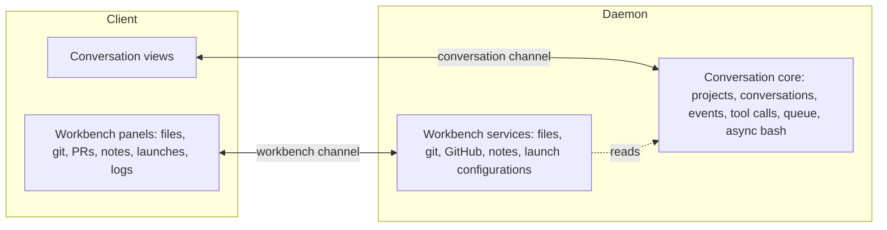

# Channels

Part of the [conversation core redesign](README.md).

## Problem

Today one WebSocket session carries everything. Events are routed to a per-conversation stream (`conv/<id>`) or to a `workspace` stream; any event without a `conversationId` falls through to `workspace` (`streamForEvent` in `packages/contracts/src/events/event-routing.ts`). Conversation-list updates, tasks, files and git share that stream, and all of it is persisted in `durable_events` (451k workspace events in the development database).

Consequences:

- Conversation behavior cannot be used without the IDE surface around it.
- Workbench traffic shares one connection and send buffer with token streaming.
- Client state is shared: [#393](https://github.com/ThilinaTLM/nerve/issues/393) measured title-bar and workspace selectors recomputing on every streamed update.
- Live UI notifications are persisted and replayed though nothing needs them after a reconnect.

## Design

Two connections, not two topics on one socket:

- Workbench refreshes such as a large diff or file tree never delay token streaming.
- A minimal client (CLI, editor extension, remote client) connects to the conversation endpoint only.
- The cost is a second reconnect lifecycle, which the protocol package already handles generically.

**Dependency rule:** the workbench may read the conversation core; the core never depends on the workbench. Agents reach files and git through their own tools, not through workbench services.

## Conversation channel

Operations: projects and trusted resources; create, list, configure, pin, complete, pause, stop, delete and branch conversations; submit and cancel inputs; resolve approvals and questions; compact.

| Subscription | Initial state | Updates | Persisted |
| --- | --- | --- | --- |
| Conversation list (per project) | Rows: title, status, timestamps, parent | Summary changes | No; re-snapshot on reconnect |
| Conversation detail | Conversation, configuration, open tool calls, queue, async bash | Row changes | Rows yes, notices no |
| Conversation history | Events after the client's last sequence | New events | Yes, `CONVERSATION_EVENT.sequence` |
| Live progress | None | Text and thinking deltas, argument drafting, tool output progress | No |

Rules:

- Durable events are never dropped; replay resumes from the last sequence the client acknowledged.
- Live deltas may be coalesced or dropped under backpressure; the next durable event or snapshot supersedes them.
- Children are separate conversations. The parent's view shows child summaries; opening a child subscribes to its own detail and history.

## Workbench channel

Covers files, git, GitHub pull requests, scratch notes, launch configurations and their running instances, and logs.

- Each panel loads a snapshot, then receives "resource changed" notices and re-fetches what it shows.
- Nothing is persisted; no replay. A reconnect re-snapshots.
- Notices are scoped to what the panel subscribed to, such as a project or a path.

## Client state

Conversation stores and workbench stores do not share reactive state. A streamed delta updates only the open conversation's live state; list summaries change only on summary events. App-shell selectors (title bar, project switcher, tabs) depend on list summaries and workbench snapshots, never on live progress.

## Sequencing

The workbench channel can be built first on today's storage, because it only removes the workbench from the persisted workspace stream. The conversation channel follows the storage cutover, since its replay depends on `CONVERSATION_EVENT.sequence`.
