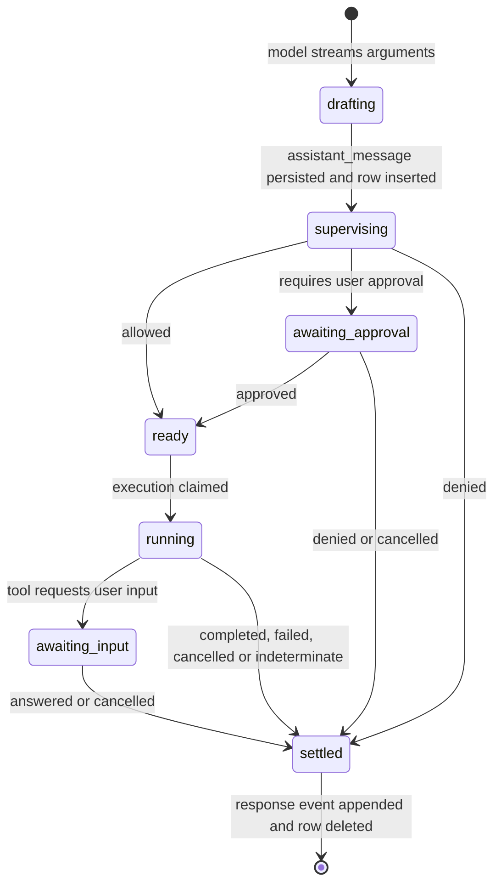

# Tool-call lifecycle

Part of the [conversation core redesign](README.md).

Every tool call follows one lifecycle; individual tools may skip states. `TOOL_CALL` holds only unfinished calls, like `INPUT_QUEUE` holds only undelivered inputs. Reaching a terminal outcome appends one `tool_call_response` event and deletes the row in the same transaction. The event log gains one event per call regardless of how many durable checkpoints the call passed.

## States

| State | Durable | Notes |
| --- | --- | --- |
| Drafting | No | Memory only. If processing stops first, no row exists; an `execution_state` event records the failure or interruption. |
| Supervising | Row inserted | Permission evaluation has no side effects. Decision, matched rule and captured authority are written to `supervision` before leaving. |
| Awaiting approval | Yes | Suspension point. `interaction` stores the request; the resolution is written once, deduplicated by its resolution request ID. |
| Ready | Yes | Allowed, not yet started. |
| Running | Yes | Claimed before external effects. Only the worker holding `execution_claim` may settle the call. |
| Awaiting input | Yes | Suspension point for `ask_user` and plan review. The user's answer is the tool result. |
| Settled | Event | `completed`, `failed`, `denied`, `cancelled` or `indeterminate`. The response payload preserves supervision and interaction resolution after the row is deleted. |

## Approval grants

Permission decisions use the conversation's baseline rule set plus overlays at user, project (`.nerve/`) and conversation (conversation data directory) level. Overlays are readable JSON rule files.

Approving with "always allow" writes a rule into the overlay for the chosen scope: conversation, project or user. A one-time approval writes nothing beyond the call's own resolution. There is no grant table.

## Multiple calls in one assistant message

- Calls progress independently. Some may be auto-allowed and running while a sibling awaits approval and another is denied with an error result.
- Whether allowed calls start while a sibling awaits approval is runtime policy, not schema.
- The conversation shows `waiting` while any of its rows is `awaiting_approval` or `awaiting_input`.
- The next model request for a turn starts only when no `TOOL_CALL` row remains for that `turn_id`.
- Responses are appended in completion order; the [context projection](events-and-context.md#projection-to-pi) orders them by `content_index`.

## Recovery

| Row state at restart | Action |
| --- | --- |
| `supervising` | Re-evaluate permission. |
| `awaiting_approval`, `awaiting_input` | Keep; the prompt reappears. |
| `ready` | Execute; no effects have occurred. |
| `running` | Re-run only tools declared safe to replay; otherwise settle as `indeterminate`. |

Recovery never invokes a provider merely to repair status. Uncertain outcomes stay visible as `indeterminate`.

## Cancellation and force push

Stopping a turn settles every unfinished row for that turn: unstarted and suspended calls become `cancelled`; running calls are aborted and settle as `cancelled` or `indeterminate`. Deliberately stopping a conversation also stops its child conversations.

Force push is stop-then-drain: stop the current turn, deliver queued inputs and start the next request. No extra state is stored; if the process crashes in between, recovery finishes the cancellation and the queue drains normally.

## Promotion to async bash

A bash call that exceeds its foreground limit is promoted to an [async bash](async-bash-and-launches.md). The call settles normally with a response explaining the promotion and identifying the async bash. Its later completion arrives as a queued `async_bash_event`.

## Direct user commands

A direct `!command` creates a row with `origin = user` and no assistant event, passes supervision like any other call, and settles into a `tool_call_response`. Fenced `!!!` blocks inside a prompt are different: they are prepared in the [input queue](input-queue.md#command-preparation), not as tool-call rows.
