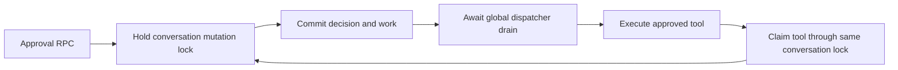
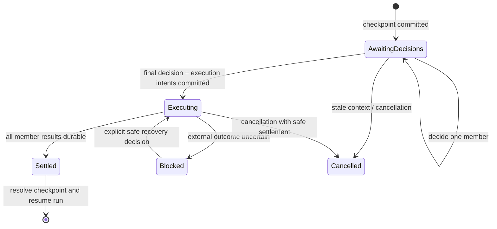

# Durable approval checkpoints and tool execution

> **Status:** Implemented, with follow-up hardening tracked in `/home/tlm/.nerve/data/plans/approval-checkpoint-hardening.md`. This document records the original design and historical incident; do not repair live run data from it without a separate reviewed recovery procedure.

## Problem (historical, before implementation)

A run-scoped approval previously spanned a tool-call record, an interaction in the conversation journal, a run interaction, lifecycle work, and in-memory approval projections. A single user decision can advance some of these without advancing the others. Worse, an approval commit wakes the dispatcher while still inside a conversation-wide tool-record mutation lock; the request awaits the dispatcher's **global drain**. An execution worker may need that same lock to claim the tool, so both can wait indefinitely.

The durable decision can also become visible before the in-memory approval list observes it. `ToolCallRepository.replaceWithCommit()` writes the journal at revision N+1 but calls `observe(next)` only after its commit callback returns. During that window the cached tool record is still revision N with a pending interaction. `listApprovals()` filters that pending record through `ConversationJournalRepository.isActionableToolInteraction()`, which rejects the N/N+1 revision mismatch and produces `Approval not found.` It also rejects interactions whenever the conversation's journal state is not loaded; even without this race, an execution worker cannot safely treat `listApprovals()` as durable authority.

The observed reproduction was a three-member supervised Bash checkpoint in Inkwell (`conv_01M37VE48WPNVASF18R4NACWZ1`, 2026-09-23 19:21–19:33 UTC). All three tool approvals eventually reached `committed`, but the run remained `waiting` with three pending run interactions. Two `execute_tool` items were leased without their tools becoming `running`; the third was marked `outcome_unknown` after `Approval not found.`. The UI showed executing tools, no approvals, and an agent awaiting user input. The earlier single-tool incident (`conv_01M37SNYR98V1BBDX0X2JBE0R4`) recorded the same approval lookup failure before the user restarted the host; the restart error was a later recovery consequence. These observations identify a broken state boundary, not proof that a shell command ran or had an external effect.

### Current dependency cycle

The global drain also lets unrelated model work delay an approval response. Even a **non-final** decision creates a fallback `reconcile_conversation` work item when no member is executable, so it too waits for the entire drain; remove this per-decision placeholder work in the target design. `ApprovalBatchResolutionService.exclusive(runId:checkpointId)` remains held while that RPC waits. Later, the `execute_tool` handler calls `recoverReadyApprovalBatches()`, which may try to acquire the **same batch lock**: a second dependency cycle. Replace this in-process approval lock with durable checkpoint revision compare-and-swap, not another lock held during execution. Deadlocked `leased` work keeps renewing its lease through the executor heartbeat, so lease-expiry recovery will not break either cycle.

## Goal

Make a user decision a short, durable **state transition**, not a synchronous request to execute a tool. Give each run checkpoint one authoritative decision/execution state, project it consistently to the transcript and UI, and allow interrupted work to resume only where external effects are proven safe. Fix the architectural boundary rather than adding retries or special cases around `Approval not found.`

Success means that approving any subset of a checkpoint returns promptly after persistence, regardless of other runs; the final decision releases execution without waiting in the request; every eligible tool has at most one active execution claim; and the run cannot remain in its user-input waiting state once all decisions have been durably recorded.

## Ownership and minimal state model

- For **run-scoped** approvals, lifecycle checkpoint/interaction records own the decision. The approval UI and canonical tool-call record are read projections of that decision, not competing authorities. Existing policy evaluation and scope grants remain separate concerns; they cannot change whether an individual decision has been recorded.
- A checkpoint groups a fixed, ordered set of proposed tool calls, their policy evidence, the run/branch epoch, and the execution checkpoint identity. Membership does not change after it is opened. Reject stale decisions before persisting them; a grant must not silently authorize a different branch, argument set, or policy target.
- Keep existing decision vocabulary: the submitted resolution action is `allow` or `deny`; interaction state is `pending | resolved | cancelled`; the projected `ApprovalRecord.status` is `pending | granted | denied` (or the existing cancellation representation). Do not introduce public `allowed`/`denied` decision statuses. A denied member receives a terminal denied tool result without dispatch.
- Reuse the existing `LifecycleWork.state` values: `ready` before claim, `leased` while a worker owns it, then `succeeded | failed | cancelled | outcome_unknown`. A not-yet-released member has **no execution work**. Keep pre-dispatch versus possibly dispatched as a durable marker on the leased attempt/work rather than inventing overlapping states such as `dispatch_uncertain`. The smallest likely storage extension is a dispatch-point marker on existing work/attempt records, not a new execution table; review its atomicity with the external call.
- Checkpoint progress is derived from durable member decisions and results: `awaiting_decisions` if any decision is pending; `executing` once every member is decided and any member has unsettled work; `settled` when every member has a terminal result; `blocked` when an uncertain effect or explicit recovery issue prevents safe progression; `cancelled` on confirmed safe cancellation. These are **derived checkpoint phases**, not another authoritative mutable enum. Do not keep the run's user-input status merely because the model is idle while tools execute.
- The UI may use indexed projections for speed, but each projection is keyed by the authoritative checkpoint/revision and rebuilt from it. A lagging projection is not allowed to accept a stale approval or to make an execution decision. Pending approvals appear only for undecided actionable members; in-progress work is distinct from actual running tool execution.

A cancellation request while an external invocation may be in flight must not promise that the effect was prevented. Preserve the existing stop/cancellation semantics, but render a stop or recovery control according to the checkpoint's _actual_ state rather than whether a model process happens to be streaming.

## Command and worker boundaries

### Decide

1. Validate caller, checkpoint membership, expected revision, policy snapshot, branch epoch, and the submitted decision. Deduplicate by a stable request ID. A repeat of the same request returns its saved outcome; a conflicting decision returns a conflict.
2. In **one short durable transaction**, record the member decision and its receipt. On the final decision, also commit the complete, deterministically identified execution intents (and denied outcomes). Never enqueue a partially decided checkpoint for execution. The transaction produces events/projections for the tool and run from the same transition.
3. Return an acknowledgement of the _decision_ and checkpoint revision. Do not await execution, batch settlement, model continuation, or any dispatcher drain. Notify the dispatcher with a nonblocking `trigger()` after committing; signalling after unlock is preferable but not necessary for correctness **once worker approval and revision preconditions are read inside the claim**. Startup recovery and polling pick up committed intents if the process dies before the hint.

No callback inside a tool repository `replaceWithCommit()` lock may **await** a lifecycle worker. In particular, `RunLifecycleService.commit()` must stop awaiting `LifecycleWorkDispatcher.wake()` (which waits for the entire global drain). An unawaited `trigger()` is safe inside that lock only after the worker's approval precondition and expected revision are read inside its claim from current state, rather than from a cache lookup performed before acquiring the claim lock. The request must not wait for the worker; the worker can briefly wait for the lock to be released. Prefer signalling after unlock for clarity, not as a substitute for correcting the claim. Eliminate the per-decision `reconcile_conversation` fallback; final checkpoint reconciliation is driven by terminal member outcomes instead.

### Execute

1. Claim an intent with a compare-and-swap on its durable state and generation. **Read the approval precondition and the tool's expected revision inside that claim**, either under the tool-record lock after the preceding decision's `observe(next)` or directly from durable storage. Recheck the saved decision, immutable proposal arguments, branch, and execution boundary against canonical state. Do not use `ToolExecutorService.executeAllowedTool()`'s current pre-claim `getToolCall()` lookup for its `committed`/approved/revision checks: it can read the stale N record before the worker acquires the lock, fail eligibility, or claim with a stale revision even if `listApprovals()` is removed. No worker should require an in-memory UI projection to find permission.
2. Do any pre-dispatch validation and claim bookkeeping without invoking the tool. Release storage/conversation locks before calling external code. Persist a distinct dispatch boundary when the invocation may begin; associate the attempt with its invocation/result identity.
3. Persist one terminal tool result and settle its intent idempotently. Separately request checkpoint reconciliation; no tool worker waits for the entire batch or an unrelated run. A repeated notification cannot create another execution attempt for an already claimed or terminal intent.
4. Reconciliation reads the authoritative checkpoint and terminal tool results. If all results are proven, append any missing result entries exactly once, resolve its run interactions once, and request model continuation once. If the process crashes between these writes, replay completes the missing transition without repeating external execution.

The serialized boundary is the **state transition**, not the duration of Bash, provider streaming, approval RPCs, or a global dispatcher drain. Independent conversations and sibling tool invocations may run concurrently subject to existing limits; checkpoint release itself remains atomic.

### Failures and recovery

- Before the dispatch boundary, missing approval, stale policy/context, or invalid arguments are definite pre-execution failures. Persist an actionable failure; do not classify them as `outcome_unknown` or pretend Bash started. Make the worker handler return a **typed pre-dispatch failure result** with a recorded phase. `LifecycleWorkExecutor` must not convert every thrown `execute_tool` error into `outcome_unknown`: reserve that classification for an error after the durable dispatch boundary, or conservatively when the boundary cannot be proven. Do not infer safety from the error message alone.
- After dispatch may have started, an absent proven result is genuinely ambiguous. Record `outcome_unknown` and require inspection or explicit authorized retry according to the tool's replay safety; do **not** automatically rerun a write-capable command. A durable dispatch marker can conservatively produce unknown if the host dies immediately after marking it but before the actual invocation.
- A lease expiry is not proof that a worker stopped or that an external effect did not happen. Fence stale generations and require a proven terminal result or the recovery path above. Startup reconciliation must reconstruct checkpoint and intent progress from durable records, not from the prior process's memory.
- If checkpoint context becomes stale before any invocation begins, cancel safely. If an invocation may already have started, preserve its outcome and block unsafe continuation rather than retroactively treating the grant as if it never happened.

Exactly-once **external effects** cannot be guaranteed for arbitrary Bash commands. The enforceable guarantees are one durable admission/claim per proposal and no silent replay of an ambiguous invocation.

## Ownership in the repository

- `packages/contracts`: transport-neutral checkpoint, decision, work/attempt, recovery, and projection schemas. Avoid introducing a parallel public approval status unrelated to lifecycle decisions.
- `packages/workbench-server`: lifecycle transition/transaction and recovery authority; tool dispatch, result persistence, checkpoint reconciliation, and derived UI read models. Consolidate run-scoped approval handling currently split across `ApprovalBatchResolutionService`, `ToolService`, and the lifecycle worker. Keep one place that decides whether the checkpoint is ready.
- `packages/protocol`: transport-neutral RPC/replay and idempotent delivery only. A request acknowledges persistence; the transport does not own worker completion.
- Workbench UI: render the checkpoint state, per-member decision and verified execution phase. Clear approval spinners when a decision receipt arrives, not after tool execution; show blocked/recovery state rather than a false endless spinner.

Standalone tool approvals, if still supported without a run checkpoint, should use the same durable decision-to-intent boundary with a one-member scope; do not maintain a second execution path with different ordering.

## Cutover and verification

1. Specify the authoritative record and transaction API first. Decide which existing lifecycle/checkpoint tables can carry these states; only add schema where the current record cannot express an invariant. Define an explicit migration for previously recorded run interactions and pending work, without converting ambiguous work to ready.
2. Change approval requests to commit-and-return, and make wakeup observational rather than completion-coupled. Replace `ApprovalBatchResolutionService.exclusive()` for decision coordination with checkpoint revision compare-and-swap. Make `deps.lifecycle` required and delete the non-lifecycle synchronous `drain()` path, `ToolService.grantApproval()`/`denyApproval()` synchronous execution entry points, and the worker's mixed `getApprovalForToolCallDetails()` (durable) → `finalizeDecidedApproval()` (in-memory `listApprovals()`) path once all callers have moved to the new boundary. Remove the second execution route in recovery, `recoverValidatedBatch()` → `drainValidated()` → `finalizeDecidedApproval()`, in favor of reconciling durable work and results. Move both approval eligibility and revision lookup **inside** the tool execution claim. Do not leave old and new execution paths active.
3. Reconcile terminal member results and run interactions idempotently from checkpoint authority, then switch UI projections to that state. Keep current permission rule evaluation and durable grant scopes intact.
4. Handle existing `leased` and `outcome_unknown` records conservatively during rollout. Never use migration to automatically execute or requeue write-capable tools with unproven outcomes. Existing live incidents require a separate operator-reviewed recovery decision.

Required automated scenarios (with deterministic barriers, not sleeps):

- Three approvals submitted concurrently; each RPC returns after its own decision, final release schedules each allowed tool once, and the checkpoint/run settles once.
- Unrelated model work runs indefinitely; approval responses and execution scheduling still progress.
- Worker wakes before local projections refresh; it reads the canonical decision and cannot report `Approval not found.` for a durably granted member. Trigger while the decision callback still holds `replaceWithCommit()`'s lock, arrange for the worker to reach its approval/revision precondition **before** `observe(next)`, and assert it waits for the claim lock, reads the new state there, and executes once. A pre-claim cached `getToolCall()` read must not be sufficient for execution.
- Worker tries to claim during decision commit; no lock cycle, no action before the final decision, and no duplicate dispatch. In particular, hold the **final** decision inside `replaceWithCommit()` while a sibling `execute_tool` tries to claim: the RPC and worker must both make progress without waiting for each other.
- Crash after decision commit but before wake; after execution claim but before dispatch; after dispatch before result; after result before checkpoint resolution; and after resolution before model continuation. Assert safe requeue only before possible external effects and no duplicate entries or continuation.
- Stale branch/policy, conflicting approvals, denied siblings, cancellation, pre-dispatch validation failure, and ambiguous write-capable execution fail closed with accurate statuses.
- UI integration: saved decisions stop showing as pending, executing does not imply Bash has started, all-decided checkpoints are not labelled `awaiting_user`, and stop/recovery controls match actual actionability.

## Non-goals and review questions

- No policy-rule redesign, sandbox for arbitrary commands, or guarantee of exactly-once external effects.
- No synchronous tool-result response from an approval RPC, and no global dispatcher drain as an RPC completion criterion.
- Review before implementation: can the existing lifecycle interaction/attempt records represent checkpoint release without another persistent aggregate? `lifecycle_work` already carries generation, lease, and `outcome_unknown`; a durable dispatch-point marker (with a clear pre-/post-dispatch failure contract) may be the only needed execution schema change. What is the smallest atomic transaction that updates authority and projects transcript state? Which public run status best expresses `executing` between the last approval and tool settlement? Settle these decisions in review with **one** authoritative state machine rather than compatibility layers.

## Implemented follow-up: cancellation, staleness, and restart verification

The accepted hardening plan distinguishes a **durable running claim** from proven
external completion. Cancellation before that claim records that the member did
not execute. After the claim, cancellation cannot prove that side effects were
prevented: the tool remains cancelled for run-control purposes but has a
structured unknown-outcome warning and a proposal-scoped, inspect-only issue. Ready execution work is fenced so a cancelled member cannot start later; leased work remains subject to fenced recovery.
A proven result committed before cancellation is preserved. An ambiguous write
is never automatically replayed, even if its host process exited.

For a released checkpoint whose conversation branch moves, workers cancel only
unclaimed members. Already-running siblings retain their actual outcomes.
After all members are terminal the obsolete run is cancelled without queuing a
model continuation. Results already durably appended remain part of the audit
trail; the checkpoint guard accepts only result entries belonging to its own
members at the branch tip. Never interpret a branch-change cancellation as
proof that an already-started external effect was undone.

Recovery dispatch is gated until hydration, run recovery and projector rebuild
finish. Startup opens the dispatcher and immediately scans durable due work;
its periodic poll is a fallback, not the primary wake path. Process-kill tests
in `approval-checkpoint-process-restart.test.ts` verify the crash windows they
cover with a temporary home and controlled child process. Exactly-once external
effects and exactly-once provider invocation are **not** claimed.
