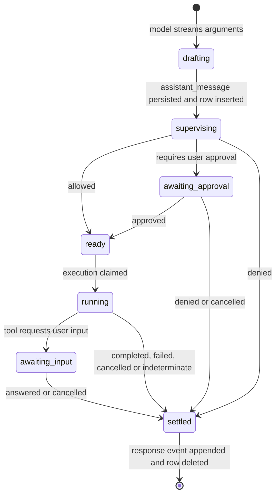

# Durable conversation data model

Status: **proposal**, not the current physical schema or an implementation/migration plan.

## Concept

A conversation is the persistent entity. Its current configuration and selected history drive model requests and tool execution; an agent is that runtime behavior, not another stored entity. Child conversations have the same structure as their parents. The top-level conversation list selects conversations whose parent is null; users navigate into children from their parent.

History is append-only and branchable. Configuration is current-only: selecting an earlier history position does not restore old model, reasoning, prompt or permission settings, and configuration keeps no revision history. There is no immutable read-only ceiling; authorized configuration changes govern future operations. Tool calls already claimed for execution retain their captured execution authority.

Child orchestration is fixed behavior, not stored policy: there are no budgets, depth limits, concurrency limits, parent grants or per-child orchestration settings. Deliberately stopping a parent stops its children. These can be added later if a concrete need appears.

## ER diagram

`enum` denotes a closed, validated set. `json` denotes a validated, versioned structure, not arbitrary untyped data. UUIDs illustrate stable identities rather than mandate a particular ID encoding. Nullable references must stay within the appropriate conversation or parent relationship. Projects are outside this model; `project_id` references the existing project entity.

```mermaid
erDiagram
    CONVERSATION {
        uuid id PK "Stable identity for navigation, history ownership and addressing"
        uuid project_id FK "Owning project; scopes conversation lists and project-level features"
        uuid parent_conversation_id FK "Nullable; links a child to its parent; null identifies a top-level conversation"
        uuid active_context_event_id FK "Nullable; selects the current branch head; null selects empty context"
        string title "Human-readable label for conversation navigation"
        enum status "idle | running | waiting | failed | interrupted; cached execution state for fast list rendering"
        bigint status_event_sequence "Identifies the latest event incorporated into the rebuildable status projection"
        datetime status_cleared_at "Nullable; user dismissal of a failed or interrupted status; survives status rebuilds"
        boolean paused "Persists explicit pause without a control event; prevents automatic processing regardless of execution status"
        bigint next_input_sequence "Allocates acceptance order for the input queue"
        datetime pinned_at "Nullable; null means unpinned; also orders pinned conversations"
        datetime completed_at "Nullable; user marked the conversation done; null means not completed"
        datetime last_user_message_at "Nullable; delivery time of the latest user_message event, human or parent submitted"
        datetime created_at "Records conversation creation"
        datetime updated_at "Supports recent-activity ordering without scanning the event history"
    }

    CONVERSATION_CONFIG {
        uuid conversation_id PK,FK "Associates exactly one current configuration with its conversation"
        json model "Provider and model ID; selects the model for future requests"
        enum reasoning_level "off | minimal | low | medium | high | xhigh | max; selects effort supported by the chosen model"
        string system_prompt "Nullable; supplies a custom system prompt; null selects the generated default"
        string permission_rule_set_id "Selects a code or file-defined permission policy; the only permission and filesystem-access control; not a database foreign key"
        enum mode "planning | coding; selects operating behavior and generated prompt guidance"
        json enabled_tools "Tool-name list; controls availability, not authorization; null uses defaults; empty disables all"
        json enabled_skills "Skill-name list; selects loaded skills; null uses defaults; empty disables all"
        string working_directory "Sets the starting directory for commands and relative paths"
    }

    CONVERSATION_EVENT {
        uuid id PK "Stable identity for event references and branch navigation"
        uuid conversation_id FK "Identifies the conversation owning this durable fact"
        bigint sequence "Orders all durable events within the conversation for replay and pagination"
        uuid previous_context_event_id FK "Nullable; links context-bearing events into a branching history; operational events do not join that chain"
        enum event_type "user_message | assistant_message | system_event | tool_call_response | compaction; identifies the application fact and payload schema"
        enum llm_representation "none | user | assistant | tool_result; selects canonical context contribution before Pi provider adaptation, not a provider wire role"
        uuid turn_id "Nullable; groups one model invocation with its output and associated tool processing"
        uuid input_id "Nullable; identifies the queued input delivered by this event and recognizes submission retries after queue deletion"
        json payload "Preserves versioned content, tool outcome and supervision record, system subtypes or compaction boundaries"
        datetime created_at "Records persistence time for transcript display and diagnostics"
    }

    TOOL_CALL {
        string id PK "Tool-call ID; pairs the call with its eventual tool_call_response event"
        uuid conversation_id FK "Identifies the conversation executing the call"
        uuid turn_id "Groups calls issued by one model invocation; the next model request waits for all of them"
        uuid assistant_event_id FK "Nullable; assistant message containing the call; null for user-issued direct commands"
        int content_index "Nullable; position in the assistant message; orders results in model context"
        enum origin "model | user; distinguishes model-issued calls from direct user commands"
        string tool_name "Identifies the tool implementation"
        json arguments "Final arguments; streaming drafts are never persisted"
        enum state "supervising | awaiting_approval | ready | running | awaiting_input; only unfinished states exist"
        json supervision "Nullable until evaluated; decision, matched rule and captured execution authority"
        json interaction "Nullable; kind approval | user_input | plan_review with request, resolution and resolution request ID"
        uuid execution_claim "Nullable; set when running; fences stale workers from settling the call"
        datetime updated_at "Records the latest durable transition"
    }

    INPUT_QUEUE {
        uuid input_id PK "Stable caller- or producer-supplied submission ID; distinguishes retries from intentional repeats"
        uuid conversation_id FK "Identifies the conversation receiving the input"
        bigint acceptance_sequence "Preserves acceptance order across all input sources"
        enum source "user | parent_conversation | system; identifies the submitter and content schema"
        uuid sender_conversation_id FK "Nullable; identifies the submitting parent when source is parent_conversation"
        json content "Prompt text with image paths and executable blocks, or notice type, producer and typed payload"
        enum delivery_target "next_turn | specific_execution | next_execution; prevents consumption at an unintended processing boundary"
        uuid target_execution_id "Nullable; references an execution-start event; selects a required execution or one that must finish first"
        json command_preparation "Nullable; prompts only; per-block commands, authority, receipts and results; states: not_started | running | completed | cancelled | indeterminate | not_run"
        string prepared_text "Nullable; final prompt after command-block replacement; null means preparation is unfinished or not applicable"
        boolean wake_when_idle "Controls whether acceptance activates idle processing or only queues the input; never overrides pause"
        datetime accepted_at "Records durable acceptance time for queue display and diagnostics"
    }

    ASSET {
        uuid id PK "Stable identity referenced from event payloads"
        uuid conversation_id FK "Owning conversation; drives deletion of stored files"
        uuid event_id FK "Nullable; event that references the asset; null while the producing tool call is unfinished"
        string tool_call_id "Nullable; producing tool call, for in-flight output and diagnostics"
        enum category "payload | report | image | plan | task_log; selects retention and display handling"
        string logical_path "Managed storage location"
        string digest "Nullable; content hash for integrity checks"
        bigint byte_length "Stored size"
        string media_type "Nullable; content type for display"
        datetime created_at "Supports orphan cleanup of assets never linked to an event"
    }

    CONVERSATION o|--o{ CONVERSATION : "parent of"
    CONVERSATION ||--|| CONVERSATION_CONFIG : "has current configuration"
    CONVERSATION ||--o{ CONVERSATION_EVENT : "owns durable events"
    CONVERSATION_EVENT o|--o{ CONVERSATION_EVENT : "context predecessor"
    CONVERSATION o|--o| CONVERSATION_EVENT : "selects active context head"
    CONVERSATION ||--o{ TOOL_CALL : "executes unfinished calls"
    CONVERSATION_EVENT o|--o{ TOOL_CALL : "assistant message issues"
    CONVERSATION ||--o{ INPUT_QUEUE : "receives inputs"
    CONVERSATION o|--o{ INPUT_QUEUE : "parent submits"
    CONVERSATION ||--o{ ASSET : "owns stored files"
    CONVERSATION_EVENT o|--o{ ASSET : "references"
```



`paused` is deliberately separate from derived execution status: idle does not tell the scheduler whether it may start queued work. Pause is a current control, not a rewindable history event.

`status_cleared_at` hides a failed or interrupted status that the user dismissed. A rebuilt status that is failed or interrupted is shown only when its event is newer than this timestamp. The next execution start supersedes it anyway.

`last_user_message_at` changes only when a `user_message` event is delivered, whether a person or the parent submitted it. Compaction summaries, tool results and system notices never update it, even though some of them reach providers as user-role messages.

## Application events and Pi projection

The five application event types are independent of provider message packaging. No separate transcript `role` column is necessary: message event types identify transcript roles; tool and system event types identify their application semantics. Tool requests are not events. Their arguments live in the assistant message content and, while unfinished, in `TOOL_CALL`.

| Application event | Canonical contribution | Required payload meaning |
| --- | --- | --- |
| `user_message` | `user` | Final delivered prompt, original submitted text, submitter and command-preparation receipts where applicable. |
| `assistant_message` | `assistant` | Ordered response content, including text, thinking and tool-call blocks with arguments, usage, stop reason and response provenance. |
| `system_event` | `none` or `user` | Typed application notice or execution transition; application provenance does not grant provider-system instruction authority. |
| `tool_call_response` | `tool_result` for model-issued calls; `user` or `none` for direct user commands, depending on context inclusion | Matching call ID, tool name, origin, originating assistant event and content index, outcome, typed result content, supervision record and asset references. |
| `compaction` | `user` | Summary text and the retained-history boundary described below. |

Tool-call blocks inside the assistant message become Pi `toolCall` content; a tool call does **not** create another assistant message. Tool responses become Pi `toolResult` messages, ordered by the originating content index rather than completion order. Persist neither Anthropic's user-role result packaging nor OpenAI's tool-role packaging as the application meaning.

The configured system prompt is supplied separately. The context projection produces Pi-compatible messages, and Pi's provider adapter constructs the wire request. Installed Pi AI 0.99.1 confirms these mappings:

| Provider API | Tool request | Tool response |
| --- | --- | --- |
| Anthropic Messages | Assistant `tool_use` block | User `tool_result` block |
| Google Gemini | Model `functionCall` part | User `functionResponse` part |
| OpenAI Chat Completions | Assistant `tool_calls` | Tool-role message |
| OpenAI Responses | `function_call` item | `function_call_output` item |

`llm_representation` specifies how an event can contribute, not whether it appears in every request. Selected branches and compaction determine inclusion. Provider switching rebuilds messages through Pi adaptation without rewriting historical events. Because this column restates information derivable from `event_type` and payload, validation must reject contradictory combinations.

### System-event payloads

Proposed closed payload subtype enum:

```text
task_event | sub_conversation_event | user_intervention | notification | execution_state
```

The first four can be queued. `execution_state` is an application lifecycle fact, not queued model input. It covers provider failure before any tool exists, retries, waiting and completion of text-only processing. Its proposed transition enum is:

```text
started | waiting | retrying | completed | failed | cancelled | interrupted
```

Retry metadata can indicate exhaustion. Waiting details identify the tool call awaiting approval or input, or the child assignment being awaited. Execution starts are identified by their event IDs; later transitions reference that start in their payload. This supports an assignment spanning multiple model turns without adding an execution table or an execution-ID column to every event. Queue execution targets reference those start events.

Task notice subtype values come from the current input-notice contract. Task status is a separate existing enum:

```text
starting | running | ready | stopping | completed | failed | timed_out |
cancelled | orphaned | recovered | interrupted | recovery_unknown
```

Child completion must identify the exact assignment, not just the child conversation's current state. A waiting Explore tool receives its report as `tool_call_response`; an asynchronous assignment notifies its parent through a queued `system` input. There is no `explore_report` event type and no separate obligation tracking.

## Tool-call lifecycle

Every tool call follows the same lifecycle; individual tools may skip states. `TOOL_CALL` holds only unfinished calls, like `INPUT_QUEUE` holds only undelivered inputs. Reaching a terminal outcome appends one `tool_call_response` event and deletes the row in the same transaction. The event log gains one event per call regardless of how many durable checkpoints the call passed through.



- **Drafting** is memory-only. If processing stops before the assistant message is persisted, no tool-call row exists; an `execution_state` event records the failure or interruption.
- **Supervising** has no side effects, so recovery re-evaluates it. The decision, matched rule and captured authority are written to `supervision` before leaving this state.
- **Awaiting approval** and **awaiting input** are durable suspension points. `interaction` stores the request; the resolution is written once, deduplicated by its resolution request ID. For `ask_user` and plan review, the user's answer is the tool result.
- **Running** is claimed before external effects. Only a worker holding the matching `execution_claim` may settle the call.
- **Settled** outcomes are `completed`, `failed`, `denied`, `cancelled` and `indeterminate`. The response payload preserves the supervision decision and interaction resolution after the row is deleted.

### Multiple calls in one assistant message

Calls from one assistant message progress independently. Some may be auto-allowed and running while a sibling awaits approval and another is denied with an error result. Whether allowed calls run while a sibling awaits approval is runtime policy, not schema. The conversation shows `waiting` while any of its rows is `awaiting_approval` or `awaiting_input`.

The next model request for a turn starts only when no `TOOL_CALL` row remains for that `turn_id`. Responses are appended in completion order. The context projection orders them by `content_index` so every assistant tool-call block is followed by exactly one matching result.

### Recovery

| Row state at restart | Action |
| --- | --- |
| `supervising` | Re-evaluate permission. |
| `awaiting_approval`, `awaiting_input` | Keep; the prompt reappears. |
| `ready` | Execute; no effects have occurred. |
| `running` | Re-run only tools declared safe to replay; otherwise settle as `indeterminate`. |

### Cancellation and force push

Stopping a turn settles every unfinished row for that turn: unstarted and suspended calls become `cancelled`; running calls are aborted and settle as `cancelled` or `indeterminate`. Force push is stop-then-drain: stop the current turn, then deliver queued inputs and start the next request. It needs no extra stored state; if the process crashes in between, recovery finishes the cancellation and the queue drains normally.

A tool that exceeds its foreground limit and is promoted to a background task settles normally with a response explaining the promotion and identifying the task. The task's later completion arrives as a queued `system` input.

## Compaction and branching

Compaction appends an event; it does not mutate or delete earlier history. Its payload contains the summary, source-history boundaries, and `first_kept_event_id` when recent pre-compaction context is retained.

On the selected branch, context assembly uses the latest applicable compaction:

1. Supply the current configured system prompt.
2. Include the compaction summary as a user message.
3. Include retained context from `first_kept_event_id` up to the compaction.
4. Include context-bearing events after the compaction.

Without a compaction, assemble the selected context path normally. Retained boundaries must preserve valid assistant/tool-call/result relationships; do not keep orphan tool responses.

Example:

```text
History:      A → B → C → D → Compaction → E → F
Summarized:   A and B
First kept:   C
LLM context:  current system prompt → summary → C → D → E → F
```

Selecting a branch changes `active_context_event_id`, not current configuration. A branch that needs a summary of the history it leaves behind appends a compaction on the new branch; there is no separate branch-summary event type. Execution facts remain in append order and must not be replayed as actions merely because an older context was selected. Branch changes require no unfinished `TOOL_CALL` rows. Parent and child histories branch independently; coordinated parent/child rewind is outside this proposal.

## Input queue, command preparation and identities

One queue holds user prompts, parent prompts and system notices. Rows contain only undelivered inputs: no delivered/cancelled state column and no separate idempotency-key column. Image locations remain in prompt text; there is no image-attachment column.

- `input_id` identifies a submission. The sender reuses it when retrying that submission; intentional repeated text gets a new ID. Before delivery, deduplicate against its queue row; after delivery, against the event's `input_id`. Reject reuse with different content.
- `turn_id` identifies one model invocation plus its associated tool processing. One prompt can produce several turns; several accepted inputs can be consumed during ongoing processing. An input identity is not a turn identity.
- Tool-call IDs pair `TOOL_CALL` rows and assistant tool-call blocks with responses.
- `specific_execution` requires a target execution-start event. `next_execution` may name the execution that must finish first; `next_turn` is eligible at the next safe turn boundary.

A direct `!command` retains its current direct command path, not the ordinary queue path. It creates a `TOOL_CALL` row with `origin = user` and no assistant event, then settles into a `tool_call_response`. When included in context, its output is projected as user content, not an orphan Pi tool result without a model-issued call.

Fenced `!!!` blocks inside a prompt use durable per-block preparation in the queue row, not `TOOL_CALL` rows. Record progress before execution, reuse confirmed results, and mark uncertain outcomes `indeterminate` rather than automatically rerunning commands. `completed` preparation means an outcome was recorded, not necessarily that the command succeeded. Results are expanded into the prompt; receipts are preserved in the delivered `user_message` payload.

After command preparation and settlement of the current turn's tool calls, atomically append delivered inputs in acceptance order, advance the context head, update `last_user_message_at` for delivered prompts and delete the corresponding queue rows.

Cancellation removes an undelivered queue item without a cancellation-history event. Consequently, deduplication covers pending and delivered submissions, **not indefinitely cancelled submissions**. A stronger cancellation retry guarantee would require separate durable receipt/tombstone storage, such as the existing expiring RPC idempotency store; it is not silently promised here.

## Assets and deletion

Large tool outputs, reports, images, plans and task logs live in managed storage tracked by `ASSET`. An asset row is created when its file is written, which may be before the referencing event exists, for example output streamed by a running tool. Settling the event links `event_id`.

Deleting a conversation deletes its children recursively: collect all assets owned by the affected conversations, delete their files, then delete asset rows, tool-call rows, queue rows, events, configuration and conversations. Asset rows with null `event_id` whose producing tool call no longer exists are orphans and may be cleaned up.

## Durability and access paths

- Commit event appends, context-head updates, affected projections, tool-call row deletion and queue deletion transactionally.
- Allow one active model execution per conversation; fence stale workers with `execution_claim` and pending input preparation before branch changes.
- Validate configuration edits against the caller's authority: the user, the conversation itself or its parent. No ceiling does not mean a child may grant itself arbitrary permissions.
- Reconstruct lifecycle status from execution-state events and unfinished tool calls; explicit pause and status dismissal remain current conversation state. Repair cached status without invoking providers or tools.
- Retain tool authority and uncertain-outcome evidence; crash recovery must not blindly repeat external effects.
- Use unique `(conversation_id, sequence)` event ordering and an index on non-null `input_id` for delivered-input lookup. Only the delivery event carries that input ID, not every related tool event.
- Index conversations by `(project_id, parent_conversation_id, updated_at, id)` for project root lists and child navigation, and by `pinned_at` for pinned lists.
- Index the queue by `(conversation_id, acceptance_sequence)`.
- Index tool calls by `(conversation_id, turn_id)` for the turn barrier and by `state` for pending approvals and inputs across conversations.
- Index assets by `conversation_id` for deletion and by `event_id`.
- Index context predecessor and tool/assignment correlation access paths. Use rebuildable checkpoints for long histories rather than replaying everything on every open.

This is the conversation-layer model. Projects, process/task supervision, secrets and settings keep their own storage. This proposal does not claim exactly-once external effects.

## Current storage this replaces

| Current storage | Replacement |
| --- | --- |
| `conversation_records`, `conversation_record_projections`, conversation journal documents | `CONVERSATION_EVENT` plus cached conversation columns |
| `agent` documents, `agent_context_leaves`, `agent-context-binding`, context-prefix migration | `CONVERSATION`, `CONVERSATION_CONFIG`, `active_context_event_id` |
| `agent_inputs`, `agent_input_preparation`, `agent-delegation-input` | `INPUT_QUEUE` |
| `lifecycle_work`, `lifecycle_tool_proposals`, `lifecycle_interactions`, `lifecycle_execution_attempts`, `run_lifecycle_records`, suspensions, `tool_call_projections` | `TOOL_CALL` plus `tool_call_response` and `execution_state` events |
| `agent_async_obligations`, `subagent_completions`, `agent-run-completion`, async-subagent documents | Queued `system` inputs and `tool_call_response` events |
| `file_assets` | `ASSET` |

Dropped without replacement: agent budgets, depth and concurrency limits, orchestration policy, parent grants, `instructions`, `permissionLevel`, workspace scope (allowed roots and the read-only flag; permission rule sets govern filesystem access), configuration revisions and acceptance receipts, read-only ceilings, branch-summary entries and the `explore_report` entry kind.

## Current-code evidence

- [Conversation kinds and transcript roles](../../packages/contracts/src/domains/conversations/conversation-state.ts).
- [Agent record and configuration](../../packages/contracts/src/domains/agents/agent.ts).
- [Queued system-notice discriminants and task event subtypes](../../packages/contracts/src/domains/agents/agent-input-notice.ts).
- [Task status contract](../../packages/contracts/src/domains/tasks/task.ts).
- [Run lifecycle, interactions and execution attempts](../../packages/contracts/src/domains/runs/run-lifecycle.ts).
- [Command preparation contract](../../packages/contracts/src/domains/agents/agent-input-preparation.ts) and [execution/recovery implementation](../../packages/workbench-server/src/domains/agents/execution/agent-input-preparation.ts).
- [Inline command and executable-block syntax](../../packages/contracts/src/domains/completions/inline-command.ts).
- [Current compaction context assembly](../../packages/harness/src/conversation/context.ts) and [conversion into Pi messages](../../packages/harness/src/messages/messages.ts).
- [Current workspace/delegated authority checks, superseded by rule sets](../../packages/workbench-server/src/domains/agents/agent-authority.ts).
- [Permission rule-set loading](../../packages/workbench-server/src/domains/permissions/permission-policy.service.ts): built-in policies are code-defined; custom sets and overlays are file-backed.
- [Canonical SQLite schema](../../packages/workbench-server/src/infrastructure/persistence/canonical-sqlite/schema.ts) and [domain-document namespaces](../../packages/workbench-server/src/infrastructure/persistence/payloads/descriptors.ts).
- Pi AI 0.99.1, pinned in [harness dependencies](../../packages/harness/package.json), inspected locally in `dist/types.d.ts` and the Anthropic, Google and OpenAI API adapters.

Read-only examination of `data/storage-1/data/nerve.sqlite` during the design discussion covered 2,517 records across 12 recently updated conversations, plus queue/preparation documents. It confirmed structured assistant tool calls, tool results, child-completion notices, notifications, retry/failure statuses and compaction. That bounded sample was not an exhaustive inventory; task-notice and inline-command flows were verified in code separately.
