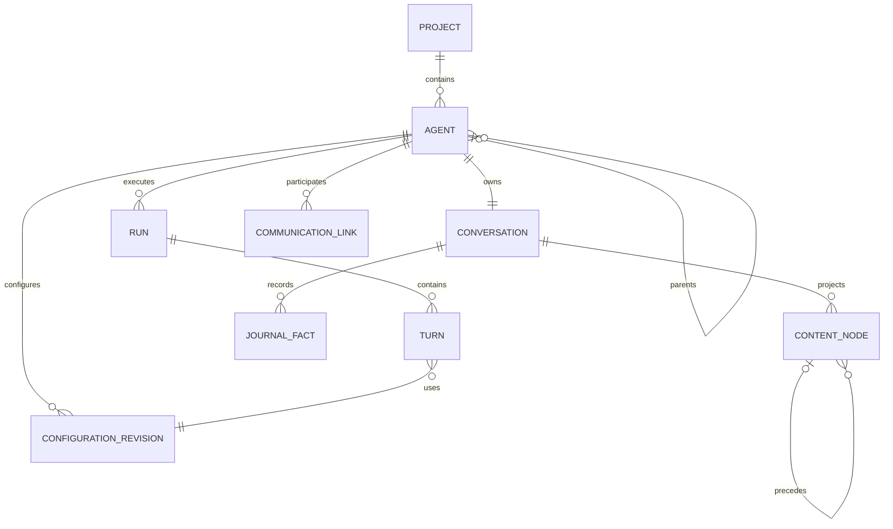
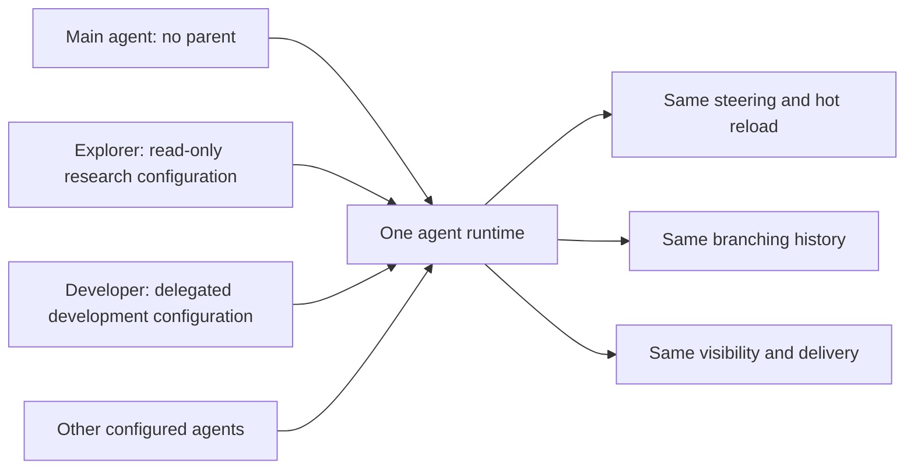

# Agent model

Part of the [generalized agent runtime proposal](README.md). Fields describe target concepts, not current API schemas.

## One blueprint

Creating a user-facing conversation creates an agent and its conversation. A child is the same entity with a parent. The user can switch to its conversation and steer, stop, or configure it through the same services as a main agent, subject to authorization. This does not reparent it or silently detach its assignment.



Parent chains are acyclic and depth-bounded. Roots have no parent; delegated children require one. Parentage establishes reporting and delegated management authority, not a different execution engine.

Each agent owns one logical conversation, containing branches and many runs over time. It has one selected branch/head for execution. Team views aggregate separate histories. Historical shared/branched conversations require explicit migration mappings, not destructive rewriting.

## Configuration determines capabilities

| Concept                       | Meaning                                                                        |
| ----------------------------- | ------------------------------------------------------------------------------ |
| ID and name                   | Stable identity and optional human label; labels are not authorization handles |
| Model and reasoning effort    | Provider/model selection and per-turn execution settings                       |
| Conversation                  | Owned canonical history and selected branch/head                               |
| Parent                        | Optional delegation/reporting relationship                                     |
| Tools                         | Enabled operations, authorized separately at dispatch                          |
| Skills                        | Enabled structured references rendered into system instructions                |
| System prompt                 | Authored base instructions and composition provenance                          |
| Modes                         | Coordination/planning behavior and corresponding instructions/tools            |
| Permission rule set / overlay | Resolved policy, constrained by the caller's authority and delegated grants    |
| Project and cwd               | Project association and starting execution directory                           |
| Workspace scope               | Allowed roots, access constraints, and sandbox boundaries                      |
| Input lanes                   | User/system inputs projected from durable acceptance facts                     |
| Controls                      | Admission, activation/paused state, generation, and depth/concurrency budgets  |

There is no intrinsic rule that children cannot ask the user, enter planning mode, or delegate. Enable those capabilities through configuration and authorization. An explorer or developer preset can still choose to exclude them. Users and parents do not necessarily possess equal authority to edit these settings.

## Hot reload at each turn boundary

> Every agent adopts committed settings at the next turn boundary, not only at the next run.

A turn is one model invocation and its associated tool execution. Before the next invocation, resolve the latest committed configuration, eligible steering, and selected history into one effective turn context. That revision governs the invocation and its tool batch. Do not mutate an in-flight provider request.

Tools, skills, model, reasoning effort, coordination/planning mode, system prompt, cwd, and permission selection all use this mechanism. A queued system message is still distinct from changing the base prompt. Provider changes must be able to reconstruct selected context through the new adapter; unsupported combinations fail explicitly rather than silently using older settings.

Record both the configuration change and the revision actually used by the turn. Several edits can be accepted before one boundary; that turn uses the latest revision, while the journal retains all edits. If authorization/configuration resolution fails, record the blocker instead of falsely reporting that the new settings became effective.

```mermaid
sequenceDiagram
    participant User
    participant Service as Agent service
    participant History as Canonical journal
    participant Loop as Shared execution loop
    User->>Service: Change tools, skills, model, modes or policy
    Service->>History: Commit configuration revision
    Service-->>User: Accepted, pending turn boundary
    Loop->>History: Resolve latest revision and eligible input
    Loop->>History: Record turn started with effective revision
    Loop->>Loop: Invoke provider and execute associated tools
```

Ordinary policy edits follow the boundary rule. Emergency revocation or stop is a separate control: dispatch enforces current safety constraints, and unsafe in-flight work may need cancellation. No hot-reload guarantee can undo already completed effects.

Effective context records model/settings, available tools, resolved policy, cwd, immutable skill/prompt provenance, and selected history/input references. Mutable skill names or file paths alone cannot reproduce old instructions; retain content or immutable references subject to privacy policy.

### Branching does not restore settings

Selecting an older history point changes context and coordinated child history, not agent-wide settings. New turns use current configuration. An explicit historical-configuration restore can be offered later, under current authorization. Old effective revisions remain inspectable regardless of current settings.

## Authority, not agent kinds

Tool availability and operation authorization remain separate. A shell tool may be enabled while a command is denied. Skills and instructions cannot grant permissions.

Conceptually, model-driven child authority is bounded by platform/workspace constraints, delegated grants, and its resolved policy. Rule ordering and overlay semantics remain the policy engine's responsibility; concatenating lists is not an authority model.

Authorized users can administer/steer children directly without pretending to be the parent. User-originated changes may exceed a parent's delegated editing rights, but never platform constraints. Parent operations remain bounded by their own grants; knowing an agent ID grants nothing.

Origin and model role are distinct. Parent assignments are normally user-role input. Trusted infrastructure may generate system routing instructions, but tool output, skill content, and child responses must not elevate themselves into privileged system instructions.

## Configured specializations



Explore remains convenient batch orchestration: fresh configured children, bounded concurrency, read-only enforcement, report formatting, and caller waiting. Developer delegation usually creates reusable children with write capabilities. Neither requires a separate runtime or hardcoded interaction prohibition.

“One-shot” describes how orchestration uses an agent, not an inherent inability to accept follow-up input. Parent-run cancellation attachment and survival across assignments are explicit orchestration policies. All use the same admission, cancellation, history, configuration, and completion services.
