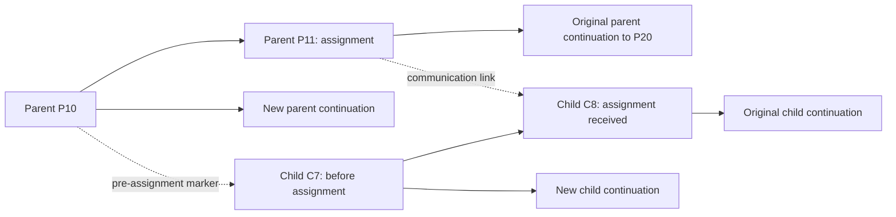

# Branching and delegation

Part of the [generalized agent runtime proposal](README.md).

## Bind points, do not copy snapshots

> Every parent/child communication binds exact historical points in both conversations. Rewinding the parent selects compatible child prefixes; original histories remain intact.

The agent ownership tree and each conversation's content tree are different structures. Branching the parent does not clone child agents, copy their transcripts, or change their settings. It changes the selected history state of the affected team.

A lightweight **history marker** references agent/conversation, branch identity, content head, and journal frontier. The head selects content ancestry; the frontier and branch association select the durable facts about it. An empty conversation has an explicit baseline marker. This is not a serialized snapshot of settings, tools, files, or a live harness.

A **communication link** has stable identity, direction/kind, parent/child identities, source/target interaction or input identity, and before/after history markers for both sides. Child creation also records membership and an initial marker. Links are immutable canonical references with query indexes.

## Example: assignment at parent message 11

Suppose the parent has messages P1–P20. Its eleventh message assigns work to a reusable child, whose selected head immediately beforehand is C7.



Selecting a continuation from P10 selects the child at C7, before it received that assignment. P11–P20 and C8 onward remain on the original branches and can be inspected later. A new assignment on the revised parent branch appends a new child continuation from C7.

Message numbers are explanatory, not storage identifiers. The actual operation uses stable content/fact IDs and journal boundaries. If the assignment was accepted into a queue before being delivered as C8, its acceptance belongs to the excluded suffix too: it must not later wake the revised child.

## Communication boundaries

| Communication | Required markers and causal references |
| --- | --- |
| Child creation | Parent creation/membership fact; child's initial baseline |
| Parent assignment/steering | Parent dispatch boundary; child head/frontier before acceptance; linked accepted input boundary |
| Child completion/result | Child producing run/output boundary; parent boundary before/after acceptance of the completion |
| User steering of child | Child input origin and boundary; correlated parent intervention notice where delivered |
| Parent management affecting execution | Linked stop/resume/control facts and affected generations; not implicit history mutation |

Dispatch and acceptance are a cross-agent transaction in the shared canonical store. Capture the child's marker before accepting the input, append linked facts in both journals, update projections, and persist delivery work together. Sending a hint happens afterward. Child delivery and completion append later facts under the same correlation identity.

Markers identify committed prefixes even if the child is currently running. They do not freeze its live process at communication time. Switching back to a marker later requires fencing and settlement before execution resumes.

Completion links bind the precise response and its originating branch/run, not the child's latest mutable status. A later result from a superseded assignment cannot enter the new parent branch merely because agent IDs still match.

## Resolving child history for a parent branch

The selected parent prefix defines branch-local membership and communication bindings:

1. Retained links establish which child points the parent actually referenced.
2. The first excluded parent-to-child assignment provides its **pre-acceptance child marker**. In the example, excluding P11 selects C7, not the child head at the time of P10's wall-clock timestamp.
3. Without an excluded assignment, use the latest compatible retained binding, or the child's creation baseline when no later bound history is available. Do not guess an exact checkpoint from timestamps or silently use the child's current head.
4. Validate markers form a compatible causal prefix. Include dependencies of retained facts; never combine a parent result with child history that excludes its producing output. Conflicting/unavailable bindings block automatic selection and require explicit reconciliation.
5. Resolve descendants from their own retained/excluded communication links, recursively. Change only the affected subtree.

This is **communication-boundary consistency**, not a time-travel snapshot of the entire team. A child may have progressed independently between parent messages. The marker before P11 captures that committed prefix, even if some of it happened after P10 was written. Intermediate progress not captured by a binding cannot be reconstructed as an exact global-time state.

Direct user intervention does not create hidden, untracked input. Its child journal records origin; parent notices create explicit bindings when accepted. Rewinding to a marker can exclude later user-intervention suffixes from the selected child path, but preserves them on the original branch. Show affected user work in the branch preview; do not silently discard it. If retained parent facts depend on those suffixes, reject an inconsistent cut rather than guess.

A child created only in the excluded suffix is no longer a member of the selected parent branch. It remains an inspectable historical agent, with its structural parent identity intact, but is paused/detached from active branch reporting and cannot wake the revised parent. Structural ownership and branch-local active membership are separate concepts.

## Coordinated selection is an explicit operation

Selecting a parent branch can affect several agents. The operation should show the affected histories, queued work, interactions, and known external effects before committing.

```mermaid
sequenceDiagram
    participant User
    participant Service as Branch service
    participant Workers as Affected workers
    participant DB as Canonical store
    User->>Service: Continue parent from selected point
    Service->>DB: Record switch intent, pause admission and fence affected generations
    Service->>Workers: Cancel affected execution
    Workers-->>Service: Settled or outcome uncertain
    Service->>DB: Validate links and settle uncertainty policy
    Service->>DB: Atomically select parent/child prefixes and classify old work
    DB-->>Service: New branch generations and publication intents
    Service-->>User: Selected team state; old branches preserved
```

Do not change active heads while old workers can still commit into them. Every write validates execution and branch generations. If a tool's outcome is uncertain, the switch remains blocked or explicitly paused for reconciliation; it must not pretend cancellation reversed the effect. A durable switch intent makes crashes midway recoverable. Only after settlement and atomic selection can replacement execution be admitted.

Selecting history and running it are distinct actions. A branch selection creates no automatic continuation unless explicitly requested. Agent settings remain current; turning back to the original branch does not resume the old harness.

If a selected prefix retains input acceptance but excludes its later delivery, the historical projection may show it pending. That is not permission to resurrect the old delivery lease. Explicit continuation must revalidate/rearm work under the new branch generation and check known effects on preserved suffixes. Previously executed or uncertain tools must not be repeated merely because their result is outside the selected path.

### Queue, interaction, and notification disposition

- Inputs accepted only on excluded branches cannot migrate automatically to the new branch. Keep them visible there; mark active delivery work superseded/cancelled.
- Pending general input is branch-bound too. Carrying it forward requires an explicit new acceptance linked to the original; do not duplicate or silently retarget it.
- Old approvals/questions remain inspectable. Resolving them cannot authorize new-branch execution. Explicit continuation may create/rebind a fresh interaction after current policy validation.
- Completion/publication retries retain their original branch/generation. Historical publication may finish, but it cannot update the active status incorrectly or wake a revised parent.
- Admission resumes only under the new activation generation. User stop and switch fences cannot be bypassed by old wake hints.

## What rewinding does not undo

It does not restore model/tools/skills/settings, revert the working tree, kill detached external processes by implication, reverse network calls, or erase approvals already acted upon. Those effects are recorded and surfaced, but need separate reconciliation/rollback facilities. Continuing from before a tool call may encounter a world already changed by that call.

Reusing a child ID is compatible with one selected execution branch per agent. Concurrent execution of old and new child branches would require an explicit fork into another agent or a separate multi-session design; it is outside the initial model.

## Efficiency and retention

Store small marker/link records and shared immutable prefixes. Index links by parent branch/event boundary and child identity, so resolving one parent rewind does not scan all child transcripts. Cache resolved branch membership/head maps as rebuildable projections. Only affected descendants participate in coordinated selection; unrelated agents continue.

Retention must preserve referenced markers, fact prefixes, configuration provenance, and assets. Old history without reliable bindings cannot support an invented automatic rewind: expose the missing boundary and offer a deliberate fresh-child/reconciliation choice.

## Validation scenarios

- P11 assignment excluded by P10 branch selects C7, including when the input was queued but not delivered.
- Branch after a retained completion includes the exact child output it references.
- Multiple assignments, child-to-parent responses, direct user steering, and nested grandchildren resolve to compatible prefixes.
- Child created on excluded suffix remains visible historically but cannot reactivate the parent.
- Switch during tools, questions, queue claims, or publication survives restart and fences stale writes/wakeups.
- Switching back preserves both histories and current settings; no tools are implicitly rerun and no external rollback is claimed.
