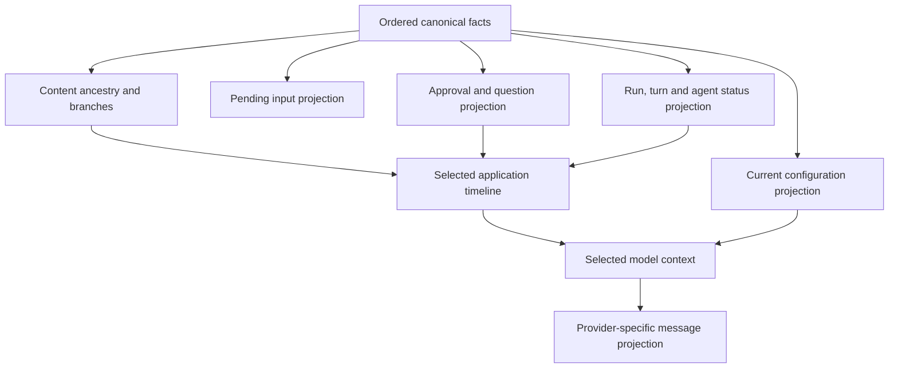
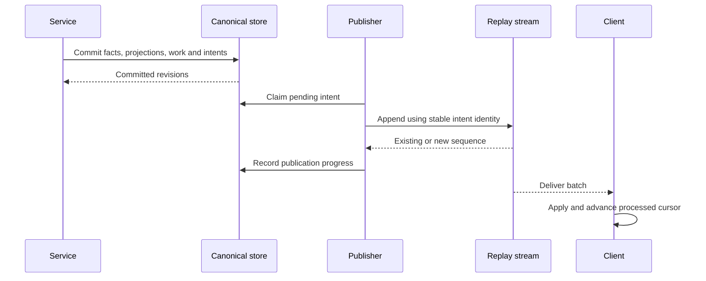

# Conversations, storage, and events

Part of the [generalized agent runtime proposal](README.md).

## One history, multiple projections

> All conversation-affecting durable facts belong to one canonical journal per agent. Fast read tables are projections, not competing histories.

The existing [storage architecture](../../architecture/storage.md), [canonical schema](../../../packages/workbench-server/src/infrastructure/persistence/canonical-sqlite/schema.ts), [journal contract](../../../packages/contracts/src/domains/conversations/conversation-journal.ts), [materializer](../../../packages/workbench-server/src/domains/conversations/conversation-state-materializer.ts), and [lifecycle work database](../../../packages/workbench-server/src/infrastructure/persistence/canonical-sqlite/lifecycle-work-database.ts) describe today's implementation. Today, run/work authority is partly separate from transcript authority. The target deliberately strengthens the journal boundary; this is not just renaming existing tables.

One journal means one ordered source for reconstructing conversation behavior, not one giant JSON document, a single provider-message array, or one globally ordered log for every agent.

## Journal facts and conversation nodes

Two orders must remain explicit:

- **Commit order:** monotonically ordered durable facts within a conversation.
- **Ancestry:** parent references defining content continuations and the selected linear path.

A committed fact has a stable ID, conversation/agent identity, journal revision, kind, authenticated origin, correlation/causation references, branch association, timestamp, and content or managed references. Relevant facts also identify content node, run/turn/attempt, interaction, configuration revision, and communication link. Not every field belongs on every kind; these are conceptual requirements, not a flat schema.

Content-producing facts define nodes with stable IDs and parent references. Other facts describe their lifecycle: a tool approval decision targets a tool interaction; it need not become an artificial provider message or content-tree node. Later changes append facts, rather than overwrite canonical history.



Branch selection includes a content head and a journal frontier/branch association for facts about that path. A content head alone is insufficient: an approval decision recorded later about the same tool node must not leak into a continuation selected before that decision. Branch-aware projection reconstructs the selected prefix and its interaction state. Agent-wide current configuration is explicitly not rolled back by this historical projection.

## Record types are not provider roles

| Application fact family | Examples | Provider context |
| --- | --- | --- |
| Input | Accepted, cancelled, delivered user/system input | Only delivered content, with explicit role adaptation |
| Assistant | Output started, persisted chunk/checkpoint, finalized/interrupted | Selected assistant content |
| Tool | Invocation, execution authorized/started, result, failure/uncertainty | Provider tool-call/result representation |
| Human interaction | Approval requested/decided, question asked/answered/cancelled | Relevant answer/outcome through the interaction contract |
| Execution | Run/turn started, suspended, resumed, settled/interrupted | Usually metadata, not synthetic chat |
| Configuration | Revision committed, turn effective revision | Effective instructions/settings, not all edits as chat |
| Delegation | Child created, assignment accepted, completion received, history binding | Relevant assignment/result references |
| Branch control | Continuation created, active selection changed | Context selection, not provider content |

Providers differ. A tool result may use a dedicated tool role or a user-message content block. Preserve application meaning and interaction identity independently of that encoding. Unsupported system-role placement or tool sequences require explicit adapter validation; never silently reinterpret trust or fabricate missing results.

## Authority and physical storage

| Concern | Canonical source | Efficient representation |
| --- | --- | --- |
| Input acceptance, eligibility, cancellation, delivery | Journal facts | Indexed inbox view |
| Approvals/questions and their resolutions | Journal facts | Indexed pending-interaction view |
| Run/turn lifecycle and tool outcomes | Journal facts | Status and execution read projections |
| Content, branch ancestry, selection, communication | Journal facts and immutable referenced content | Node/branch/link indexes |
| Agent creation, configuration changes and effective revisions | Journal facts with durable revision references | Identity/configuration indexes and immutable revision payloads |
| Large complete payloads | Managed assets referenced by committed facts | File ownership/digest index and safe previews |
| Work leases, fences, admission lock, publication progress | Operational transactional metadata | Dedicated bounded work/control tables |
| Replay notifications | Replay store, derived from committed facts | Sequenced streams and snapshot cursors |
| Live tokens/progress | No recovery authority unless explicitly checkpointed | In-memory live buffers |

Operational metadata coordinates workers; it must not be the only place an approval answer, input acceptance, or run outcome exists. Persist corresponding facts and maintain projections atomically. Rebuilding read state never invokes tools/providers. Recovery reconciles leases with the journal before admitting new execution.

## Efficient storage and loading

- Append compact facts and update only affected projection rows. Do not rewrite the complete transcript for each change.
- Store content and large tool/report payloads once. Branches share ancestry and asset references instead of copying prefixes.
- Index conversation/revision, content ID/parent, branch/head, interaction identity, input eligibility, and communication link boundaries. Exact DDL awaits query measurements.
- Page the selected path from recent nodes; fetch older segments on demand. Resolve ancestry from indexes, not by scanning unrelated branches.
- Checkpoint reconstructed state to bound hydration cost. A checkpoint identifies covered journal revision and branch/context state; history remains reconstructable from retained canonical data.
- Batch high-frequency output checkpoints if crash-surviving partial text is required. Token delivery does not require one SQLite write per token.
- Keep model-safe tool projections and UI previews distinct from complete payloads, following the [tool-result projection decision](../../decisions/tool-result-projection.md).
- Stage managed assets durably before referencing them in a commit. Unreferenced staged files may be collected; committed references must not point at incomplete writes.

A communication marker is an immutable reference to a branch/head and journal boundary, not a full conversation snapshot. See [branching and delegation](branching-and-delegation.md).

## Human interaction is durable conversation state

Tool supervision and Ask User follow the same pattern:

```mermaid
sequenceDiagram
    participant Loop as Agent loop
    participant DB as Canonical store
    participant UI
    Loop->>DB: Commit request, suspension fact and projection
    DB-->>UI: Durable interaction update
    UI->>DB: Authorized answer/decision with stable identity
    DB->>DB: Commit resolution and continuation work atomically
    DB-->>Loop: Wake hint
    Loop->>DB: Validate branch, interaction and generation
    Loop->>DB: Record continuation before further execution
```

Requests are durable before presentation; answers are durable before continuation. Restart reconstructs unanswered requests and already-resolved answers. Resolution retries deduplicate by identity. A stale UI response to an interaction on an inactive branch/generation cannot authorize current execution; reject it explicitly.

Branching at an outstanding request preserves historical visibility but does not automatically reactivate it. Continuing requires a new generation and explicit validation/rebinding of the interaction. A previous approval must not silently authorize a newly executed tool call. Uncertain tool effects require reconciliation rather than replay.

## Durable versus transient delivery

Durable facts determine accepted work, history, interaction outcomes, and execution state. Replay notifications announce those committed changes; they are not another domain history.

Transient activity includes token deltas, fine-grained progress, heartbeat, and temporary indicators. It carries agent, branch/execution generation, run/attempt, output identity, and live ordering information. It is disposable and repaired from current live baseline or durable output/status. It does not consume durable replay sequence numbers. Transient “done” is not settlement.

If output should survive a process crash, explicitly checkpoint it durably. Otherwise recover only its persisted prefix and mark interruption; do not imply every displayed token was saved. [Visibility and delivery](visibility-and-delivery.md) defines who receives live activity.

## Atomic commit and publication

One transaction validates expected history/configuration/branch/generation, appends facts, updates affected projections, writes operational work, and creates stable publication intents. Cross-agent communication updates both conversations and their binding in the same canonical SQLite transaction.



Publication follows commit. Retry after append but before acknowledgment returns the same sequence. Parent inbox delivery and client socket delivery are different effects; neither implies the other consumed an update. The SQLite path may append replay events and acknowledge intents transactionally, but socket delivery remains outside the transaction.

## Ordering, replay, and retention

Keep inbox acceptance sequence, journal revision, content ancestry, run/branch generation, and replay sequence distinct. No global clock is needed to bind parent/child points: explicit links carry exact references.

[StreamLogRegistry](../../../packages/workbench-server/src/infrastructure/events/stream-log-registry.ts) and [protocol streams](../../../packages/protocol/src/streams/event-stream.ts) already support sequenced delivery and processing cursors. Reconnect replays duplicates safely, detects gaps, and resynchronizes when history is unavailable or the epoch changes.

Snapshots pair domain revisions with coherent replay watermarks. Asynchronous publication requires a barrier or revision-aware overlap handling; an arbitrary latest cursor can skip changes not covered by the snapshot. Live buffers use a separate watermark and loss recovery.

Replay retention may be bounded independently of canonical history. Never prune pending interaction/input facts, communication bindings, referenced branch prefixes/assets, or unresolved publication work merely because replay events are old. Journal checkpoint/pruning policy must preserve supported reconstruction, branching, and audit promises. Deduplication windows are explicit, not infinite.

Deletion first fences execution and records durable deletion intent, then removes dependencies in recoverable bounded steps. Old branches and references must be considered before collecting child outputs or tool assets. Do not add a second authoritative file event log alongside SQLite.

## Validation focus

Test projection rebuild, selected-path paging, fact-frontier filtering, approval/question restart, stale resolution rejection, role adaptation, partial-output loss, cross-agent atomicity, duplicate publication, snapshot races, and referenced-asset cleanup. Verify replay pruning does not erase history and branch selection does not silently execute side effects.
