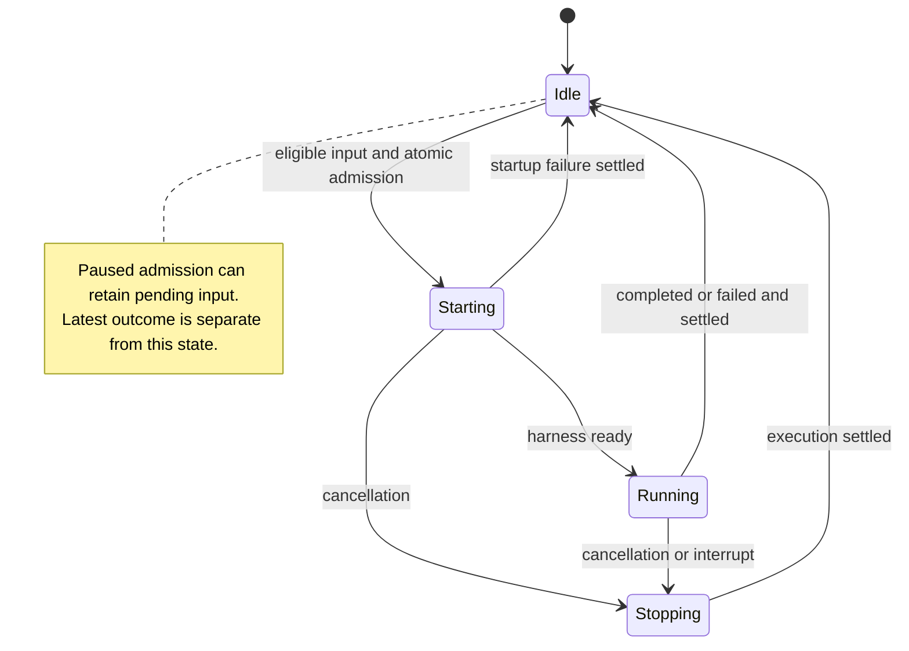
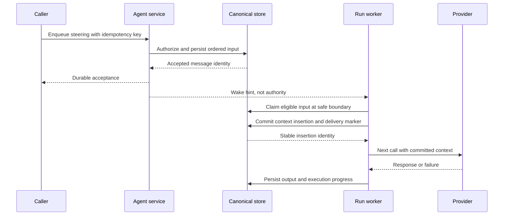

# Execution and messaging

Part of the [generalized agent runtime proposal](README.md).

## Asynchronous does not mean concurrent runs on one agent

An agent may be idle, active, or stopping, independently of its last run's outcome. Scheduling may also be paused. Admission reserves its execution slot durably before constructing a harness. Different agents execute concurrently; one agent never has two active harnesses writing its context.

A run has an ID, selected branch and input batch, execution/branch generation, attempt, timestamps, and a terminal outcome: completed, cancelled, failed, or interrupted by recovery. Each turn records its own effective configuration revision; settings can hot reload during a run. “Stopping” is not evidence of settlement. Blocking approvals/questions are journaled interactions associated with a run/turn/tool, not a second execution slot.

Authorized users can steer any agent directly, including children. Parent and user operations share the same admission/delivery services with different authorization and recorded origins. User intervention does not change parentage; a correlated parent notice can make it visible to the supervising agent. No agent kind intrinsically prohibits human interaction or hot reload.

## Durable agent inbox

The requested user and system queues are **two logical lanes over one journal-derived inbox projection**. Acceptance, cancellation, and delivery are canonical history facts; indexed pending rows make scheduling efficient without becoming a second history. Independent uncoordinated queues would make ordering ambiguous. A message includes:

- Stable ID, target agent, per-agent acceptance sequence, creation time, and idempotency key.
- Model role (`user` or `system`), authenticated origin, content or asset references, and correlation/causation IDs.
- Delivery policy, activation policy, originating branch/generation and communication link, optional target run/generation, and cancellation state.
- Claim/lease information, attempt count, delivered run ID, context insertion identity, and committed delivery time.

A model role is not an authorization decision. System-role admission requires a trusted producer. A parent assignment normally uses user-role input; a completion envelope can be trusted system metadata without promoting the child's response to instructions.

Acceptance is acknowledged only after its journal fact and projection commit. Retrying the same key and payload returns the same acceptance within the supported deduplication window; conflicting reuse is rejected. Pending input is visible in application history with its state but is not yet a delivered provider message. A parent assignment commits linked parent/child facts and a pre-acceptance child marker; see [branching and delegation](branching-and-delegation.md).

### Delivery policies

| Policy             | Active agent                                        | Idle agent                                                     |
| ------------------ | --------------------------------------------------- | -------------------------------------------------------------- |
| `steer`            | Deliver at the next safe boundary in the active run | Eligible for next admission if activation permits              |
| `follow_up`        | Remain queued for the next run                      | Eligible for next admission if activation permits              |
| Run-targeted input | Deliver only to the named run/generation            | Mark obsolete if that run has settled; never silently retarget |

Activation is explicit: `wake_if_idle` requests serialized admission; `manual` retains input without waking. Roles do not imply priority or activation. Batch limits and fairness budgets prevent a continual stream of steering from indefinitely starving settlement and follow-ups.

For the active run, select eligible steering in acceptance order. For next-run admission, select eligible untargeted pending input in acceptance order, with an explicit bounded batch. Within either selection, user/system role does not reorder input. Actual delivery order is recorded separately from acceptance sequence.

This deliberately permits a later steer to be delivered before an earlier follow-up, because the follow-up is ineligible for the current run. Example: message 41 is `follow_up`, message 42 is `steer`; run A receives 42 and run B later receives 41. Two separate queues must not accidentally invent this behavior—it is an explicit scheduling rule.

Run-targeted input that loses its target becomes visibly obsolete. General queued input survives a failed or cancelled run on the same selected branch unless explicitly cancelled. It does not silently migrate across a branch switch. A delivered input remains delivered even when its run fails; retrying the assignment requires a new explicit input linked to the original, not silent redelivery of the same conversation entry.

## Steering and interruption

Steering is cooperative: the model receives input at a safe turn boundary, before a subsequent provider call. At that boundary the shared runtime also resolves the latest configuration revision and records the effective turn context. It does not rewrite an in-flight provider request or undo a completed tool operation. If a tool batch is executing, settle its operations and associated records before inserting steering.

Interrupt is an explicit operation: request cancellation, fence the execution, wait for settlement, then admit replacement input. Do not start a replacement harness while the previous tool/provider attempt can still write. Uncertain external side effects require inspection or recovery intervention, not a promise that cancellation rolled them back.

Claiming is not delivery. The transaction that appends the conversation input also records committed delivery and a stable insertion ID. Provider submission is a later external action, not part of that transaction. Recovery reconstructs the committed context rather than appending the input again.

## Completion, reporting, and wakeup

Run settlement atomically appends terminal/output facts, updates lifecycle projections, releases the execution slot, and creates a correlated completion delivery intent. References include child agent, child run, branch/generation, outcome, response record if any, and owning parent; never present an older response as the output of the latest run.

A reusable child completes a run, not its lifetime. A parent may inspect results and enqueue another assignment. Small completion notices enter the parent's inbox with an explicit delivery/activation policy. Full results remain in the child's conversation or report asset and are referenced, not duplicated as another authoritative transcript.

Parent wakeup shares the same admission lock as user input and other completions. Multiple notices may share one admission batch. A completion from an old child execution or branch generation cannot mark newer execution idle or wake a revised parent. Accepting a result creates a communication link to the exact producing child history point. Suppressing wakeup does not erase terminal history or completion inspection state.

### Stop scope

- **Stop run:** cancel and settle its execution; pause automatic activation for that agent. Preserve general pending input for explicit resume, and obsolete run-targeted input.
- **Stop child through parent:** stop the child; report its settlement to the parent under the parent's activation policy.
- **Stop team:** fence the subtree, cancel relevant runs, and suppress automatic parent/descendant wakeups. Keep queued input visible, paused or explicitly cancelled.
- **Interrupt and replace:** explicit user/owner action authorizes replacement after settlement and overrides the pause only for that operation.

Wake requests carry the agent's activation generation. A prior request cannot unpause a user-stopped agent. Resume is explicit. Archiving/deleting an agent requires settlement and queue disposition before history/assets are removed; retention is not a cancellation mechanism.

## Restart and failure semantics

The journal owns accepted input, interaction, configuration, and execution facts. Inbox/lifecycle projections accelerate scheduling; work leases, admission locks, and fences coordinate execution transactionally. In-memory queues, wake hints, and harness registries are caches. Workers validate execution/branch generation and ownership at every committed mutation. Startup reconciles projections, claimed input, active runs, interactions, branch-switch intents, and publication work against history before admitting new execution.

| Failure window                                    | Required behavior                                                                      |
| ------------------------------------------------- | -------------------------------------------------------------------------------------- |
| Before acceptance commit                          | No acceptance acknowledgment; retry is safe                                            |
| After acceptance, before wake hint                | Scheduler finds pending durable work                                                   |
| After claim, before context insertion             | Expired/fenced claim can be retried                                                    |
| After insertion, before provider submission       | Rehydrate committed context; do not duplicate input                                    |
| During provider/tool execution                    | Fence old attempt; record interruption/uncertainty; do not blindly repeat side effects |
| After settlement, before notification             | Publish/retry persisted completion intent                                              |
| After publication, before delivery acknowledgment | Deduplicate by notification/message identity                                           |

Workers and notifications may execute at least once. Committed input effects are deduplicated. External provider/tool execution is not exactly once; a process loss may leave an effect whose outcome cannot be inferred from stored state.

## Behavioral validation targets

Test races, not just exported schemas: simultaneous user/parent admissions, user/system interleaving, follow-up versus steer eligibility, claim expiry, crash around insertion, cancellation during tools, stopped-agent wake suppression, old-generation completions, queue edits/cancellation, and provider failure after delivery. Include hot reload mid-run and branch switching with queued inputs or unresolved approvals/questions. Verify restart never silently promotes role, retargets input across run/branch boundaries, or duplicates a committed history fact. See [conversation storage](conversations-and-events.md) for durable interaction recovery and [branching and delegation](branching-and-delegation.md) for coordinated rewind semantics.
