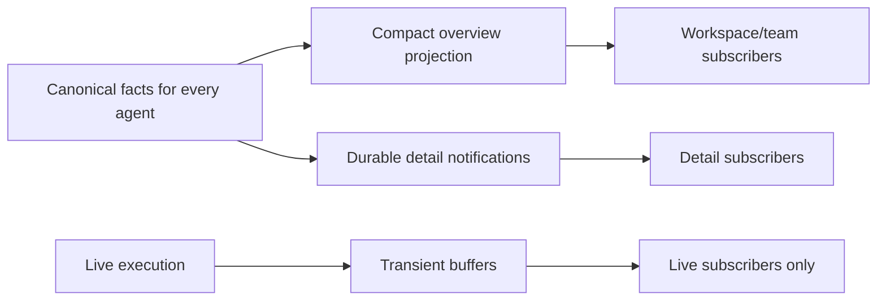

# Visibility and efficient delivery

Part of the [generalized agent runtime proposal](README.md).

## Visibility is universal; detail is demand-driven

> Every authorized agent is discoverable. Watching controls delivery cost, not execution, persistence, or authority.

The main agent, reusable children, and one-shot explorer children share navigation and rendering. Users can open a child directly, inspect its selected/history branches, and use the same steering/settings services. No UI capability gap should imply a runtime capability gap.

An agent overview includes ID/name, parent, active branch/membership, current state, latest outcome, current operation summary, pending attention, and relevant revisions. Historical/detached agents remain accessible with clear labels; they need not occupy the default active-team list forever. Authorization applies to snapshots, history, and live subscriptions equally.

## Three interest levels

| Interest | Delivery                                                                          | Typical use                                         |
| -------- | --------------------------------------------------------------------------------- | --------------------------------------------------- |
| Overview | Compact durable summary changes for authorized agents in scope                    | Workspace/team list; discover children and blockers |
| Detail   | Durable conversation changes, branch selection, interactions, configuration state | Opened transcript or inspection panel               |
| Live     | Detail plus transient output/progress for current execution                       | Actively watched agent                              |

These are delivery interests, not new domain histories. One client may watch several agents. Interest is explicit and independent of conversation existence: a cached transcript should not leave an accidental permanent live subscription.

The overview keeps an unwatched agent visibly running or waiting for approval without delivering every token or every transcript record. It is not required to contain the entire durable history. All detailed facts are persisted and available through loading/replay regardless of interest.



## Reuse a simple stream topology

The existing implementation has workspace and conversation streams, per-session subscriptions, replay, batching, and queue budgets. Relevant owners are [event routing](../../../packages/contracts/src/events/event-routing.ts), [WebSocket adapter](../../../packages/workbench-server/src/adapters/protocol/protocol-websocket.ts), [server session](../../../packages/protocol/src/sessions/server-session.ts), and [notification buffer](../../../packages/protocol/src/streams/notification-buffer.ts).

Today the event registry fans out to session listeners before filtering; conversation live notifications are interest-scoped, while other unscoped notifications can reach all ready sessions. Frontend cursor subscriptions live in [stream cursor state](../../../packages/workbench-app/src/lib/application/event-routing/stream-cursors.svelte.ts). The target should make interest explicit rather than rely on these incidental scopes.

Start with one authorized workspace/team overview stream and one detail stream per agent-owned conversation. Do not add redundant agent and conversation replay streams for the same history. Represent live interest separately from durable cursor subscription, so an opened durable view need not receive token traffic.

Route fan-out through indexed interested subscribers instead of broadcasting every event to every session and then dropping it. Use an exact desired interest set or explicit add/remove operations with generation/acknowledgment; transport details belong in protocol. Workspace summaries and detail notifications carry source revisions so overlapping deliveries reconcile, rather than produce competing state updates.

## Subscribe without missing the current output

Durable synchronization uses journal-derived snapshots and replay watermarks. A live watcher additionally needs a current output baseline plus a live watermark:

1. Authorize interest and establish the subscription generation.
2. Capture durable state and its coherent replay cursor; buffer relevant concurrent updates.
3. Capture current live preview/output offset and the matching run/attempt/branch generation.
4. Install the baseline, then apply buffered/new activity after its watermark.
5. Deduplicate overlap and reject activity from superseded attempts, branches, or subscription generations.

```mermaid
sequenceDiagram
    participant UI
    participant Service as Subscription service
    participant State as Durable and live state
    UI->>Service: Watch agent
    Service->>Service: Authorize and begin buffering
    Service->>State: Capture snapshot and current live baseline
    State-->>Service: Revisions, cursors, attempt and live watermark
    Service-->>UI: Install baseline
    Service-->>UI: Updates after baseline watermarks
    UI->>Service: Remove live interest
    Service->>Service: Stop transient delivery; retain requested overview/detail
```

A live baseline is not necessarily durable. Within the current process it can provide an unwatched agent's current partial response; after a crash only persisted output is available. Keep bounded current-output buffers or durable partial checkpoints as appropriate, not an unlimited retained token-event log.

Transient output uses output identity, offset/sequence, and execution generation. A lost delta cannot simply be skipped when later deltas depend on it. Coalesce into a latest replacement preview, or detect a gap and refresh the baseline. Final durable output replaces the preview authoritatively.

## Batching and backpressure

- Batch durable detail notifications by count/bytes while preserving replay order. Large payloads are references, not repeated socket blobs.
- Update overview summaries only when meaningful fields change. Coalesce presentation notifications when the latest complete summary supersedes earlier ones; retain canonical source facts independently.
- Coalesce transient progress by scope and combine contiguous text deltas. Apply bounded byte/count budgets and cadence limits.
- Drop or replace transient updates first for slow clients; repair text with a baseline. Do not silently discard durable synchronization updates.
- If durable queues exceed budget, require replay/snapshot resynchronization rather than growing memory without bound. No execution decision may depend on a client acknowledgment.
- Release live interest when a pane is closed/hidden according to explicit UI policy. A background window can retain durable overview interest without receiving all live output.

Prefer compact replacement overview rows at small scale; use revisioned patches only when measurements justify their complexity. Rendering batches should be separate from durable cursor correctness.

## Branch changes and settings

Branch selection publishes durable overview/detail changes identifying new branch generations and affected children. Invalidate old live previews before installing the new baseline. A stale completion for an old branch remains historical, not a current status change.

Settings UI distinguishes accepted revision from effective turn revision. An unwatched agent's overview can expose pending settings or a configuration blocker without broadcasting full prompt/skill content. Sensitive content is loaded only through authorized detail operations.

## Validation focus

Verify all children are discoverable without parent detail subscriptions; two watched agents stream independently; closing a pane stops transient fan-out; opening mid-response receives a coherent baseline; slow consumers recover; duplicate overview/detail updates reconcile; old attempt/branch activity is discarded; and zero watchers never changes accepted work, durable output, or human-interaction state.
