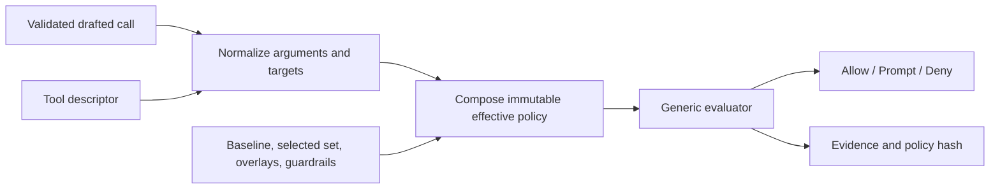

# Permission rules and rule sets

> **Status:** Implemented architecture. Current behavior is defined by the permission contracts, tool policy implementation, tests, and the public [Tools and approval policy](https://nerve.tlmtech.dev/developers/tools-policy/) page.

## Implementation ownership

The shipped evaluator combines named permission rule sets, catalog and argument-sensitive risk assessment, normalized targets, and rule-set-bound user/project/conversation overlays. Policy decisions are `allow`, `prompt`, or `deny`; the host projects `prompt` to an approval interaction.

The transport-neutral contracts live in [`permission-rule-sets.ts`](../../packages/contracts/src/domains/permissions/permission-rule-sets.ts), pure composition and evaluation live in [`permission-policy.ts`](../../packages/tools/src/policy/permission-policy.ts), and storage/trust resolution lives in [`permission-policy.service.ts`](../../packages/workbench-server/src/domains/permissions/permission-policy.service.ts).

## Purpose

Use one generic permission framework for every agent-callable tool. The framework decides whether a validated drafted call may execute automatically, requires a user decision, or must not execute.

Product concepts such as Read only, Supervised, Autonomous, Planning, and future custom agents select or compose rule sets. They do not add special branches inside the generic evaluator.

The system is designed to be:

- deterministic and fail-closed;
- independent of tool execution and agent mode implementation;
- argument- and target-aware;
- explainable from a durable policy snapshot;
- configurable at user, project, and conversation scopes;
- portable across machines and `NERVE_HOME` locations;
- extensible without copying the tool catalog into policy prose.

## Concepts

| Concept             | Target meaning                                                                                                  |
| ------------------- | --------------------------------------------------------------------------------------------------------------- |
| Permission rule     | Filters plus one `allow`, `prompt`, or `deny` decision.                                                         |
| Permission rule set | Named, versioned, ordered collection of permission rules with source and compatibility metadata.                |
| Built-in rule set   | Immutable application-owned Baseline, Read only, Supervised, Autonomous, or Planning policy.                    |
| Overlay             | Ad hoc rules bound to one permission rule set and one user, project, or conversation ownership scope.           |
| Guardrail           | Non-overridable restriction that can only preserve or reduce authority.                                         |
| Effective policy    | Immutable composition evaluated for one drafted call.                                                           |
| Tool descriptor     | Catalog-owned identity, groups, risks, argument selectors, and target extraction metadata.                      |
| Permission target   | Canonical structured resource affected by the call, such as a path, command segment, URL, agent, or whole tool. |

The tool manifest remains the source of truth for available names and metadata. This proposal intentionally does not duplicate the catalog.

## Evaluation model



### Preconditions

Before matching rules, the host must:

1. validate arguments against the active tool schema;
2. canonicalize paths, URLs, commands, and identifiers;
3. derive every required security target;
4. reject malformed requests or target-extraction failures;
5. snapshot the applicable rule sources and tool metadata.

Normalization is a security boundary. Rules never match untrusted raw argument text when a canonical form is available.

### Composition order

The effective policy composes:

1. Baseline foundation rules;
2. one selected built-in or custom rule set;
3. the user overlay bound to that selected rule set;
4. the project overlay bound to that selected rule set;
5. the conversation overlay bound to that selected rule set;
6. call-specific host constraints that can only reduce authority.

An overlay does not match merely because another rule set, such as Baseline, is also active. Planning and coding grants therefore remain isolated. Exact precedence is encoded in contracts, not inferred from storage order. User guardrails remain non-overridable within their bound rule set.

### Matching

Rules may filter by stable catalog metadata and normalized request data, including:

- exact tool name or catalog-owned group;
- base/effective risk;
- normalized target kind and access;
- project-relative path glob;
- command token/prefix pattern;
- canonical URL origin or host pattern;
- primary validated argument;
- agent type or selected policy purpose where explicitly modeled.

Multi-target calls are allowed automatically only when the effective decision covers every relevant target. Whole-tool authority is used when no narrower structured target represents the call's complete effects.

### Decision and evidence

Every successful evaluation returns exactly one decision:

```ts
type PermissionDecision = "allow" | "prompt" | "deny";
```

Durable evidence includes the selected and winning rule-set IDs, policy hash, normalized targets, matched rule, reason, and any safe suggested rule. The selected rule-set ID is copied into approval state so a durable grant is saved against evaluation-time policy identity even if conversation selection later changes. Evidence is committed before execution starts so a later policy edit cannot change why an existing call proceeded or stopped.

Interaction tools that implement the human boundary must not recursively prompt for permission to display that boundary.

## Storage and portability

- Built-in rule sets ship with the application and are immutable.
- Each ownership scope keeps one atomic v2 overlay document with `overlays: [{ ruleSetId, rules }]`; separate per-rule-set files are not used.
- User and project rule sets/overlays use portable configuration without absolute `NERVE_HOME` paths.
- Conversation overlays are stored with managed conversation data.
- Project trust covers the digest of the complete project overlay document.
- Durable records store policy identity and evidence, not a mutable pointer whose meaning can change later.
- Secrets never appear in rules or evidence.
- Unknown tool names remain readable in historical evidence but cannot execute without an active catalog descriptor.

The final storage shape must follow the implemented [storage architecture](../architecture/storage.md); this proposal does not reserve new directories or tables.

## Failure behavior

The evaluator fails closed when:

- arguments fail validation;
- required targets cannot be derived or canonicalized;
- a referenced rule set is missing, malformed, incompatible, or has an unknown version; the host selects Baseline without overlays;
- the selected policy exceeds an enclosing guardrail;
- an unknown matcher could expand authority;
- policy evidence cannot be committed before execution.

A policy failure is never converted into automatic approval.

## Implementation criteria

The architecture remains complete only while:

- shared contracts define rule sets, overlays, normalized requests, decisions, and evidence;
- the tool manifest supplies all required metadata without a second inventory;
- one pure evaluator covers built-in modes and custom policies;
- server composition resolves scoped sources and commits evidence atomically with lifecycle transitions;
- migration preserves current exceptions or requires an explicit, understandable reset;
- UI surfaces selection, explanation, and editing without bypassing guardrails;
- focused tests cover precedence, every-target coverage, portability, malformed sources, unknown tools, restart restoration, and current-policy migration;
- public docs are updated from current exception behavior only after the cutover ships.

## Non-goals

- Operating-system sandboxing or container isolation.
- Inferring arbitrary shell/Python safety from source text.
- Storing complete tool metadata in policy files.
- Allowing overlays to bypass hard host, planning, or secret boundaries.
- Maintaining parallel legacy and rule-set evaluators after migration.
