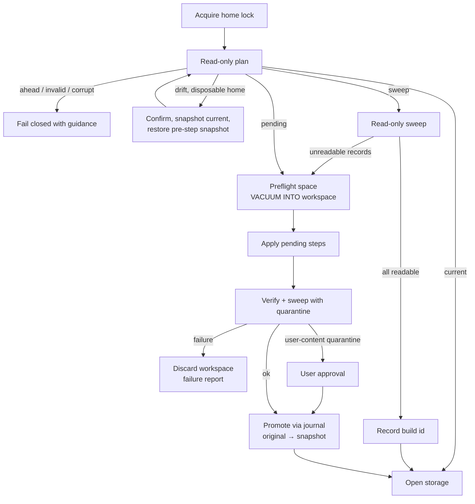

# Storage migration framework

Status: accepted; implementation in progress. Replaces the current mix of canonical schema migrations, the home migration ledger, ad-hoc data conversions, and startup repairs. The explicit offline legacy `nerve-workbench-state` v2 import is out of scope and unchanged.

## Goal

Upgrading a `NERVE_HOME` should be boring. When a migration fails, it should fail before anything changes, name the step and record, and leave the user's data untouched. When one old or malformed record can't be converted, the upgrade should set that record aside, not stop the daemon.

The structure should make the safe path the easy path. Folder layout, the step API, scaffolding, and CI checks should lead developers to good practice without them having to remember a checklist.

## Why now

The failures come from a few structural causes, not one-off bugs.

| Cause                                                                                                                                                                                      | Evidence                                                                                                                                                                                                                                                                          |
| ------------------------------------------------------------------------------------------------------------------------------------------------------------------------------------------ | --------------------------------------------------------------------------------------------------------------------------------------------------------------------------------------------------------------------------------------------------------------------------------- |
| **Three uncoordinated ledgers:** `schema_migrations`, `migrations/ledger.json`, and a `canonical_data_migration` marker document. Nothing orders one ledger's steps relative to another's. | [`inspectToolResultPayloadReferenceMigration`](../../packages/workbench-server/src/infrastructure/migrations/tool-result-payload-reference-v2.ts) requires the _latest_ schema but runs _before_ the SQL steps at startup, so an older home without that ledger entry is blocked. |
| **Migrations import live code.** Conversions parse data with current `@nervekit/contracts` schemas.                                                                                        | [`migrateLegacyAgentObligations`](../../packages/workbench-server/src/infrastructure/persistence/canonical-sqlite/agent-obligation-migration.ts) calls `taskRecordSchema.parse`. When the contract changes later, the historical migration breaks.                                |
| **All-or-nothing on data.**                                                                                                                                                                | `explore-agent-names-v6` calls `json_extract` on `json_each(... '$.args.tasks')` items. If any item isn't an object, SQLite raises `malformed JSON` and startup aborts.                                                                                                           |
| **Stored JSON has no version.** `payload_version` is always `1`, and read schemas are often `.strict()`.                                                                                   | Repeated `ZodError`s from `Workbench initialization failed`: unknown keys `winningRuleSetId`, old `imageGeneration.quality` values, and retired `tools.disabled` names.                                                                                                           |
| **In-place migrations with no backup.**                                                                                                                                                    | Normal startup migrates `data/nerve.sqlite` in place.                                                                                                                                                                                                                             |
| **Development builds migrate the live home.**                                                                                                                                              | The live ledger shows v5 and v6 applied before their commits merged. A development build failed with `table state_identity already exists`. Editing an applied step becomes permanent checksum drift.                                                                             |
| **Fragile mechanics.**                                                                                                                                                                     | The startup lock is taken over after 30 s by file time. Checking for migrations opens the database read/write. Errors are raw SQLite messages. Tests use synthetic, current-shaped data.                                                                                          |

## Principles

1. **One list, one ledger, one order.** Every step has a stable id and a fixed position in the list. The ledger lives in the database it describes.
2. **Never migrate in place.** Migrate a copy, verify it, and swap it in. The original becomes the snapshot.
3. **Steps are frozen history.** A step depends only on its own folder and versioned kit files. It declares the minimal shapes it reads, parses them loosely, and preserves unknown fields.
4. **Expect hostile data.** A record that can't be converted or read is set aside (quarantined) atomically. Aborting is reserved for structural failures and for quarantine volumes that point to a bug.
5. **Upgrade old JSON on read.** Additive changes need nothing. Breaking shape changes bump `payload_version` and add a pure upgrader.
6. **Merged means immutable.** Steps change freely only as drafts, and drafts run only on disposable homes. Homes with real data are always fixed forward, never by restoring.
7. **Verify with the real reader.** After every upgrade and every new build, stored data is checked against the current read path before the daemon serves requests.

## Trust model

Migration steps are first-party code, reviewed like any other server code, running in a local, single-user application. The framework protects against _mistakes_: wrong assumptions about data, edits to history, partial writes, crashes, and full disks. It does not sandbox malicious steps.

Import rules, the kit API, CI checks, and review are the guardrails. See [Deliberately not doing yet](#deliberately-not-doing-yet) for what that excludes.

## Decision guide

The central question for a developer: _"I changed a persisted shape. What do I need?"_ This table is linked from the scaffold output and the PR template.

| Change                                                                                         | Mechanism                                                                  | Migration step?      |
| ---------------------------------------------------------------------------------------------- | -------------------------------------------------------------------------- | -------------------- |
| Add an optional field to a stored document or config file                                      | Make it optional in the read schema.                                       | No                   |
| Add a required field, rename or remove a field, narrow or rename an enum value, change meaning | Bump the document's `payload_version`; add an upgrader and fixture.        | No (upgrade on read) |
| Physically rewrite old documents (e.g. to delete an old upgrader)                              | `data` step that rewrites through the upgrader chain.                      | Yes                  |
| New table, column, or index                                                                    | `schema` step.                                                             | Yes                  |
| Backfill from existing data                                                                    | `schema` step followed by a `data` step.                                   | Yes                  |
| Move, re-encode, or restructure managed files                                                  | `files` step (additive), with deferred cleanup.                            | Yes                  |
| Restructure a configuration document                                                           | Configuration upgrader. Use a `config` step only for cross-document moves. | Usually no           |
| Fix a bug in a _draft_ step                                                                    | Edit it. Disposable homes restore the pre-step snapshot.                   | —                    |
| Fix a _final_ or _released_ step                                                               | Add a corrective step. Never edit the original.                            | Yes                  |

## Codebase structure

```text
packages/workbench-server/src/infrastructure/storage-migrations/
├── README.md                  # decision guide + checklist; links here
├── kit/                       # the only code steps may import; no barrel file
│   ├── define-step/v1.ts
│   ├── json/v1.ts             # loose JSON helpers, guarded SQL fragments
│   ├── rows/v1.ts             # batched iteration, savepoint per record
│   ├── files/v1.ts            # staged, additive file writes tracked per record
│   └── shapes/v1.ts           # loose zod helpers
├── runner/                    # engine; never imported by steps
│   ├── registry.ts            # ordered list from steps/index.ts
│   ├── ledger.ts
│   ├── planner.ts             # read-only inspection -> plan
│   ├── workspace.ts           # working copy, promotion journal, snapshots
│   ├── executor.ts
│   ├── sweep.ts               # readability sweep over descriptors
│   ├── quarantine.ts
│   └── home-lock.ts
├── steps/
│   ├── index.ts               # explicit ordered list; one line per step
│   ├── 0006-explore-agent-names/
│   │   ├── step.ts
│   │   ├── shapes.ts          # frozen minimal shapes this step reads
│   │   └── step.test.ts       # release fixture + hostile fixture
│   └── ...
└── migrations.lock.json       # id, checksum, stage, releasedIn, acceptedChecksums

packages/workbench-server/src/infrastructure/persistence/payloads/
├── descriptors.ts             # every persisted kind: location, key, record class, unit, codec
└── <document-kind>/
    ├── upgraders.ts           # v1 -> v2 -> ... pure functions
    └── upgraders.test.ts      # one fixture per historical version

packages/workbench-server/test/fixtures/storage/
├── releases/<version>/        # small real homes generated at release time
└── hostile/                   # malformed and outdated rows for every JSON column
```

How this shape steers developers:

- **Folder per step.** Everything a step depends on sits next to it. Copying a shape into `shapes.ts` is the path of least resistance.
- **Import boundary.** A rule in [`scripts/lib`](../../scripts/lib/) rejects the following inside `steps/**`:
  - `@nervekit/contracts`, `domains/`, repositories, and `runner/`;
  - direct `zod`, Node built-ins, and non-literal dynamic imports;
  - kit directories and barrel files. Steps import concrete files such as `kit/rows/v1.js`.
- **Versioned kit files.** A kit file used by any final step is frozen. New behavior goes in `v2.ts`. Adding a file never touches existing steps.
- **Collisions become merge conflicts.** Two branches adding step `0011` both edit the last lines of `steps/index.ts` and `migrations.lock.json`.
- **Scaffold.** `pnpm migrations:new <kind> <name>` creates the folder with the next ordinal, a template, a test wired to both fixtures, and a `draft` lock entry. A folder without a lock entry fails CI.

## Step model

```ts
// steps/0006-explore-agent-names/step.ts
import { defineDataStep } from "../../kit/define-step/v1.js";
import { agentDocumentShape } from "./shapes.js";

export default defineDataStep({
  id: "0006-explore-agent-names",
  description: "Recover short labels for explore child agents.",
  records: "derived", // derived | user-content
  async run({ rows }) {
    await rows.eachDocument("agent", agentDocumentShape, (row, write) => {
      // Inside SAVEPOINT. write.merge preserves unknown fields.
      // Throwing rolls back this record and quarantines it.
    });
  },
  verify({ db }) {
    /* optional invariant checks on the working copy */
  },
});
```

| Kind     | Runs on                               | Transaction                                          | Notes                                                                                                                          |
| -------- | ------------------------------------- | ---------------------------------------------------- | ------------------------------------------------------------------------------------------------------------------------------ |
| `schema` | Working copy                          | One transaction                                      | DDL and set-based SQL. JSON access uses kit guards (`json_valid`, `json_type(...) = 'object'`); SQL guards rather than throws. |
| `data`   | Working copy                          | Batches (default 500) with one savepoint per record  | Per-record errors are quarantined according to `records`.                                                                      |
| `files`  | Workspace staging area + working copy | Same as `data`; created files are tracked per record | Writes only new paths. Superseded files are removed by deferred cleanup after promotion.                                       |
| `config` | Staged copy of `config/`              | One document per record; promoted with the database  | Only for cross-document moves.                                                                                                 |

### Per-record atomicity

The kit, not the step author, owns record boundaries:

1. Each batch runs in one transaction; each record in `SAVEPOINT record`.
2. Files are written through `ctx.files`, which creates only new paths in the staging area and records them against the current record.
3. On success: `RELEASE record`.
4. On a throw: `ROLLBACK TO record`, delete that record's created files, then write the quarantine entry in a fresh savepoint.
5. A failure of the batch itself (e.g. `SQLITE_FULL`) rolls back the batch, deletes its files, and fails the step.

Promotion moves only files the kit recorded as committed. Anything else in the staging area is discarded with the workspace.

Steps must be deterministic. Time and randomness come from `ctx`, so tests can pin them.

## Ledger and planning

```sql
CREATE TABLE storage_migrations (
  id TEXT PRIMARY KEY,
  ordinal INTEGER NOT NULL UNIQUE,
  kind TEXT NOT NULL,
  checksum TEXT NOT NULL,
  stage TEXT NOT NULL CHECK(stage IN ('draft','final','released')),
  app_version TEXT NOT NULL,
  git_sha TEXT,
  applied_at_ms INTEGER NOT NULL,
  duration_ms INTEGER NOT NULL,
  quarantined INTEGER NOT NULL DEFAULT 0,
  origin TEXT NOT NULL CHECK(origin IN ('applied','adopted'))
) STRICT;

CREATE TABLE storage_read_sweeps (
  build_id TEXT PRIMARY KEY,      -- app version + git SHA (+ dirty marker)
  swept_at_ms INTEGER NOT NULL,
  quarantined INTEGER NOT NULL
) STRICT;
```

A step's `checksum` is the SHA-256 of its folder's non-test files. `pnpm migrations:finalize` formats the folder before recording it, and formatting tools exclude finalized step folders. The ledger records file and config steps truthfully because they're promoted together with the database. `migrations/ledger.json` is read once, during adoption. Legacy raw-SQL checksums are separate adoption evidence in the lock metadata; `acceptedChecksums` is reserved for harmless edits to finalized framework step folders.

Planning, in order:

| Situation                                                                    | Plan                                                                                    |
| ---------------------------------------------------------------------------- | --------------------------------------------------------------------------------------- |
| Ledger has ids this app doesn't know                                         | `ahead`: fail closed; see [Home classes](#home-classes-and-restore).                    |
| A `draft` ledger row on a standard home                                      | `invalid`: fail closed. Drafts belong only on disposable homes.                         |
| A checksum differs from the registry and from the step's `acceptedChecksums` | Draft on a disposable home: `drift`. Otherwise: `corrupt`, fail closed naming the step. |
| Pending steps                                                                | `pending`. Refused on a standard home if any pending step is a draft.                   |
| Everything applied, but the current build hasn't swept this home             | `sweep`; see [Readability sweep](#readability-sweep).                                   |
| Otherwise                                                                    | `current`.                                                                              |

## Upgrade pipeline



- **Lock.** One home lock from planning through promotion. It checks whether the owning PID is still alive instead of using a fixed mtime timeout, and checks the daemon lease.
- **Read-only planning.** Opens with `readOnly: true`, doesn't change the journal mode, and runs no trial transactions.
- **Workspace.** A dedicated `migrations/work/<run-id>/` directory holds the working copy (`VACUUM INTO …/nerve.sqlite`), the staged `config/`, and the file staging area. Steps never receive paths outside it. Promotion runs in the host, after steps finish.
- **Verify.** Runs `quick_check`, `foreign_key_check`, each step's `verify`, and the readability sweep with quarantine.
- **Promotion.** Reuses the journaled pattern from [`current-home-migration.ts`](../../packages/workbench-server/src/infrastructure/migrations/current-home-migration.ts) at database and config granularity. The replaced original goes to `backups/storage/<timestamp>-before-<first-step>/`. Deferred cleanup of superseded files and quarantine file moves run after promotion.
- **Crashes.** A crash before promotion leaves only a discardable workspace, and the original is untouched. The next start discards it and plans again. The promotion journal completes or reverts an interrupted swap.
- **Failure report.** Written to `migrations/last-failure.json` and the logs: step, record key or path, error, app version, git SHA. The startup screen shows it, with retry and export-diagnostics actions.
- **Disk space.** See [Disk space](#disk-space).

### Readability sweep

Most shape changes ship as an upgrader with no migration step. Dependency upgrades such as `zod` can change decoding too. So every new build verifies the home once, whether or not steps ran:

1. **Read-only pass.** Decode every record of every kind in [`descriptors.ts`](#quarantine) through the current read path, plus every config document. Nothing is written, and the startup screen shows progress.
2. **All readable (the common case).** Insert the build id into `storage_read_sweeps`. This single metadata write is the only in-place write the framework makes. If it's interrupted, the sweep simply repeats.
3. **Unreadable records.** Run the workspace pipeline with no steps: preflight, copy, sweep with quarantine, approval if needed, promotion.

When steps ran, the verification sweep inside the workspace covers this, and the build id is recorded with promotion. Development builds get a new build id per build, so developers' disposable homes are swept often, which is intentional.

At runtime, repositories still treat a decode failure as an isolated, reported error for that record, never a crash.

## Home classes and restore

Restoring a snapshot discards writes made since it was taken. So homes with real data never need a restore.

| Class          | How                                                                                                                                                        | Drafts                                   | Recovery                                                                                       |
| -------------- | ---------------------------------------------------------------------------------------------------------------------------------------------------------- | ---------------------------------------- | ---------------------------------------------------------------------------------------------- |
| **Standard**   | Default, including `~/.nerve` used by any build.                                                                                                           | Refused, with a pointer to `home:clone`. | Fix forward: final steps are immutable, so fixes are corrective steps. Mismatches fail closed. |
| **Disposable** | `manifest.json` has `"disposable": true`. Set by `home:clone`, fresh development homes under `/tmp`, and fixtures. Never allowed on the default home path. | Allowed.                                 | Draft drift: confirm, snapshot the current state, restore the pre-step snapshot, re-apply.     |

- **`ahead`** (a newer build upgraded this home): fail closed and advise running the newer build. `pnpm home:restore` can restore an older snapshot as an explicit destructive action. It first exports the current home, shows the time range of writes that would be lost, and needs typed confirmation.
- **A disposable home that lost its marker or was moved to a standard location** is refused by the `invalid` rule if it contains draft rows.

## Quarantine

Records are quarantined from two sources, under one policy:

- **Step failure** during per-record processing.
- **Sweep failure:** a record the current read path can't decode, attributed to `sweep:<kind>`.

`persistence/payloads/descriptors.ts` registers every persisted kind: `domain_documents` namespaces, JSON columns, config documents, and managed file references. Each descriptor has:

- location and key;
- record class (`derived` or `user-content`);
- quarantine unit;
- codec (decoder, upgraders, read schema).

A coverage test fails if the schema has a JSON column, or a repository writes a namespace, that has no descriptor.

```sql
CREATE TABLE storage_quarantine (
  id TEXT PRIMARY KEY,
  source_step TEXT NOT NULL,          -- step id or "sweep:<kind>"
  unit TEXT NOT NULL CHECK(unit IN ('record','conversation','config','file')),
  source TEXT NOT NULL,
  source_key TEXT NOT NULL,
  conversation_id TEXT,
  reason TEXT NOT NULL,
  original BLOB,                      -- record and config units only
  affected_records INTEGER NOT NULL,
  affected_bytes INTEGER NOT NULL,
  created_at_ms INTEGER NOT NULL
) STRICT;
```

| Unit           | Handling                                                                                                |
| -------------- | ------------------------------------------------------------------------------------------------------- |
| `record`       | Original bytes are copied to `original`, and the source row is removed in the same savepoint.           |
| `config`       | Original bytes are copied, and the staged document is replaced with defaults.                           |
| `conversation` | Flagged in place; readers and projections skip it. Nothing is copied; a repair tool can clear the flag. |
| `file`         | Recorded; after promotion, the file is moved to `data/quarantine/files/` by rename.                     |

Policy:

- **Derived** records are quarantined automatically and reported. **User-content** records and config documents need approval, which generalizes the fingerprinted "skippable conversation" flow in [`data-directory-migration.ts`](../../packages/desktop-shell/src/app/data-directory-migration.ts).
- **Circuit breaker by impact, not storage.** `affected_records` and `affected_bytes` count everything made unavailable, including every record of a flagged conversation. A step or `sweep:<kind>` fails once either total exceeds `max(20, 1 % of input records)` or `max(64 MiB, 1 % of input bytes)`. Widespread quarantine means a bug in the step or read path, not bad data.
- Originals stay in the promoted database or quarantine directory, so a corrective step or tool can restore them.

## Disk space

- **Preflight.** Required space = database size + staged `config/` size + `max(10 %, 512 MiB)`. The margin also covers quarantine copies, which the byte breaker keeps within 1 % of the input. If there isn't enough space, nothing starts. The error shows required and available bytes and lists snapshots that could be pruned; pruning is the user's choice.
- **Monitoring.** Free space is checked between batches. If it drops below the margin, the run stops at the batch boundary, discards the workspace, and reports it. `SQLITE_FULL` and `ENOSPC` produce the same structured report.
- **Retention.** Keep the last three snapshots and any younger than 14 days, within a disk budget.

## Upgrading stored JSON on read

- Every persisted document kind has a codec: `decode(row) → upgrade(payload_version → current) → read schema`. Writes always emit the current version.
- **Persisted reads preserve unknown fields; new writes and API inputs are strict.** Read codecs use recursively passthrough schemas and retain the upgraded raw object so known-field updates can be merged without erasing unknown top-level or nested fields. Upgraders map retired enum values. Contract modules export strict input schemas separately from persisted read schemas.
- Upgraders are pure functions in `persistence/payloads/<kind>/upgraders.ts`, with one fixture per historical version.
- `config/*.json` documents already carry `version`. They get the same upgrader chain in [`home-configuration.ts`](../../packages/workbench-server/src/infrastructure/configuration/home-configuration.ts), next to the existing merge of missing defaults.
- [`contracts-source-policy.mjs`](../../scripts/lib/contracts-source-policy.mjs) flags persisted read schemas that use `.strict()`.

## Step lifecycle

| Stage      | Set by                                                               | May change?                                                                             | Runs on                |
| ---------- | -------------------------------------------------------------------- | --------------------------------------------------------------------------------------- | ---------------------- |
| `draft`    | `pnpm migrations:new`                                                | Freely.                                                                                 | Disposable homes only. |
| `final`    | `pnpm migrations:finalize`, required before merge                    | No, except a reviewed harmless edit that lists the old checksum in `acceptedChecksums`. | All homes.             |
| `released` | [`tag-release.sh`](../../scripts/tag-release.sh) stamps `releasedIn` | Never.                                                                                  | All homes.             |

CI fails when:

- a PR to `main` contains a `draft` entry;
- a final or released step folder differs from `main` without a matching `acceptedChecksums` entry, or a kit file used by one does;
- an accepted checksum is added to a released step;
- ordinals aren't contiguous;
- a step folder has no lock entry, or no tests.

`acceptedChecksums` is for edits that can't change the outcome where the old version already succeeded. Example: JSON guards that only affect inputs that would have aborted. Anything else is a corrective step.

Dependency upgrades (e.g. `zod`) are reviewed changes like any other. They're gated by the release-matrix and hostile-fixture tests, and the next start runs a readability sweep because the build id changed.

## Development workflow

1. `pnpm migrations:new data backfill-foo` creates a draft.
2. `pnpm home:clone --to /tmp/nerve-foo` creates a disposable clone of a real home. Iterate there. Draft drift restores automatically after confirmation.
3. `pnpm home:migrate --dry-run --home /tmp/nerve-foo` prints per-step timings, counts, quarantines, and sweep results. The PR template asks for this output.
4. `pnpm migrations:finalize` before merge. From then on, any build may apply the step to `~/.nerve`, and fixes go forward.

Dogfooding `main` builds on `~/.nerve` stays supported, because `main` contains only final steps.

## Testing

The scaffold creates the step tests; the lock check requires them.

- **Release matrix.** `test/fixtures/storage/releases/<version>/` holds a small home produced by each release, generated during release preparation. Every fixture is upgraded to the current list and must pass the sweep with zero quarantines.
- **Hostile fixture.** Malformed JSON, non-object JSON, missing fields, retired enum values, oversized payloads, and dangling references in every JSON column and config document. Every step completes against it with only expected quarantines.
- **Step tests.** Each step's transformation from the previous release fixture, and its behavior on hostile rows.
- **Upgrader tests.** One fixture per historical `payload_version`.
- **Runner tests.**
  - Promotion crash recovery at each journal phase, and lock contention.
  - Every planning outcome, including `invalid` for draft rows on standard homes.
  - Per-record rollback of database writes and files.
  - Batch-level `SQLITE_FULL`.
  - The impact-based circuit breaker with a large flagged conversation.
  - Sweep escalation to a workspace.
  - Space preflight and monitoring.
- **Coverage.** Descriptors for every JSON column and namespace.

## Adopting existing homes

v0.31.1 ships schema v4, so v5–v7 aren't released yet and switching now is cheap. Steps `0001`–`0004` enter the lock as `released`; `0005`–`0010` as `final`. The first run adopts existing state in the workspace:

| Existing mechanism                                        | New step                                | Adopted when                                                      |
| --------------------------------------------------------- | --------------------------------------- | ----------------------------------------------------------------- |
| `schema_migrations` v1–v4                                 | `0001`–`0004`                           | Rows match their legacy raw-SQL checksums                         |
| `schema_migrations` v5–v7                                 | `0005`–`0007`                           | Rows match their legacy checksums (listed in `acceptedChecksums`) |
| `ledger.json` `tool-result-payload-reference-v2`          | `0008-tool-result-payload-reference`    | Ledger entry present                                              |
| `canonical_data_migration` / `agent-async-obligations-v1` | `0009-agent-async-obligations-backfill` | Marker present                                                    |
| `repairCanonicalDeletionIndexes` at startup               | `0010-deletion-indexes` with `verify`   | Both indexes present with the expected definitions                |

- Step `0008` only needs the v1 baseline, so homes where it's still pending run it after `0007`. During adoption only, the ledger may record `0008` as applied while `0002`–`0007` are pending.
- `0006` gains JSON guards when ported, and its legacy checksum is accepted.
- `0008` and `0009` get frozen shapes that replace their contract imports.
- `schema_migrations` stays read-only for one release, so older builds fail with their existing "newer schema" error. A later step drops it.

## Rollout

1. **Hotfixes, independent of the framework.**
   - Guard v6's JSON access.
   - Stop the tool-result check from requiring the latest schema before SQL steps run.
   - Make inspection read-only.
   - Detect a stale lock by PID liveness.
   - Make read schemas lenient for the known `ZodError` cases.
2. **Runner core.**
   - Ledger, planner, workspace, promotion, adoption, and home classes.
   - Versioned kit with per-record savepoints, step folders, lock and CI checks, the import boundary rule, and the scaffold.
   - Port `0001`–`0010`, and remove the old entry points.
3. **Resilience.**
   - Descriptors, the readability sweep, quarantine with approval, and the circuit breaker.
   - Release and hostile fixtures.
4. **Payload versioning.**
   - Codecs and upgraders, starting with the kinds in the observed `ZodError`s.
   - Configuration upgraders and the contract-policy check.
5. **Tooling and docs.**
   - `home:clone`, `home:migrate --dry-run`, `home:restore`, and the startup failure screen.
   - Update [storage architecture](../architecture/storage.md) and the public guide.

Phase 1 fixes the failures seen so far; phases 2–4 prevent new ones.

## Deliberately not doing yet

These came up in review. They're left out to keep the framework proportionate, and should be revisited only if real homes show a need.

- **Sandboxing steps** (separate process, filesystem permissions, network blocking). This is excluded by the [trust model](#trust-model). Steps can read user data, so this would matter only if third parties could ship steps.
- **Checksums over import closures, and vendoring dependencies.** Kit immutability and dependency changes are handled by CI and review. Build-id sweeps catch read-path effects.
- **Per-step disk growth estimates.** The simple preflight plus monitoring fails safely.
- **Resumable data steps and incremental sweeps.** A crash restarts from the untouched original, and the sweep is a read-only full decode. Add cursors or watermarks if large homes make this too slow.

## Resolved rollout decisions

1. **Disposable marker.** A version-2 `manifest.json` carries `homeClass: "standard" | "disposable"`; version-1 manifests remain valid standard homes and are not rewritten merely for adoption. The default `~/.nerve` path can never be disposable.
2. **Snapshot retention.** Keep at least the newest three snapshots and all snapshots younger than 14 days. Older excess snapshots are shown as prune candidates, never automatically deleted to make an upgrade proceed.
3. **Quarantine thresholds.** Derived records are automatic; user content and config require exact fingerprinted approval. The breaker defaults remain `max(20, 1%)` records or `max(64 MiB, 1%)` bytes.
4. **Restore on standard homes.** Restore is CLI-only, preceded by an export, loss-window display, and typed confirmation.
5. **Legacy v2 import.** It remains unchanged and outside this framework.
