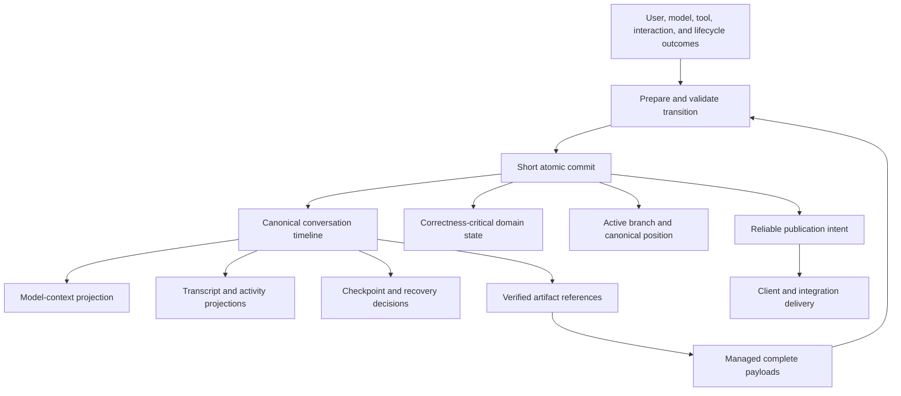

# Unified conversation timeline

> **Status:** Proposed architecture. This document defines a target direction for review; it does not describe current behavior or authorize implementation before the open design questions are resolved.

## Summary

Nerve should establish one canonical, ordered conversation timeline as the durable authority for every event that changes what a conversation means. User messages, model output, tool calls, tool results, interaction requests and resolutions, summaries, branches, and run lifecycle boundaries should all refer to the same timeline identities and ordering.

Runs, tools, agents, the model harness, notifications, and UI query models may retain specialized state and projections. They must not maintain competing definitions of transcript membership, ancestry, or position. A checkpoint or projection should identify a position in the canonical timeline rather than reconstructing an overlapping transcript from a subsystem-owned journal.

This proposal is intended to improve correctness, recovery, explainability, and future evolution. It does not require storing all data in one table, replaying all history for ordinary reads, placing large tool output inline, or keeping database transactions open while models and tools execute.

## Motivation

Conversation state currently crosses several lifecycle boundaries:

- model execution produces assistant content and tool requests;
- tool execution produces status changes, results, and artifacts;
- human interactions suspend and resume runs;
- conversation branching selects an active history;
- run checkpoints preserve resumable execution state;
- model context, UI history, notifications, and recovery each consume projections of that activity.

When more than one subsystem records its own overlapping sequence of conversation entries, those sequences can legitimately differ. A tool result may be durable in the conversation branch while absent from a run-local transcript. A checkpoint can then appear stale even though the active branch has not changed. Similar disagreements can complicate restart recovery, idempotent retries, branch validation, and diagnostics.

Localized reconciliation rules can handle known differences, but each rule adds another interpretation of how the histories relate. Over time this makes safety properties harder to state and verify.

The architectural issue is not that specialized state exists. Specialized state is necessary. The issue is that multiple specialized states can act as authorities for the same facts:

- which entries belong to the conversation history;
- the order and ancestry of those entries;
- the exact point at which a run suspended;
- whether a later operation still applies to that point;
- whether a result was committed before interruption.

Nerve should represent those facts once and derive consumer-specific views from them.

## Goals

The target architecture should provide:

1. **One authoritative history.** Every conversation-changing event has one canonical identity, order, and branch relationship.
2. **Atomic logical transitions.** The timeline event and correctness-critical state changes become durable together.
3. **Unambiguous checkpoints.** A checkpoint identifies a canonical branch position and the execution state associated with it.
4. **Deterministic recovery.** Restart behavior can determine what committed without reconciling competing transcript authorities.
5. **Idempotent mutation.** Retried requests do not create duplicate entries, duplicate tool effects, or conflicting resolutions.
6. **Independent projections.** Model context, UI history, search, notifications, and audit views can differ without becoming alternate sources of truth.
7. **Bounded hot-path cost.** Committing a change remains proportional to that change rather than total conversation history.
8. **Safe concurrency.** Multiple conversations and agents may progress concurrently while each conversation retains deterministic ordering.
9. **Portable durable state.** The design preserves Nerve's local-first storage, managed artifact, and movable-home boundaries.
10. **Explainable failures.** Diagnostics can identify the last committed timeline position and any projection that has not caught up.

## Non-goals

This proposal does not require:

- one physical table or one ever-growing conversation document;
- storing complete tool output inside timeline events;
- treating reliable notification delivery as canonical conversation state;
- exposing internal lifecycle events directly as UI transcript rows;
- persisting model streaming tokens as individual durable events;
- replaying the full timeline for every query or at every startup;
- holding a database transaction open while waiting for a model, tool, user, filesystem, or network operation;
- removing domain-specific run, tool, task, approval, or agent records;
- making all conversations share one global execution lock;
- preserving obsolete dual-write behavior indefinitely after cutover.

## Core concepts

### Canonical timeline

The canonical timeline is the durable authority for conversation history. Each committed item has a stable identity, belongs to one conversation, and has an explicit position and branch relationship.

The timeline must represent enough meaning to reconstruct the conversation and prove ordering, but it need not embed every large payload or every domain object's complete current state.

### Logical transition

A logical transition is one indivisible change in externally meaningful state. Examples include:

- accepting a user message and establishing it as the active branch tip;
- committing an assistant response and its drafted tool calls;
- completing a tool call and attaching its result to the conversation;
- requesting approval and suspending at a checkpoint;
- resolving an interaction and recording the resulting run transition;
- cancelling a run and terminalizing affected pending work;
- creating or selecting a branch.

A transition may update several durable records, but observers must not see a state in which only a correctness-critical subset committed.

### Canonical position

A canonical position identifies an exact point on a conversation branch. It includes sufficient identity to distinguish a branch tip from another branch that happens to have a similar numeric sequence.

Runs and interactions use canonical positions to state where they started, suspended, resumed, or terminated. They do not define an independent list of transcript entries for branch validation.

### Projection

A projection is a consumer-specific view derived from canonical state. Projections may be compact, filtered, indexed, cached, or asynchronously maintained according to their correctness requirements.

Important projections include:

- model-facing context;
- human-readable transcript history;
- tool and interaction status;
- run and agent activity;
- search and navigation indexes;
- reliable client notifications;
- audit and diagnostic views.

A projection may omit information intentionally. Omission does not alter the canonical timeline.

### Artifact reference

Large or byte-faithful content remains in managed artifact storage. The timeline records its ownership, integrity, size, semantic role, and durable reference. Consumers choose an appropriate bounded projection without weakening the complete result.

## Target architecture

The atomic commit is the consistency boundary. External work occurs before or after it, never while the storage transaction remains open. If an operation has an irreversible side effect, durable intent and idempotency state must define whether execution is safe before the effect begins and how its outcome is reconciled afterward.

## Architectural invariants

### Timeline authority

- Every durable conversation entry has exactly one canonical identity.
- The active branch tip refers to a canonical timeline item.
- Parentage and ordering are immutable after commit.
- Branch changes create or select explicit ancestry; they do not rewrite historical identity.
- No run, harness, cache, or client projection can introduce a second authoritative transcript order.

### Atomicity

- A logical transition commits its timeline change, active position, and correctness-critical domain state together.
- An approval cannot be durably resolved without the corresponding tool and run state transition.
- A tool cannot be represented as completed in the conversation while its authoritative execution state remains unresolved, except as an explicitly modeled recovery state.
- Reliable publication is committed with the transition so a crash cannot make durable state permanently invisible to subscribers.

### Idempotency

- Every externally retryable mutation has a stable idempotency identity and input fingerprint.
- Replaying the same mutation returns the committed outcome.
- Reusing an identity with different input fails closed.
- Tool execution and other side effects have stable deduplication identities separate from transport request IDs.

### Checkpoints

- A checkpoint names one canonical conversation position and one immutable execution snapshot.
- Resumption validates that the expected branch position is still applicable.
- Checkpoint validation does not compare independently assembled transcript lists.
- Resolving an interaction advances from the checkpoint through one atomic transition or produces a durable terminal outcome.
- Recovery can distinguish pending, committed, superseded, cancelled, and indeterminate work.

### Projections

- Correctness does not depend on a rebuildable projection being current.
- Synchronous projections are limited to fields required for transactional reads or immediate interaction safety.
- Other projections advance from a known canonical position and may be rebuilt.
- Projection lag is observable and does not masquerade as canonical state loss.

### Payloads

- Large tool results and files are not duplicated into every timeline representation.
- Required artifacts are prepared and verified before a timeline event exposes them as available.
- Timeline events contain bounded metadata and durable references rather than unbounded payloads.
- Missing or corrupt referenced content fails explicitly and remains diagnosable.

## Ordering and concurrency

Ordering should be deterministic within a conversation without unnecessarily serializing unrelated conversations.

Each conversation has a monotonically advancing logical position governed by optimistic concurrency or an equivalent compare-and-swap rule. A transition declares the position and branch tip it expects. It either commits as the next valid transition or fails without partially changing state.

This permits concurrent preparation while preserving serialized commitment where histories intersect:

- unrelated conversations can commit independently;
- independent work may execute concurrently outside storage transactions;
- operations targeting the same conversation resolve through a short commit boundary;
- stale operations receive an explicit conflict and must reload canonical state;
- multi-agent activity in one conversation has an intentional order rather than relying on arrival timing across projections.

A global diagnostic order may coexist with conversation-local order, but ordinary conversation progress must not require a long-lived global lock.

## SQLite and performance model

SQLite remains suitable for this architecture if the design optimizes for short append-oriented transactions.

The unified timeline must not become a giant mutable document. Historical items should be append-oriented, while compact heads and current-state projections may be updated in place. The hot transaction must remain proportional to the current transition and its affected records.

Performance requirements include:

- no model, tool, network, or filesystem wait inside a database transaction;
- no full-conversation rewrite for an appended event;
- no full replay for ordinary transcript and status queries;
- conversation-and-position indexes for bounded range reads;
- bounded synchronous projection work;
- managed external storage for large payloads;
- snapshots or checkpoints for efficient cold hydration;
- measured write contention under multiple active conversations and agents;
- bounded cleanup, compaction, and retention work that yields to interactive writes.

A unified commit may reduce total write amplification by replacing several independently synchronized updates with one transaction. The principal risks are long transactions, globally contended counters, large inline payloads, and synchronous maintenance of too many projections—not the existence of one canonical timeline itself.

## Model context and human transcript

A unified authority does not imply one identical representation for models and humans.

The model-context projection may include provider-specific message shapes, compaction boundaries, summaries, selected tool details, and visibility policy. The human transcript may use compact previews and presentation-oriented grouping. Both must preserve references to canonical timeline identities so their origin and relative position remain explainable.

Compaction does not delete or rewrite canonical history. It creates a durable summary or context boundary and advances the model projection according to explicit policy. Historical inspection and recovery retain the underlying authoritative events subject to documented retention rules.

## Tool and interaction lifecycle

Tool calls and human interactions require special care because they connect durable state to side effects.

The target lifecycle should distinguish:

1. a validated tool proposal;
2. a durable policy decision or pending interaction;
3. durable authorization to execute;
4. execution attempt identity;
5. terminal execution outcome;
6. complete result or artifact preparation;
7. canonical conversation attachment;
8. run continuation or terminalization.

These stages need not each produce a visible transcript row, but their durable identities and transitions must be unambiguous.

Approval, denial, question answering, and plan review resolution should advance from the canonical checkpoint position. If that position is no longer applicable, the system should durably cancel or supersede the pending interaction rather than leave an action visible that can never succeed.

## Recovery model

Recovery should begin from canonical state and answer three questions:

1. What was the last fully committed transition?
2. Which side effects were authorized or attempted but lack a terminal outcome?
3. Which projections or deliveries have not advanced to the canonical position?

Recovery must never infer permission to repeat a side effect merely because a transcript projection is missing its result. It uses durable execution identities, authorization records, and idempotency evidence.

Snapshots accelerate hydration but are not independent authorities. A snapshot identifies the canonical position it covers; subsequent transitions are replayed in order. Interrupted snapshotting or projection updates leave the authoritative timeline intact.

## Reliable publication

Canonical state and client notification have different responsibilities:

- the timeline is authoritative conversation history;
- publication records guarantee that committed changes can be delivered;
- subscribers consume ordered notifications and then read or reconcile canonical projections;
- notification retention or deduplication must not alter conversation truth.

The transaction that commits a logical transition also records its publication intent. Delivery may occur asynchronously and may be retried.

## Failure behavior

The system fails closed when:

- an expected canonical position or branch tip no longer matches;
- an idempotency identity is reused with incompatible input;
- required artifact preparation or integrity validation fails;
- a checkpoint references missing or inconsistent execution state;
- an interaction resolution cannot atomically advance all required state;
- recovery cannot determine whether an irreversible side effect occurred;
- a projection claims a position that does not exist in canonical history.

Failures should preserve enough evidence to distinguish a rejected transition from a partially completed external effect. Pending UI actions that become impossible must transition to an explicit cancelled, superseded, or recovery-required state.

## Migration and cutover principles

Migration must avoid a permanent compatibility architecture in which both transcript authorities continue to receive writes.

A safe cutover should:

1. define and version the canonical timeline and checkpoint semantics;
2. inventory every path that can change conversation history or active branch state;
3. establish one atomic commit boundary for new writes;
4. convert existing history into canonical identities and positions with integrity checks;
5. preserve artifact ownership and idempotency evidence;
6. validate migrated checkpoints, pending interactions, runs, and branch tips;
7. rebuild disposable projections from canonical state;
8. test crash recovery at every transition boundary;
9. switch readers and writers together at a controlled compatibility boundary;
10. remove dual-write and legacy-authority paths after successful validation.

Migration should be staged and restart-safe. An interrupted migration must leave either the old authoritative format intact or a fully validated new format ready for promotion. Ambiguous pending side effects must be surfaced for explicit recovery rather than silently replayed.

## Proposed workstreams

The architecture can be developed and reviewed through the following rough workstreams.

### 1. Semantic model

- Define canonical item identity, ordering, ancestry, and position.
- Classify which lifecycle changes belong in the timeline and which remain domain-only state.
- Define visible entries versus non-visible lifecycle evidence.
- Define branch, compaction, summary, and retention semantics.

### 2. Transaction model

- Define logical transition boundaries.
- Identify correctness-critical records committed with each transition.
- Define optimistic concurrency, idempotency, and publication guarantees.
- Specify side-effect authorization and reconciliation boundaries.

### 3. Run and checkpoint model

- Make runs refer to canonical positions rather than owning transcript membership.
- Define suspension, interaction resolution, continuation, cancellation, and supersession.
- Define checkpoint integrity and compatibility rules.
- Ensure multi-tool and multi-agent waits have deterministic outcomes.

### 4. Tool-result lifecycle

- Integrate execution outcome, artifact preparation, transcript attachment, and continuation.
- Preserve separation between complete results, model projections, and UI previews.
- Define exact recovery behavior for interrupted and indeterminate execution.

### 5. Projection model

- Define synchronous correctness projections and asynchronous rebuildable projections.
- Establish canonical-position watermarks and lag diagnostics.
- Preserve efficient model context, UI queries, notifications, and search.

### 6. Storage and performance validation

- Prove bounded transaction size and conversation-local contention behavior.
- Benchmark parallel conversations, multi-agent activity, large histories, and tool-result bursts.
- Define snapshot, compaction, cleanup, and retention behavior.
- Verify that large payloads remain outside the hot timeline path.

### 7. Migration and compatibility

- Map existing conversation, run, tool, interaction, branch, and checkpoint state.
- Design staged conversion, integrity verification, rollback boundaries, and backup requirements.
- Decide how unresolved historical interactions and indeterminate side effects are handled.
- Remove legacy transcript authority after cutover.

### 8. Operational readiness

- Add diagnostics for canonical position, projection watermarks, stalled work, and recovery decisions.
- Establish corruption and partial-migration failure behavior.
- Document backup, restore, support, and forensic workflows.
- Define rollout gates and representative fault-injection tests.

## Alternatives considered

### Continue reconciling specialized histories

The current architecture can be maintained by adding explicit reconciliation rules wherever transcript views differ. This minimizes immediate change and remains appropriate for isolated defects. It does not remove the underlying class of disagreement, and the number of cross-view invariants grows as branching, recovery, and concurrency become richer.

### Make one subsystem's existing transcript authoritative

Promoting an existing run, harness, or UI transcript directly would import that subsystem's omissions and consumer-specific concerns into canonical history. A canonical timeline must be defined around conversation truth rather than whichever projection currently has the broadest coverage.

### Use notification events as the transcript

Reliable notifications are optimized for delivery and retention, not necessarily complete domain reconstruction. Conflating delivery events with canonical conversation state would couple notification cleanup and compatibility to recovery correctness. Publication should remain derived from the canonical transition.

### Adopt a separate database service

A client-server database could provide multiple concurrent writers and richer operational tooling, but it would weaken Nerve's portable local-first model and add deployment complexity. The expected workload does not require this change. The proposed architecture should first be implemented with bounded SQLite transactions and measured against realistic concurrency.

## Risks and mitigations

| Risk                                                       | Mitigation                                                                                           |
| ---------------------------------------------------------- | ---------------------------------------------------------------------------------------------------- |
| Migration changes the meaning of existing checkpoints      | Version semantics, validate every migrated checkpoint, and fail closed on ambiguity.                 |
| The canonical stream becomes a large mutable bottleneck    | Use append-oriented items, compact heads, bounded transactions, and conversation-local ordering.     |
| Unified authority is mistaken for unified presentation     | Keep explicit model, UI, search, and notification projections tied to canonical identities.          |
| Large tool output increases database and WAL pressure      | Persist complete payloads as managed artifacts and commit bounded references.                        |
| Side effects are repeated during recovery                  | Require durable authorization, stable attempt identities, and idempotent reconciliation.             |
| Projection lag causes stale UI state                       | Track watermarks, publish committed transitions reliably, and allow direct canonical reconciliation. |
| Dual-write migration creates a new permanent inconsistency | Use a staged cutover with one final write authority and remove legacy paths.                         |
| Same-conversation agent concurrency increases conflicts    | Serialize only short commits, expose explicit conflicts, and define deterministic ordering.          |
| Full replay becomes slow for long histories                | Maintain validated snapshots and incremental projections at known canonical positions.               |

## Success criteria

The proposal is successfully realized when:

- every conversation-changing path commits through one canonical timeline authority;
- active branches, runs, checkpoints, tools, and interactions refer to canonical positions and identities;
- no subsystem-owned transcript is required to decide whether a branch changed;
- tool completion and transcript attachment cannot become durably contradictory;
- retried mutations and recovery do not duplicate entries or side effects;
- UI and model projections can be rebuilt and their lag measured;
- pending interactions cannot remain actionable after their canonical checkpoint becomes impossible;
- large histories and tool outputs retain bounded interactive write and read costs;
- multiple conversations can progress concurrently without a global execution lock;
- crash and fault-injection tests prove behavior at every external-effect and commit boundary;
- migration either completes with verified integrity or leaves the previous authoritative state safely recoverable;
- obsolete dual-authority and compatibility paths are removed after cutover.

## Open design questions

The following questions require explicit resolution before implementation planning:

1. What is the minimal canonical item taxonomy, and which lifecycle evidence remains outside the visible timeline?
2. How are canonical positions represented across branches without relying on one ambiguous global sequence?
3. Which projections must update atomically, and which may advance asynchronously?
4. Where is the durable boundary between tool authorization, external execution, result preparation, and transcript attachment?
5. How are indeterminate external side effects represented and resolved?
6. What checkpoint information is required beyond canonical position and execution-state integrity?
7. How are model compaction and provider-specific history represented without becoming alternate transcript authorities?
8. What retention guarantees apply to canonical history, snapshots, notifications, and external artifacts?
9. How should existing pending approvals, questions, plan reviews, and suspended runs migrate?
10. What performance and fault-injection thresholds must be met before cutover?
11. Can migration switch directly to the new authority, or is a bounded read-compatibility phase necessary?
12. What operational evidence is required to prove projection lag rather than canonical data loss?

These questions should be resolved in reviewed design decisions before package-level implementation ownership or concrete storage schemas are finalized.
