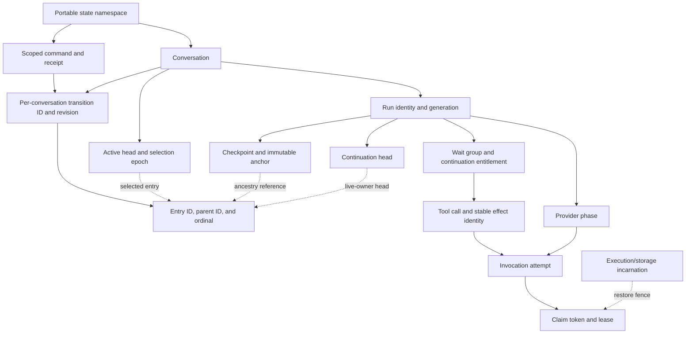
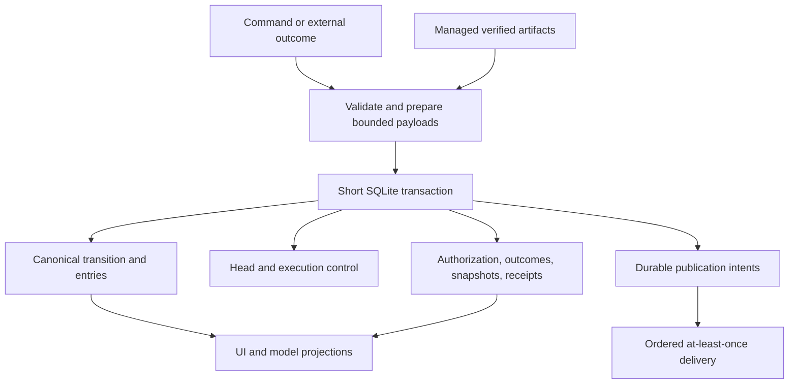

# Timeline authority, identity, and transitions

> **Status: Proposed implementation contract — pending architecture approval.** Part of the [unified conversation timeline proposal](README.md). The overview defines the shared status and normative language; this document owns the detailed contract for its topic.

Owns canonical identity, ancestry, head updates, atomic transitions, receipts, and semantic outcomes. See [execution](execution.md) for applicability and effects, and [permissions](permissions.md) for the file-write exception.

## Authority boundaries

### INV-AUTH-01

There MUST be exactly one canonical conversation-entry ancestry and active selection. Execution records remain authoritative for authorization and attempts, not for a second transcript. The authority table and representation-fate decisions below define this boundary.

| Data                                                                                                        | Authority                                                  | Rebuild policy                                                                                         |
| ----------------------------------------------------------------------------------------------------------- | ---------------------------------------------------------- | ------------------------------------------------------------------------------------------------------ |
| Entry identity, content references, parentage, committed transition order, selection/context-boundary facts | Canonical conversation journal                             | Never reconstructed from runs, harness state, notifications, or UI caches                              |
| Active head, selection epoch, foreground owner, continuation head                                           | Transactionally maintained canonical control records       | May be verified against canonical transitions; never use stale asynchronous copies for mutation safety |
| Authorization, attempts, effective run state, wait groups, resolutions, command receipts                    | Durable execution/domain records                           | Not assumed rebuildable from timeline evidence; backup and integrity checks must include them          |
| Versioned immutable execution snapshots                                                                     | Durable execution state                                    | Required snapshots cannot be replaced by a provider transcript approximation                           |
| Transcript pages, search, model-context caches, presentation status                                         | Projections of canonical facts and authorized domain state | Rebuildable; must expose source positions and versions                                                 |
| Complete payload bytes                                                                                      | Managed artifact storage                                   | References do not recreate missing bytes; loss is an explicit integrity failure                        |
| Publication intents and subscriber delivery cursors                                                         | Durable outbox and protocol delivery state                 | Delivery retention does not define conversation retention                                              |

Permission authority and its file-write exception are defined by [INV-POLICY-01](permissions.md#inv-policy-01) and [INV-POLICY-04](permissions.md#inv-policy-04), not by a second configuration representation in this timeline.

“Canonical state” means the journal **and** its required control/execution records, not a claim that the journal alone restores a running system. A backup containing only timeline events is incomplete. Each fact has one owner; copies are identified as projections.

Shared API, event, policy, storage, and checkpoint schemas MUST live in `packages/contracts`. Session, RPC, replay, and transport lifecycle mechanics remain in `packages/protocol`; both packages remain transport-neutral. SQLite transaction orchestration belongs to the server. Provider formatting and disposable context trees belong to the harness, not history authority.

### Fate of existing history representations

These names identify the existing representations whose authority changes; they do not prescribe target tables or migration algorithms.

| Existing representation                                                     | Target authority decision                                                                                                                                                                                                                                                                                                                                       |
| --------------------------------------------------------------------------- | --------------------------------------------------------------------------------------------------------------------------------------------------------------------------------------------------------------------------------------------------------------------------------------------------------------------------------------------------------------- |
| Conversation entries (`conversation.entry_appended`, `parentEntryId`)       | Consolidate into the single canonical entry tree and transition model. Preserve stable history identities and ancestry; enrich canonical facts where the current display-oriented shape omits meaningful data                                                                                                                                                   |
| Journaled model-context tree (`model_context.entry_appended`, `parentId`)   | Retire as an independently authoritative entry tree. Move unique conversation facts, messages, summaries and context boundaries into canonical entries/transitions. Preserve provider-specific state required for exact resumption as immutable execution snapshots linked to canonical identities; all remaining context structure is a rebuildable projection |
| Journaled model-context selection (`model_context.leaf_changed`)            | Retire independent conversation selection authority. Derived per-agent/context leaves refer to canonical history and cannot select or rewrite its active branch                                                                                                                                                                                                 |
| Harness `ConversationStorage` tree/leaf and Agent in-memory message history | Retain only as model/context projections with canonical provenance. They may propose changes through the canonical transition boundary, not independently commit history or active selection                                                                                                                                                                    |
| Run-local `transitions[*].entries` and checkpoint entry-ID lists            | Remove transcript-membership/order authority and duplicated target checkpoint arrays. Retain execution lifecycle, immutable snapshots, and references to canonical entries/positions                                                                                                                                                                            |

Unique durable model-context facts that are not conversation history (for example, agent configuration or provider metadata) retain one authoritative owner in typed domain state or immutable execution/context-recipe snapshots, without an independent conversation parent/leaf tree. Required data is not discarded merely because it falls outside the visible transcript or is not needed for immediate resumption. Unclassified legacy content is preserved as inert import evidence until classified; it cannot supply runtime history, policy or executable continuation through a legacy parser. If its meaning is needed to prove history or recovery correctness, unresolved classification blocks that migration or resumption under INV-MIGRATE-02.

Durable model-context records are not disposable merely because their **target representation** becomes a projection. Their unique meaningful content and required provider state MUST survive migration under [INV-MIGRATE-01](migration.md#inv-migrate-01). If current representations disagree, migration follows [INV-MIGRATE-02](migration.md#inv-migrate-02); it cannot discard a branch or invent proof of resumption. The result is consolidation of existing facts, not a third tree alongside the old two.

## Identity, ordering, and ancestry

### Identity glossary

These names distinguish existing semantic roles; they do not require a table or independently allocated identifier for every row.

| Identity or position             | Meaning and boundary                                                                                        |
| -------------------------------- | ----------------------------------------------------------------------------------------------------------- |
| State namespace                  | Stable identity of portable state used to scope receipts; moving/restoring state preserves it               |
| Execution/storage incarnation    | Fresh restore-era fence for workers, mutation sessions, and cursors; not a new namespace or effect identity |
| Conversation ID                  | Owner of one canonical history and its local revision sequence                                              |
| Command ID and receipt scope     | Identity of a semantic mutation/retry; one command may commit transitions in several conversations          |
| Transition ID and revision       | One committed change in one conversation; revision orders commits, not ancestry                             |
| Entry ID, parent ID, and ordinal | Immutable history node, ancestry edge, and entry order within its transition                                |
| Active head and selection epoch  | Selected entry plus a fence for navigation changes; ordinary append does not increment the epoch            |
| Run identity and generation      | Execution owner and its validity fence; separate from conversation selection and restore incarnation        |
| Continuation head                | Current canonical head owned by a live run; equals its active head, not its immutable checkpoint anchor     |
| Checkpoint identity and anchor   | Immutable execution snapshot reference tied to a canonical historical entry/position                        |
| Wait-group identity              | Fixed member set whose dispositions determine one continuation entitlement                                  |
| Provider-phase identity          | One logical frozen model request, possibly with several fenced attempts and at most one committed response  |
| Tool-call and effect identities  | Proposed local operation versus stable logical external effect/deduplication key                            |
| Attempt identity                 | One possible invocation of a provider phase or tool effect; retry is not a new history authority            |
| Claim token/generation           | Time-bounded worker execution/settlement authority; lease loss does not prove non-execution                 |

The following relationships show ownership and references, not a physical schema. Dotted edges are references or fences rather than transcript ancestry.

Detailed fence applicability belongs to [execution](execution.md#applicability-predicate); the fresh-incarnation protocol belongs to [durable recovery](durable-recovery.md#restore-and-rollback-execution-protocol).

### INV-ID-01

Canonical entry identity, immutable ancestry, conversation-local commit order, and scoped ownership MUST remain distinct. The conceptual records and ordering rules below define their required semantics; the glossary and diagram are explanatory views of these rules.

### Conceptual records

These fields define semantics, not a required table-per-record implementation. Equivalent normalized storage is allowed.

| Record             | Required semantic fields                                                                                                                                                                                   |
| ------------------ | ---------------------------------------------------------------------------------------------------------------------------------------------------------------------------------------------------------- |
| Transition         | `schemaVersion`, `transitionId`, `conversationId`, `revision`, `kind`, `commandId`, input fingerprint reference, actor/cause, timestamp, ordered entry/evidence references, resulting head/control changes |
| Entry              | `entryId`, `conversationId`, `transitionId`, `ordinal`, nullable `parentEntryId`, entry kind, bounded content or artifact references, optional run/tool/interaction provenance                             |
| Conversation head  | `conversationId`, current `revision`, nullable `activeEntryId`, `selectionEpoch`, nullable foreground run owner                                                                                            |
| Execution control  | Run identity/generation, effective state, bound selection epoch, continuation head, current wait-group/snapshot references                                                                                 |
| Command receipt    | Idempotency scope/key, fingerprint version/hash, committed outcome including generated IDs and revision references                                                                                         |
| Artifact reference | Stable artifact identity, owner, relative managed locator, digest, byte length, media type, semantic role, availability state                                                                              |

Timestamps are diagnostic, not ordering authorities. Unknown schema versions MUST fail closed for mutations and resumption; they must not be silently ignored. Entry IDs and transition IDs are distinct. All references MUST be checked for conversation/owner membership.

### Conversation commit order

- A conversation starts at revision `0` with an empty head. Each committed conversation transition increments its revision by one using compare-and-swap (CAS) or an equivalent transactional condition.
- `(conversationId, revision)` and `transitionId` are unique. One transition can append multiple entries, ordered by `ordinal` within that transition.
- A no-op or receipt replay does not advance the revision. Rejected CAS attempts do not create journal items.
- Conversation revisions order **all committed transitions**, including those with no transcript entry. They do not describe branch ancestry.
- A cross-conversation command has **one scoped command receipt and one distinct canonical transition per changed conversation**; [INV-COMMIT-01](#inv-commit-01) commits them together. Each transition has its own `transitionId`, single `conversationId`, and next conversation-local revision; all link to the same scoped command identity. The receipt identifies every transition and resulting owner/head. An unchanged conversation may be a validated precondition without receiving a transition. There is no multi-owner timeline item, shared transition ID across conversations, or global conversation counter.

### Entry ancestry and selection

- Entries form an immutable parent-linked tree with a nullable root parent. A parent MUST already exist in the same conversation or precede the child within the same transition. Cycles and missing parents are rejected.
- The active history is the path from `activeEntryId` to the root. A nullable head represents empty history. Numeric revisions do not establish ancestry.
- Ordinary append extends the current active/continuation head. Multiple entries appended by one transition form an explicit parent chain unless a supported operation explicitly creates an inactive path.
- Navigation selects an existing entry (including an ancestor) or the empty root. It records a selection transition, not a new transcript node. The next append forks naturally from that selection.
- Selection changes and their execution consequences are governed by [INV-HEAD-01](#inv-head-01), not numeric ancestry comparisons.
- No first-class mutable branch object is required. Stable entry ancestry plus selection epoch is sufficient for this version; future branch labels are metadata referencing entries.

### Control-head transitions

#### INV-HEAD-01

This version permits one foreground owner of the active continuation path. `selectionEpoch` increments when navigation actually changes the selected head; ordinary append does not increment it and same-head selection is a no-op. Navigation away and back increments the epoch twice without reviving an old run. While a foreground run owns the active path, **the active head and its continuation head MUST be equal at every committed boundary**. The checkpoint anchor is an immutable historical reference, not another mutable head. A fenced/terminal run retains its last continuation head as evidence; it is no longer required to equal the current active head.

The following is the complete set of permitted head changes for this design:

| Transition                                                                                                          | Active head                                                     | Run continuation head                                                                                                                   |
| ------------------------------------------------------------------------------------------------------------------- | --------------------------------------------------------------- | --------------------------------------------------------------------------------------------------------------------------------------- |
| Accept user entry/start run                                                                                         | Advance to last accepted entry                                  | Initialize the new owner's head to that same entry                                                                                      |
| Commit assistant/proposals, attached tool or child result, or conclusive recovery attachment                        | Advance to last appended entry                                  | Advance to exactly the same entry atomically                                                                                            |
| Append a visible summary entry at a compatible context boundary                                                     | Advance to that entry                                           | If owned by a live run, advance to the same entry atomically                                                                            |
| Commit non-entry context boundary, policy/interaction state, execution claim, provider phase, or lifecycle evidence | Unchanged                                                       | Unchanged                                                                                                                               |
| Navigate to a different entry/root                                                                                  | Select target and increment selection epoch                     | Fence prior owner; retain its historical head without rebasing it                                                                       |
| Cancel, abandon, terminalize, or record detached output                                                             | Unchanged                                                       | Freeze prior owner's head; no new attachment rights                                                                                     |
| Validated import or restore recovery admission                                                                      | Establish/validate the selected canonical head                  | Initialize fresh admitted ownership to that head only after applicability/recovery proof; never move the head to fit a stale checkpoint |
| Delete                                                                                                              | Fence immediately; remove active head only during owner cleanup | Fence immediately; retain only evidence required by deletion protocol                                                                   |

A resolution or lifecycle operation that also appends entries follows the append rule, not the unchanged-head rule. Append without a foreground owner changes only the active head; a new owner initializes from it. No operation advances a live run's continuation head without the matching active-head write, or attaches a result to active history while advancing neither. Inactive outcomes are evidence, not hidden transcript appends. New head-changing operations require a revision of this contract.

### Minimal transition taxonomy

A transition has one command-level kind and may carry several related facts. It is not necessary to emit a separate event for every record written.

| Kind                         | Canonical meaning                                                                                 |
| ---------------------------- | ------------------------------------------------------------------------------------------------- |
| `entries_appended`           | User/model content, drafted tool calls, or tool-result attachment; stable entry IDs and parentage |
| `selection_changed`          | Explicit active-head selection and affected execution fence                                       |
| `context_boundary_committed` | Summary or model-context policy boundary with canonical source provenance                         |
| `interaction_changed`        | Request, resolution, denial, cancellation, or supersession and its execution references           |
| `run_changed`                | Start, suspension, continuation, cancellation, interruption, or terminal state                    |
| `execution_changed`          | Durable authorization/attempt/outcome evidence not already covered by another transition          |
| `history_imported`           | Migration baseline with explicit legacy provenance; never fabricated execution chronology         |

Entry kinds cover user messages, assistant messages/tool proposals, tool results, and summaries. Lifecycle evidence is not automatically a visible transcript row. Existing lifecycle-only rows may remain visible through a projection without remaining ancestry-bearing nodes for new writes.

Heartbeat updates, lease renewals, streaming deltas, delivery acknowledgements, cache rebuild progress, and logs remain domain/projection-only. Authorization, first execution claim, terminal or indeterminate outcome, and history attachment require canonical evidence; every lease renewal does not.

## Transition and transaction contract

### INV-COMMIT-01

A logical database transition MUST commit canonical changes, correctness-critical execution/control state, its scoped receipt, and publication intent together. Cross-conversation commands commit every affected conversation's transition atomically. External waits and filesystem work stay outside this boundary. The commit sequence and transition matrix below elaborate this rule; entry/head effects come from [INV-ID-01](#inv-id-01) and [INV-HEAD-01](#inv-head-01).

The existing atomic persistence facility MUST become the shared commit owner for these database participants. A sequence of repository calls that individually commit is not an atomic logical transition. The remembered-grant file workflow in [file-authoritative permissions](permissions.md) deliberately consists of multiple transitions; its intermediate outcomes must not be presented as one all-or-nothing commit.

### Commit algorithm

1. Outside the transaction, validate input shape, prepare bounded data and required artifacts, and load a candidate canonical state. Do not execute an external effect merely to prepare a command that has not been authorized.
2. Begin a short SQLite transaction. Look up the scoped command receipt **before** rejecting an obsolete expected revision. An identical committed request returns its prior outcome even if the conversation has advanced.
3. Compare fingerprint, current conversation revision(s), selection epoch, run generation, interaction revision, and authorization as required. Revalidate all safety predicates inside the transaction.
4. Write the transition, entries, head/control changes, correctness-critical domain changes, snapshot references, command receipt, and publication intents atomically.
5. Commit, then expose the committed outcome. External execution, delivery, and asynchronous projection work occur afterward.

CAS mismatch returns a conflict without partial writes. A caller may reload and retry the **command** only after semantic revalidation; this is not permission to repeat an external effect. Resource contention retries MUST be bounded and observable. The coordinator may serialize local command preparation/commit admission for fairness, but MUST NOT hold an application lock across a model/tool/user wait.

A durable semantic rejection, such as superseding an impossible approval, is itself a successful terminalization transition with a receipt explaining the rejected action. It is different from a transient CAS conflict.

### Idempotency

#### INV-RECEIPT-01

Every externally retryable mutation MUST have a stable key scoped to its operation and owner. Its versioned fingerprint covers normalized semantic input, including explicit execution/selection preconditions and grant scope, but excludes transport request IDs and a refreshed CAS revision used only for optimistic retry. Reuse with different semantic input fails closed. Receipts return the originally committed result and generated IDs, not a reconstruction from current UI state.

Receipt uniqueness is `(stateNamespaceId, operationKind, ownerId, commandId)`. The state namespace is a durable identity of the portable state, preserved by backup/restore, not its filesystem path. Conversation mutations use the conversation ID as owner; application-originated overlay-save/trust operations use a typed policy-scope/owner identity. Their fingerprint includes the intended rule/content digest, scope, and observed base-document digest. External file edits are not database commands and do not require receipts. Cross-conversation review acceptance uses the source conversation and returns all destination IDs/revisions in **one** receipt committed with all changes. Creation uses the state namespace as owner so a deleted destination cannot erase its creation receipt. Recovery uses the affected conversation as owner and includes the attempt/effect identity in its semantic fingerprint. Receipts for deletion and creation survive conversation-row cleanup. Authorization to read or replay a receipt MUST be checked independently; knowing its key does not grant access.

Logical effect keys and their retry lifetime are governed by [INV-EFFECT-01](execution.md#inv-effect-01), distinct from this command-receipt identity.

Canonical command receipts are durable domain records, not the expiring transport retry cache. A transport cache may accelerate replay but its expiry, eviction, or reset MUST NOT erase canonical replay protection or permit a fresh mutation under a committed key. After a cache miss, resolve the canonical receipt or retained deletion reservation. The implementation may share physical storage only if these distinct retention and authority contracts are preserved.

### Shared semantic outcomes

#### INV-OUTCOME-01

Before consumer integration, transport-neutral contracts MUST distinguish the following outcomes; exact schema names and wire encoding belong to the implementation plan:

- Committed mutation versus committed receipt replay, transient CAS conflict, fingerprint mismatch, and durable semantic supersession/cancellation.
- Projection lag (requested/applied/canonical positions), rebuilding or incompatible view, expired cursor, restored-incarnation invalidation, deleted owner, access denial, and reconciliation required with a reason and fresh-view entry point where permitted.
- Tool/member disposition and recovery-required reason, plus the currently permitted recovery actions and their evidence/precondition requirements.
- Permission diagnostic identity bound to scope/document and observed failure fingerprint, stale repair/reset/fallback confirmation, and separate remembered-save versus approval-finalization outcomes.

Consumers MUST NOT infer these meanings from human-readable error text, generic unknown payloads, or transport status alone. Outcome contracts identify applicable canonical positions and retry/reconciliation behavior. This specifies the semantic vocabulary, not a new transport or API-name inventory.

### Logical transition matrix

All rows include the transition, applicable head/control changes, receipt, and publication intents. “Fence” means authoritative invalidation that every executor and interaction read checks.

| Operation                                | Preconditions                                                                                                                                        | Additional atomic writes and outcome                                                                                                                                                                                               |
| ---------------------------------------- | ---------------------------------------------------------------------------------------------------------------------------------------------------- | ---------------------------------------------------------------------------------------------------------------------------------------------------------------------------------------------------------------------------------- |
| Accept user message/start run            | Expected selection and revision; no active foreground owner                                                                                          | Append user entry; create run/generation, foreground ownership, and first provider-phase preparation obligation. If a run exists, return explicit conflict or queue the prompt outside active history; never silently supersede it |
| Commit assistant response/tool proposals | Current run/generation and continuation head; bounded proposal set                                                                                   | Append assistant/proposal entries; create drafts and new snapshot. Streaming is not committed output until this succeeds                                                                                                           |
| Evaluate policy/authorize                | Fresh validated file observation under [file-authoritative permissions](permissions.md); database-owned draft/input state still matches              | Persist observed policy/trust evidence and exact-call authorization or pending interaction; no execute-before-commit path                                                                                                          |
| Request interaction/suspend              | Current run/generation; stable proposal/input                                                                                                        | Store immutable checkpoint, wait-group membership, pending interaction, and waiting/partially-waiting run state                                                                                                                    |
| Resolve approval/question/review         | Applicability rules in [checkpoint and wait-group contract](execution.md#checkpoints-wait-groups-and-applicability); unresolved interaction revision | Store resolution, observed policy/save outcome evidence, exact-call eligibility/denial or answer, wait-group update, and run state. File grants are separate; continue only when the group's barrier is satisfied                  |
| Accept plan in new conversation          | Applicable review; deterministic destination IDs                                                                                                     | Resolve review and create destination conversation/run state in the same database transaction; retain source review provenance without cross-conversation parent links                                                             |
| Claim execution                          | Durable authorization; current execution fence; no conflicting active attempt                                                                        | Create attempt and work claim with fencing token before invoking the tool                                                                                                                                                          |
| Settle execution and attach result       | Matching attempt; complete required payload prepared; run still applicable for attachment                                                            | Persist outcome, terminal tool state, unique result entry, continuation-head/wait-group update and next snapshot or continuation intent                                                                                            |
| Record late/detached outcome             | Valid attempt identity but owning run/selection fenced                                                                                               | Persist actual outcome and payload references with detached disposition; no append to the new active path and no run revival                                                                                                       |
| Continue model execution                 | Wait-group barrier satisfied; current generation/head; valid snapshot                                                                                | Consume continuation entitlement once and create the durable provider phase and next-work authorization atomically; retries belong to that phase                                                                                   |
| Cancel run                               | Current run generation, or replay of prior cancellation                                                                                              | Close/fence generation and continuation entitlement; schedule bounded owned-member/work cleanup, not implicit child-conversation cancellation. Report effective cancellation immediately                                           |
| Navigate                                 | Existing target in conversation; expected head/revision                                                                                              | Select target, increment selection epoch, fence any owning run and pending actions; cleanup is bounded and asynchronous                                                                                                            |
| Commit context boundary                  | Current source head/policy version; no incompatible in-flight provider phase                                                                         | Persist immutable summary/source references and selected context policy boundary; update permitted run snapshot atomically                                                                                                         |
| Recover indeterminate work               | Attempt evidence insufficient to prove outcome                                                                                                       | Record `outcome_unknown`, block automatic continuation/re-execution, expose recovery-required action                                                                                                                               |

User input during a run may be queued as domain state; it becomes conversation history only when a later acceptance transition gives it a canonical entry. New user/model work cannot be smuggled into an unresolved wait group. Interrupt/steer admission is explicitly deferred in the [decisions register](decisions.md#deferred-design). Its implementation must preserve these rules or first revise the affected invariant IDs; consumers must not implement independent ownership or steering policies.

The approval row applies [INV-COMMIT-01](#inv-commit-01) to exact-call execution state. Remembered file grants and observed policy evidence follow [INV-POLICY-04](permissions.md#inv-policy-04); that exception is not an additional database atomicity guarantee.

Cross-conversation commits acquire any application-level locks in stable conversation-ID order and use the same database transaction; no distributed transaction mechanism is introduced.
