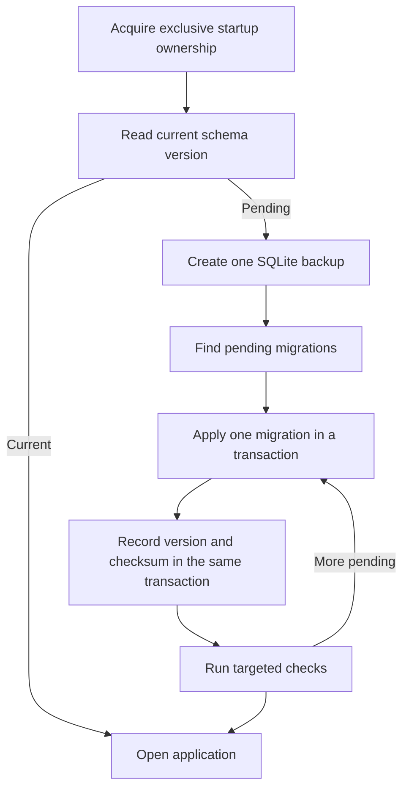
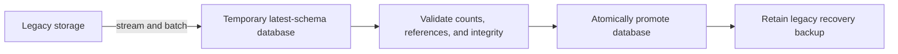

# Storage migration framework

> **Status:** Non-normative design brainstorm for a simple, reliable migration system around the canonical SQLite store.

## Scope

The framework covers all Nerve-owned durable data, but not all data belongs physically in SQLite.

| Data                                                                                   | Location                               | Migration approach                                                     |
| -------------------------------------------------------------------------------------- | -------------------------------------- | ---------------------------------------------------------------------- |
| Settings and UI preferences                                                            | Canonical SQLite                       | Schema or versioned payload migration                                  |
| Projects, conversations, agents, records, and durable events                           | Canonical SQLite                       | Schema or versioned record migration                                   |
| Permission rules                                                                       | Canonical SQLite                       | Schema or versioned payload migration                                  |
| Task definitions/state, scratch notes, provider profiles, and other queryable metadata | Canonical SQLite                       | Schema or versioned payload migration                                  |
| API keys, OAuth tokens, and integration credentials                                    | `SecretProvider`, not plaintext SQLite | Explicit secret-name/format migration                                  |
| Secret encryption key and local daemon authentication token                            | Restricted secret/bootstrap storage    | Explicit security migration; never copied into ordinary tables         |
| Runtime discovery, locks, WAL files, and migration work files                          | Ephemeral filesystem state             | Recreated, cleaned, or handled by startup recovery                     |
| Logs and reconnectable external-process output                                         | File/task-log storage                  | Format-specific migration only when necessary                          |
| User-authored plans, prompt files, skills, and exports                                 | Files                                  | Preserve as user content; import metadata into SQLite only when useful |
| Regenerable caches                                                                     | Cache storage                          | Invalidate and rebuild rather than migrate                             |

Provider/authentication metadata may live in SQLite, but secret values remain behind `SecretProvider`. The migration coordinator covers both stores when necessary without weakening that boundary.

## Three migration mechanisms

### 1. SQLite schema migrations

Use forward-only, checksummed migrations embedded in the storage package.

```sql
CREATE TABLE schema_migrations (
    version       INTEGER PRIMARY KEY,
    name          TEXT NOT NULL,
    checksum      TEXT NOT NULL,
    applied_at_ms INTEGER NOT NULL,
    duration_ms   INTEGER NOT NULL
);
```

A migration contains only:

```text
version
name
checksum
up(transaction)
```

The framework owns locking, transactions, recording, backup, and common verification.



Rules:

- one short, atomic transaction per migration;
- no down migrations—restore the pre-upgrade backup instead;
- reject databases newer than the binary's supported schema;
- reject changed checksums for already-applied migrations;
- retain the single pre-upgrade backup until the upgraded application starts successfully;
- use migration-specific assertions plus `foreign_key_check`; run `quick_check` once after the batch.

### 2. Versioned record/configuration payloads

Most field changes should not alter the SQL schema. Flexible records and settings carry a payload version:

```json
{
  "version": 2,
  "phase": "executing"
}
```

The storage package decodes supported historical versions into the current contract. Old payloads are rewritten in the latest format on their next mutation or by an optional measured backfill.

SQL migrations are reserved for changes to relational envelopes, indexes, constraints, or query paths. This keeps ordinary domain evolution fast and avoids rewriting every conversation at startup.

### 3. Legacy storage import

Moving from the current JSON/files/journals layout to canonical SQLite is a one-time importer, not a normal schema migration.



The importer:

1. Creates a temporary database directly at the latest schema.
2. Streams legacy data using prepared statements and bounded transactions.
3. Sends credentials directly through `SecretProvider`; plaintext secrets never enter the temporary database or migration logs.
4. Builds expensive indexes after bulk insertion when beneficial.
5. Validates entity counts, foreign keys, record decoding, and `quick_check`.
6. Closes and checkpoints the database before atomic promotion.
7. Leaves legacy storage untouched if any step fails.
8. Retains the old layout until the new application completes a healthy startup.

## Secret migrations

Secret migrations are rare and explicit. They operate through the `SecretProvider` API rather than reading storage internals directly.

A secret migration should:

- enumerate only known secret names;
- copy/write the new value before deleting the old value;
- verify the new value can be read;
- never log secret material;
- be idempotent after interruption;
- keep encryption keys outside ordinary database backups;
- record only non-secret migration completion metadata in SQLite.

If the platform later supplies an OS keychain, the same interface can migrate encrypted-file secrets without changing domain repositories.

## Fresh installations

A fresh installation creates the current schema directly and records one baseline version. It does not replay historical migrations.

```text
No database  -> create current baseline
Old database -> apply only later migrations
Newer database -> refuse downgrade and preserve data
```

## Performance

Normal startup performs one schema-version query and no filesystem-wide detection scan. During upgrades:

- use prepared statements and set-based SQL;
- avoid loading all conversations or payloads into memory;
- make large transformations resumable only when a measured migration cannot fit one safe transaction;
- create one backup per upgrade batch using SQLite's backup API;
- report migration ID and progress without exposing payload content;
- perform expensive full integrity checks only during upgrade or explicit diagnostics.

## Minimal ownership

The storage package owns:

- latest schema creation;
- ordered migration registry and checksums;
- transaction and backup behavior;
- payload decoders/upgraders;
- legacy importer;
- startup compatibility checks.

Individual domains provide only their schema SQL, payload conversion, and focused invariants. This keeps the migration framework intentionally boring and prevents each migration from inventing its own detection, backup, rollback, and verification architecture.
