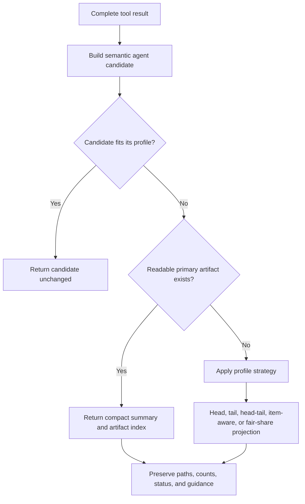

# Adaptive tool-result agent previews

> **Status:** Non-normative requirements proposal. This document captures expected behavior for refinement before implementation planning. Current behavior remains defined by the owning contracts, catalog, implementation, and tests.

## Problem

A tool call can produce three different result forms:

1. a complete durable result or file artifact;
2. a model-facing projection returned to the agent;
3. a compact public transcript preview shown in the UI.

These forms serve different purposes and must not share one accidental limit. The complete result preserves recoverability. The agent projection must provide enough information for the agent to continue effectively without flooding its context. The public transcript preview must remain compact, safe, and understandable to a person.

The current agent projection applies a common aggregate text ceiling of 200 lines and 24,000 UTF-8 bytes. That is appropriate for requested source text, but it is unnecessarily large for acknowledgements and routine process output, while a simple head truncation can hide the most useful diagnostics. Conversely, replacing every artifact-backed result with a file path would cause avoidable follow-up tool calls and reduce agent capability.

This proposal defines adaptive, tool-aware agent projections. It does not change the complete durable result or the public transcript preview contract.

## Goals

- Reduce automatic model-context consumption from verbose tool results.
- Preserve agent capability and avoid unnecessary follow-up `read` or `grep` calls.
- Return small useful results inline and unchanged.
- Treat generated files and reports as first-class results without duplicating large file contents into model context.
- Select information semantically before applying byte and line bounds.
- Preserve exact recovery, continuation, status, and artifact-location information.
- Make policies explicit, consistent, measurable, and independently tunable.

## Non-goals

- Reducing or deleting complete durable tool results.
- Changing process capture, download-size, storage, or public UI-preview safety limits.
- Automatically summarizing arbitrary output with another model call.
- Estimating provider tokens as the enforcement mechanism. Limits are deterministic UTF-8 bytes, lines, or structured item counts; bytes are not tokens.
- Finalizing package ownership, schemas, or migration mechanics. Those belong to a later implementation design.
- Forcing the agent to read a file when the original useful result already fits comfortably inline.

## Core principle

> Inline a small useful result. When the useful result is large and a readable primary artifact exists, return a compact index and let the agent inspect only what it needs.

Artifact presence alone must not suppress useful output. Projection considers the result's semantic value, size, artifact role, and recoverability together.



## Required invariants

1. **Small-result fast path:** If the semantic model candidate fits the selected profile, return it unchanged. The existence of a raw or supporting artifact does not alter this rule.
2. **No hidden reread:** Projection must not open a generated artifact merely to copy it back into context. It operates on the complete result and artifact metadata already available. A producer may include a small inline candidate alongside a file.
3. **Complete-result preservation:** Agent projection never replaces, mutates, or weakens the complete durable result.
4. **Independent budgets:** Every tool call, including parallel siblings, receives its own model-projection budget.
5. **Aggregate enforcement:** Byte and line ceilings apply across all model-visible text blocks, including truncation notices. Image bytes do not count as text.
6. **Semantic selection first:** Do not serialize duplicate representations such as `content`, `stdout`, `stderr`, `entries`, and `matches` and then truncate them. Select one useful representation first.
7. **Recovery survives:** A truncated projection retains a readable artifact or payload path when one exists.
8. **Continuation survives:** Offsets, byte offsets, cursors, next-page tokens, omitted-item counts, and focused recovery guidance remain model-visible.
9. **Status survives:** Exit status, failure state, warnings, partial-success state, and affected resource identifiers take precedence over bulk content.
10. **Safe fallback:** If an expected primary artifact is absent or unreadable, use the normal bounded inline strategy instead of returning a dead pointer.
11. **Unknown-tool fallback:** Historical, renamed, or unknown tools use the current conservative 200-line/24,000-byte head policy.
12. **Errors remain actionable:** Terminal errors receive a compact headline and diagnostic tail rather than being reduced to an artifact path.

## Artifact roles

Artifact behavior should be based on semantic role, not merely extension or artifact existence.

| Proposed role       | Meaning                                                                    | Agent behavior                                                                |
| ------------------- | -------------------------------------------------------------------------- | ----------------------------------------------------------------------------- |
| `primary_result`    | The requested product is the file or report itself                         | Inline a small available candidate; otherwise return a compact artifact index |
| `supporting_data`   | Raw or supplemental data backs a useful semantic response                  | Keep the semantic response inline and mention the artifact secondarily        |
| `overflow_recovery` | The artifact preserves output omitted from an inline diagnostic projection | Return the bounded diagnostic projection plus the recovery path               |

Examples:

- An Explore report, downloaded attachment, downloaded page bundle, or saved large web response is a primary result.
- Raw Jira or Confluence JSON saved alongside issue/page summaries is supporting data.
- A file containing omitted Bash or Python output is overflow recovery.

The exact contract representation is future implementation work. Existing artifact kinds are not always enough to infer the role: for example, a `raw_result` may be an API backup or the requested downloaded attachment.

## Balanced preview profiles

The following thresholds are initial requirements for evaluation, not immutable constants. “Fits” means all applicable boundaries are satisfied. Structured item counts are the primary boundary where lines are not semantically meaningful; UTF-8 bytes remain the hard aggregate boundary.

| Profile                  | Small-result behavior                                  | Overflow strategy                                                            | Proposed ceiling                                                          |
| ------------------------ | ------------------------------------------------------ | ---------------------------------------------------------------------------- | ------------------------------------------------------------------------- |
| Source text              | Return the requested range unchanged                   | Head, with continuation                                                      | 200 lines / 24,000 B                                                      |
| Process diagnostics      | Return all output and exit status                      | First 20 lines plus last 60; prioritize stderr and termination state         | 80 lines / 12,000 B; 1,000 characters per output line                     |
| Search matches           | Return all matches/context                             | Match-aware head, never split metadata from a match                          | 80 displayed lines / 16,000 B                                             |
| File listing             | Return all entries                                     | Item-aware head                                                              | 120 entries / 12,000 B                                                    |
| Search summaries         | Return answer and all fitting results                  | Answer plus highest-ranked result summaries                                  | 10–20 results / 12,000 B                                                  |
| Network prose            | Return complete converted text                         | Metadata followed by text head                                               | 120 lines / 16,000 B                                                      |
| Resource detail          | Return complete semantic summary                       | Core fields plus bounded related collections                                 | 160 lines / 16,000 B                                                      |
| Mutation acknowledgement | Return complete acknowledgement                        | Preserve identifiers, status, warnings, and next action                      | 40 lines / 4,000 B                                                        |
| Lifecycle state          | Return complete state                                  | Structured state summaries                                                   | 80 lines / 8,000 B                                                        |
| Task logs                | Return all requested events                            | Diagnostic tail with task termination state                                  | 60 events / 10,000 B; 512 B per log line                                  |
| Delegated reports        | Return complete reports when aggregate output is small | Compact report index; if no reports are readable, fair-share report excerpts | Inline up to 120 lines / 16,000 B; index up to 20 lines / 6,000 B         |
| Primary file result      | Return a small available textual candidate plus path   | File metadata and inspection guidance only                                   | Inline candidate up to 80 lines / 8,000 B; index up to 12 lines / 3,000 B |
| Vision explanation       | Return complete explanation and supported image block  | Explanation head; retain image metadata                                      | 100 lines / 12,000 B                                                      |
| Terminal error           | Return complete short error                            | Headline plus diagnostic tail                                                | 40 lines / 4,000 B                                                        |

A profile must not pad, summarize, or rewrite a fitting result. The small-result path avoids both context waste and unnecessary follow-up calls.

## Tool inventory and proposed behavior

The current catalog contains 50 active tools. Every active tool is covered below.

### Local files, processes, network, and interaction

| Tools                    | Profile                              | Required projection behavior                                                                                                                                                            |
| ------------------------ | ------------------------------------ | --------------------------------------------------------------------------------------------------------------------------------------------------------------------------------------- |
| `read`                   | Source text                          | Preserve the explicitly requested line or byte range. Use a head boundary only when execution returns more than the profile permits. Pass supported image blocks independently of text. |
| `bash`, `python_exec`    | Process diagnostics                  | Small command output remains complete. Large output preserves command outcome, first 20 and last 60 lines, with tail diagnostics favored and full-output recovery identified.           |
| `grep`                   | Search matches                       | Preserve path, line number, matching text, selected context, omitted-match count, and continuation guidance. Avoid duplicating structured matches and formatted content.                |
| `find`, `ls`             | File listing                         | Preserve ordered typed entries and the requested root. Return first entries plus omitted count and refinement guidance when bounded.                                                    |
| `edit`, `write`          | Mutation acknowledgement             | Return path, operation outcome, changed ranges or byte count, and warnings. Do not repeat the submitted content or inject a full success diff.                                          |
| `web_search`             | Search summaries                     | Preserve answer when present, query, and up to 10 ranked title/URL/snippet summaries. Keep result ordering and omitted-result count.                                                    |
| `web_fetch`              | Network prose or primary file result | Apply the conditional behavior described below. Preserve final URL, status, content type, conversion state, size, and saved path.                                                       |
| `explain_image`          | Vision explanation                   | Preserve supported image content where needed, explanation, path, MIME type, and relevant model metadata. Do not serialize image base64 as text.                                        |
| `ask_user`               | Mutation acknowledgement             | Preserve the question identity and the user's response or dismissal. Do not needlessly repeat long prompt context after resolution.                                                     |
| `todos_set`, `todos_get` | Lifecycle state                      | Preserve ordered todo text and completion state using item-aware bounding.                                                                                                              |

### Jira

| Tools                                                                                                                                                                                                            | Profile                  | Required projection behavior                                                                                                                                                                 |
| ---------------------------------------------------------------------------------------------------------------------------------------------------------------------------------------------------------------- | ------------------------ | -------------------------------------------------------------------------------------------------------------------------------------------------------------------------------------------- |
| `jira_search_users`, `jira_search_issues`, `jira_search_boards`                                                                                                                                                  | Search summaries         | Preserve query, first fitting summaries, totals, and next-page token. Existing raw JSON is supporting data.                                                                                  |
| `jira_get_issue`, `jira_get_project`, `jira_get_board`, `jira_get_sprint`                                                                                                                                        | Resource detail          | Preserve core resource fields and at most three previews from each requested related collection before applying aggregate bounds. Preserve offsets/tokens and supporting raw artifact paths. |
| `jira_download_attachment`                                                                                                                                                                                       | Primary file result      | Return attachment ID, filename, MIME type, bytes, saved path, and inspection guidance. Never inline binary bytes.                                                                            |
| `jira_create_issue`, `jira_update_issue`, `jira_transition_issue`, `jira_manage_comment`, `jira_manage_worklog`, `jira_manage_issue_link`, `jira_manage_attachment`, `jira_manage_sprint`, `jira_manage_backlog` | Mutation acknowledgement | Preserve operation, outcome, affected identifiers, relevant URL, warnings, partial failures, and dry-run state.                                                                              |

### Confluence

| Tools                                                                                                                                                                                                 | Profile                  | Required projection behavior                                                                                                                                               |
| ----------------------------------------------------------------------------------------------------------------------------------------------------------------------------------------------------- | ------------------------ | -------------------------------------------------------------------------------------------------------------------------------------------------------------------------- |
| `confluence_search_spaces`, `confluence_search_pages`                                                                                                                                                 | Search summaries         | Preserve query, first fitting summaries, totals, and cursor. Raw response artifacts are supporting data.                                                                   |
| `confluence_get_page`                                                                                                                                                                                 | Resource detail          | Preserve core page metadata, body preview, and at most three previews from each requested related collection. Preserve cursor/offset information and supporting artifacts. |
| `confluence_download_page`                                                                                                                                                                            | Primary file result      | Return download directory, manifest, pages file, body format, page count, attachment count, and inspection guidance. Do not duplicate downloaded bodies.                   |
| `confluence_create_page`, `confluence_update_page`, `confluence_manage_comment`, `confluence_manage_page`, `confluence_manage_label`, `confluence_manage_restriction`, `confluence_manage_attachment` | Mutation acknowledgement | Preserve operation, outcome, page/resource identifiers, URL, warnings, partial failures, and dry-run state.                                                                |

### Orchestration

| Tools                                                          | Profile                  | Required projection behavior                                                                                                                                                                  |
| -------------------------------------------------------------- | ------------------------ | --------------------------------------------------------------------------------------------------------------------------------------------------------------------------------------------- |
| `task_start`, `task_status`, `task_control`                    | Lifecycle state          | Preserve task IDs, names, statuses, readiness, timing, termination, lineage, and control outcome. Use compact structured summaries rather than raw task records.                              |
| `task_logs`                                                    | Task logs                | Small requested log sets remain complete. Large sets retain the newest diagnostic events and task termination state. Preserve the query mode/cursor needed to continue.                       |
| `explore`                                                      | Delegated reports        | Apply the conditional report behavior described below. Preserve report ordering, label, child status, short summary, and readable report path.                                                |
| `plan_mode_enter`, `plan_mode_present`, `plan_mode_force_exit` | Mutation acknowledgement | Preserve review lifecycle status, plan path/identifier, decision, and actionable failure details. Do not repeat a large plan body that is already available as the reviewed artifact/message. |

## Conditional behavior by result shape

### Web fetch

`web_fetch` must not impose a second tool call for a small fetched document.

- If converted or textual content is returned inline and fits 120 lines/16,000 B, return it unchanged even if supporting metadata exists.
- If inline text exceeds that profile and no primary artifact exists, return a bounded head with URL/status/type and recovery guidance.
- If the response was deliberately saved (`raw` or binary mode), or large content was saved as the primary result, return a compact file summary rather than duplicating the document.
- Never inline binary content.

Examples:

```text
Small Markdown response, 35 lines
→ all 35 lines returned by web_fetch; no follow-up read required

Large converted page saved to /.../page.md
→ URL, status, Markdown conversion, size, path, and “use grep/read” guidance
```

### Explore

Explore reports are high-value but are also deliberately written to readable files.

- If all report text together fits 120 lines/16,000 B, return it inline and retain report paths. This lets the parent agent use small findings immediately.
- If the aggregate exceeds that boundary and report files are readable, return a compact index rather than excerpts from every full report.
- The index includes one entry per report: label/task, status, short summary preview, and path. It is capped at 20 lines/6,000 B; when more reports exist, preserve omitted count.
- If one or more report files are unavailable, allocate the normal 24,000-byte fallback fairly across unavailable reports so one report cannot hide all siblings.

Example large-result projection:

```text
Explore completed: 3 reports.
1. Local output taxonomy — completed — Process tools need diagnostic-tail previews. — /.../01-local.md
2. Atlassian taxonomy — completed — Raw JSON is supporting data. — /.../02-atlassian.md
3. Architecture — completed — Policies should be explicit catalog metadata. — /.../03-architecture.md
Use read or grep on a report path for full findings.
```

### Jira and Confluence reads

Many read operations save raw API responses. Those artifacts are supporting data, not the primary model response.

- A small semantic issue, project, page, board, sprint, space, or search result remains inline.
- Large related collections are represented by compact previews, total/omitted counts, and continuation information.
- The raw artifact path remains visible but does not force the agent to parse raw JSON for routine work.

### Jira and Confluence downloads

Download tools intentionally produce files.

- Return concise identity, type/format, count/size, and path information.
- Include a one-line instruction naming the appropriate inspection tool when useful.
- Do not read and duplicate downloaded text automatically.
- Never inline downloaded binary bytes.

### Bash and Python overflow

Large process output uses an artifact for recovery, but a bare path is insufficient for routine diagnostics.

- Fitting output remains complete.
- Overflow returns exit status, first 20 lines, last 60 lines, omitted counts, and artifact path.
- Diagnostic tail receives more of the budget because compiler, test, and runtime failures are commonly reported last.
- Extremely long individual log lines are bounded independently so one generated line cannot consume the whole result.

## Agent-facing notices

A bounded result should end with one concise, machine-readable-enough notice in ordinary prose. It must state:

- what was omitted: lines, items, events, or bytes;
- the projection direction when relevant;
- where the complete result can be recovered;
- the most appropriate next action, such as a focused `read`, `grep`, cursor, or offset.

The notice counts against the profile budget. It must not include legacy continuation instructions that no longer work.

Examples:

```text
Output truncated to the first 20 and last 60 lines. Full output: /.../result.txt
```

```text
Showing 20 of 73 issues. Continue with next_page_token="..."; raw response: /.../issues.json
```

## Public transcript preview remains separate

This proposal concerns the result returned to the model. It does not replace public transcript projection rules.

The public preview has stronger compactness and safety requirements, including secret-like field filtering, credential-bearing URL handling, bounded nesting, and tool-specific head/tail selection. A model projection may be larger than the public preview while still being far smaller than the complete result.

## Observability and tuning requirements

A future implementation should make each projection explainable without logging private result content. Limit metadata should be sufficient to answer:

- which profile and strategy were selected;
- whether the small-result fast path was used;
- whether a primary, supporting, or recovery artifact affected selection;
- original and displayed bytes, lines, and structured item counts;
- truncation direction and omitted counts;
- whether the artifact-index or fallback path was used.

Threshold tuning should use aggregate counters and focused tests, not captured user content. Limits should be centrally defined and changed deliberately rather than copied into individual executors.

## Acceptance scenarios

1. A 35-line file read is returned completely.
2. A 300-line file read is bounded to 200 lines with valid continuation guidance.
3. A 25-line Bash result is returned completely, including exit state.
4. A 700-line Bash result returns first 20 and last 60 lines plus a readable recovery path.
5. A short web page is returned by `web_fetch` without requiring `read`.
6. A large saved web page returns URL/type/size/path metadata without duplicating its body.
7. A binary web response is never converted to model-visible text.
8. A small Jira issue summary remains inline even though raw JSON was saved.
9. A large Jira issue preserves core fields, related-item counts, continuation offsets, and the raw artifact path.
10. A Jira attachment download returns concise file metadata and no binary content.
11. A Confluence page download returns manifest and bundle paths without page-body duplication.
12. One small Explore report is available inline and by path.
13. Several large Explore reports return a compact ordered index with summaries and paths.
14. If an Explore report path is unavailable, a fair-share fallback prevents the first report from consuming the entire budget.
15. Mutation tools return compact confirmations and do not repeat submitted bodies.
16. A task-log query with ten events remains complete; a large query returns the newest 60 events and continuation state.
17. A truncation notice and artifact path fit inside the selected byte and line ceiling.
18. Two parallel tool calls receive independent budgets.
19. Image blocks do not consume or bypass the aggregate text budget.
20. An unknown historical tool receives the conservative 200-line/24,000-byte fallback.

## Open questions for refinement

- Should small primary text artifacts use one common 8,000-byte inline threshold, or should delegated reports and fetched documents retain separate thresholds?
- Should process projection explicitly separate stdout and stderr, or preserve the observed combined ordering with stream labels?
- Which structured result types need first-class item counters in limit metadata?
- Should a caller be able to request `summary_only`, `inline_if_small`, or `artifact_only`, or should projection remain entirely automatic?
- How should readability of owner-scoped artifacts be represented without filesystem checks during projection?
- Should an artifact's semantic role be declared by the producer, derived from tool/result shape, or both with validation?
- What telemetry period and workloads should be used before changing the proposed balanced thresholds?

## Relationship to current behavior

The current architecture already preserves complete overflow payloads, records execution/storage/model limit metadata, supports artifacts and continuation guidance, and applies a common model text budget. Process tools already distinguish inline output from larger head/tail previews, while public transcript previews already vary by tool.

The proposed change is conceptual: replace one generic model projection with an adaptive semantic policy while preserving those existing durability and safety boundaries. Implementation design begins only after this requirements proposal is reviewed and refined.
