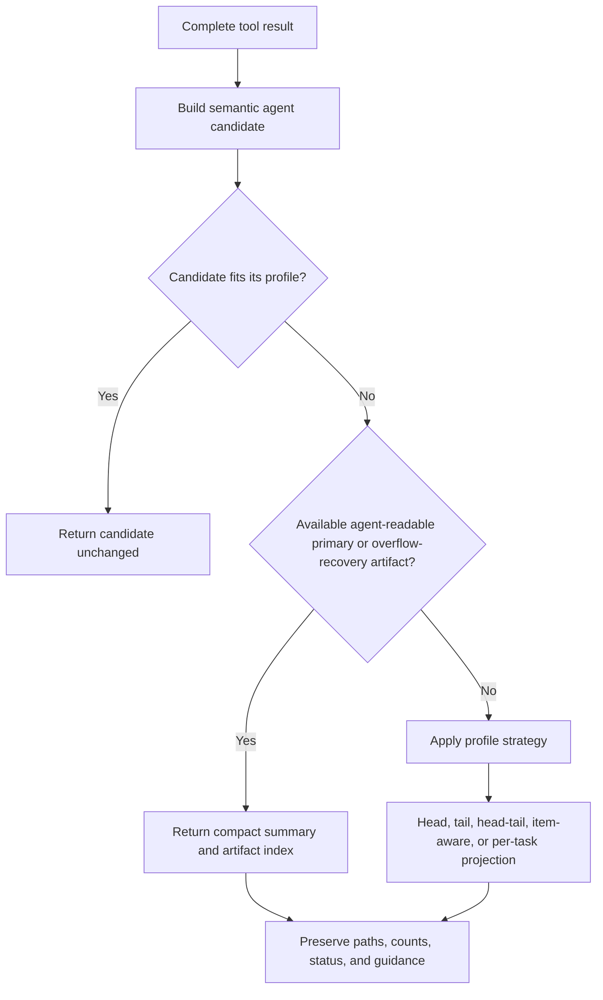

# Adaptive tool-result agent previews

> **Status:** Implemented. The accepted requirements below are enforced by the shared contracts, the 50-tool catalog policy inventory, host preparation/artifact validation, and projection tests.

## Implementation references

- Contracts: `packages/contracts/src/domains/tools/tool-agent-projection.schema.ts`
- Profiles, strategies, and all tool-family policies: `packages/tools/src/result-projection/`
- Host trust and preparation: `packages/workbench-server/src/domains/tools/tool-result-{artifact-validator,preparation,projector}.ts`
- Versioned task output bundles: `packages/workbench-server/src/domains/tasks/task-log-bundle.store.ts`

## Problem

A tool call can produce three different result forms:

1. a complete durable result or file artifact;
2. a model-facing projection returned to the agent;
3. a compact public transcript preview shown in the UI.

These forms serve different purposes and must not share one accidental limit. The complete result preserves recoverability. The agent projection must provide enough information for the agent to continue effectively without flooding its context. The public transcript preview must remain compact, safe, and understandable to a person.

The previous agent projection applied a common aggregate text ceiling of 200 lines and 24,000 UTF-8 bytes. That is appropriate for requested source text, but it is unnecessarily large for acknowledgements and routine process output, while a simple head truncation can hide the most useful diagnostics. Conversely, replacing every artifact-backed result with a file path would cause avoidable follow-up tool calls and reduce agent capability.

This policy defines adaptive, tool-aware agent projections. It does not change the complete durable result or the public transcript preview contract.

## Goals

- Reduce automatic model-context consumption from verbose tool results.
- Preserve agent capability and avoid unnecessary follow-up `read` or `grep` calls.
- Return small canonical semantic results inline without truncation or rewriting.
- Treat generated files and reports as first-class results without duplicating large file contents into model context.
- Select information semantically before applying byte and line bounds.
- Preserve exact recovery, continuation, status, and artifact-location information.
- Make policies explicit, consistent, measurable, and independently tunable.

## Non-goals

- Reducing or deleting complete durable tool results.
- Changing process capture, download-size, storage, or public UI-preview safety limits.
- Automatically summarizing arbitrary output with another model call.
- Estimating provider tokens as the enforcement mechanism. Limits are deterministic UTF-8 bytes, lines, or structured item counts; bytes are not tokens.
- Finalizing package ownership, schemas, or migration mechanics. Those belong to a later implementation design.
- Forcing the agent to read a file when the original useful result already fits comfortably inline.

## Core principle

> Inline a small useful result. When the useful result is large and an available, agent-readable artifact becomes the recovery source, return a compact index and let the agent inspect only what it needs.

Artifact presence alone must not suppress useful output. Projection considers the result's semantic value, size, artifact role, and recoverability together. Once the agent must inspect an artifact to recover the full result, the inline projection should become a compact locator and decision summary rather than a large excerpt that the subsequent file read will duplicate.



## Required invariants

1. **Small-result fast path:** First build the canonical semantic model candidate, including required status, identity, continuation, and recovery metadata. If that complete candidate fits the selected profile, return it byte-for-byte without truncation, summarization, padding, or further rewriting. The existence of a raw or supporting artifact does not alter this rule.
2. **No hidden reread:** Projection must not open a generated artifact merely to copy it back into context. It operates on the complete result and artifact metadata already available. A producer may include a small inline candidate alongside a file.
3. **Complete-result preservation:** Agent projection never replaces, mutates, or weakens the complete durable result.
4. **Independent budgets:** Every tool call, including parallel siblings, receives its own model-projection budget. Delegated reports within one `explore` result receive independent per-task budgets because each report is a distinct requested result. `explore` has no additional call-level text ceiling.
5. **Aggregate enforcement:** Except for the explicit per-task `explore` policy, byte and line ceilings apply across all model-visible text blocks, including metadata and truncation notices. Image bytes do not count as text. Profiles may define a content-item allowance inside a slightly larger aggregate line ceiling, but the aggregate byte ceiling remains hard. For `explore`, every task block—including its label, status, report or summary, size metadata, path, notice, and allocated share of any call-level header or footer—must fit 60 lines/6,000 B. With at most eight tasks, the entire text projection therefore remains within 480 lines/48,000 B.
6. **Semantic selection first:** Do not serialize duplicate representations such as `content`, `stdout`, `stderr`, `entries`, and `matches` and then truncate them. Select one useful representation first.
7. **Recovery survives:** Every truncated projection retains either an exact continuation mechanism or an available, agent-readable artifact or complete-result payload path. If the producer has neither, the result must be externalized to a readable payload before projection truncates it.
8. **Continuation survives:** Offsets, byte offsets, cursors, next-page tokens, omitted-item counts, and focused recovery guidance remain model-visible. Continuation guidance must recover omitted content rather than skip over it.
9. **Status survives:** Exit status, failure state, warnings, partial-success state, and affected resource identifiers take precedence over bulk content.
10. **Safe fallback:** If no primary artifact is declared both available and agent-readable, use the normal bounded inline strategy plus an exact continuation or readable complete-result payload path instead of returning a dead pointer.
11. **Unknown-tool fallback:** Renamed or unknown tools use the conservative 200-line/24,000-byte head policy. Newly processed calls still receive exact recovery before truncation. Historical records receive recovery guidance only when a complete payload or readable artifact actually exists; projection cannot fabricate content that was not preserved.
12. **Terminal outcomes remain actionable:** A failed, denied, cancelled, or interrupted tool call receives a compact status-first message with the tool name, reason, affected resource or process state when available, and next action. A process that ran and exited nonzero remains a completed process-diagnostics result rather than being reclassified as a tool-execution failure. Unexpectedly large diagnostics retain a readable complete payload path.
13. **No redundant artifact handoff:** When a fitting candidate can be returned completely, return it completely. When overflow makes an artifact or complete-result file the authoritative recovery source, inline only enough status, semantic summary, size/count metadata, path, and inspection guidance for the agent to choose its next step. Do not spend the normal inline ceiling on a long excerpt the agent will have to reread from the file.

## Artifact roles

Artifact behavior should be based on semantic role, not merely extension or artifact existence.

| Proposed role       | Meaning                                                                    | Agent behavior                                                                |
| ------------------- | -------------------------------------------------------------------------- | ----------------------------------------------------------------------------- |
| `primary_result`    | The requested product is the file or report itself                         | Inline a small available candidate; otherwise return a compact artifact index |
| `supporting_data`   | Raw or supplemental data backs a useful semantic response                  | Keep the semantic response inline and mention the artifact secondarily        |
| `overflow_recovery` | The artifact preserves output omitted from an inline diagnostic projection | Return a compact diagnostic index plus the recovery path                      |

Examples:

- An Explore report, downloaded attachment, downloaded page bundle, or saved large web response is a primary result.
- Raw Jira or Confluence JSON saved alongside issue/page summaries is supporting data.
- A file containing omitted Bash or Python output is overflow recovery.
- Structured task-event JSONL and raw per-stream task output have different roles: JSONL supports event queries, while readable raw text preserves exact output recovery.

The exact contract representation is implemented in the shared contracts package. Existing artifact kinds are not always enough to infer the role: for example, a `raw_result` may be an API backup or the requested downloaded attachment.

Artifact selection must use producer-declared, validated metadata rather than a filesystem check during projection. The metadata must distinguish:

- semantic role: `primary_result`, `supporting_data`, or `overflow_recovery`;
- access: whether the location is an agent-readable file or metadata-only location;
- availability at result completion;
- appropriate inspection tools, such as `read` or `grep`, when applicable.

Producers may report artifact facts, but only trusted host code or the artifact store may issue the validated descriptor consumed by projection. Validation must canonicalize the location, verify that it is an allowed regular file or managed logical reference, reject unsafe indirection such as an unapproved symlink, and record availability at result completion. Metadata originating in a remote tool or integration cannot make an arbitrary host path agent-readable. Projection trusts the validated descriptor and does not reopen the artifact. If the descriptor is absent, unavailable, or not agent-readable, the artifact cannot suppress the bounded inline fallback.

### Agent-ready artifact format

An agent-readable path must lead to content that the available inspection tools can use directly. Merely exposing a filesystem path does not make binary, minified, or poorly structured content agent-ready.

- Generated textual primary results use UTF-8 and a format appropriate for `read` and `grep`, normally Markdown, plain text, pretty-printed JSON, or one-event-per-line JSONL.
- Reports use descriptive headings, stable field labels, and one semantic item or paragraph per line-oriented block. Prose should target at most 120 characters per physical line. Wide tables should become sections or lists instead of forcing very long rows.
- Code, exact paths, URLs, and source excerpts may exceed the prose width when wrapping would change meaning. If an exact line is too long for useful inline inspection, preserve byte-oriented recovery rather than silently rewriting it.
- Pretty-printed semantic files must not contain avoidable minified payloads or huge generated lines. Raw API responses, process streams, and other exact recovery files remain byte-faithful; when they are not pleasant to inspect directly, pair them with an agent-ready semantic summary, index, or manifest.
- A binary artifact may be a valid requested product, but it is metadata-only for textual inspection unless a supported tool can consume its content. Projection must not call a binary path agent-readable merely because the file exists.
- Artifact notices identify the format, size, path, and most appropriate inspection tool. Files must remain available for the lifetime advertised by their owning result.

This policy does not change the physical payload layout, storage migration rules, deletion behavior, or export behavior. Those remain owned by the existing storage contracts and implementation.

## Balanced preview profiles

The following thresholds are initial requirements for evaluation, not immutable constants. “Fits” means all applicable boundaries are satisfied. Structured item counts are the primary boundary where lines are not semantically meaningful; UTF-8 bytes remain the hard aggregate boundary.

| Profile                  | Small-result behavior                                                  | Overflow strategy                                                                                                                    | Proposed ceiling                                                                                    |
| ------------------------ | ---------------------------------------------------------------------- | ------------------------------------------------------------------------------------------------------------------------------------ | --------------------------------------------------------------------------------------------------- |
| Source text              | Return the fitting canonical requested-range candidate                 | Head, with exact range metadata and continuation                                                                                     | 200 content lines / 202 aggregate lines / 24,000 B                                                  |
| Process diagnostics      | Return all output and exit status when the complete candidate fits     | Compact status, diagnostic sample, size/omission metadata, recovery path, and guidance; no large head/tail excerpt                   | Inline threshold: 84 lines / 12,000 B; overflow index: 16 lines / 4,000 B; 1,000 B per sampled line |
| Search matches           | Return all matches/context                                             | Match-aware head, never split metadata from a match                                                                                  | 80 displayed lines / 16,000 B                                                                       |
| File listing             | Return all entries                                                     | Item-aware head                                                                                                                      | 120 entries / 12,000 B                                                                              |
| Search summaries         | Return answer and all fitting results                                  | Answer plus highest-ranked result summaries                                                                                          | 10 results / 12,000 B                                                                               |
| Network prose            | Return complete converted text when the complete candidate fits        | Compact response metadata and agent-ready recovery path; avoid duplicating a large body excerpt                                      | Inline threshold: 120 lines / 16,000 B; overflow index: 12 lines / 3,000 B                          |
| Resource detail          | Return complete semantic summary                                       | Core fields plus bounded related collections                                                                                         | 160 lines / 16,000 B                                                                                |
| Mutation acknowledgement | Return complete acknowledgement                                        | Preserve identifiers, status, warnings, and next action                                                                              | 40 lines / 4,000 B                                                                                  |
| Lifecycle state          | Return complete state                                                  | Structured state summaries                                                                                                           | 80 lines / 8,000 B                                                                                  |
| Task logs                | Return all requested events                                            | Mode-aware event window with task termination and bidirectional continuation; shorten individual events only with exact raw recovery | At most 60 events / 10,000 B aggregate; 512 B per displayed event line                              |
| Delegated reports        | Evaluate and return each small report independently                    | For each large report, return only status, a short summary, size metadata, readable path, and guidance                               | Per task inline threshold: 60 lines / 6,000 B; large index: 12 lines / 3,000 B; summary up to 512 B |
| Primary file result      | Return a small textual candidate plus an available agent-readable path | File metadata and inspection guidance only                                                                                           | Inline candidate up to 80 lines / 8,000 B; index up to 12 lines / 3,000 B                           |
| Human response           | Return the complete user-authored response or review feedback          | Source-style head with exact readable payload recovery                                                                               | 200 content lines / 202 aggregate lines / 24,000 B                                                  |
| Vision explanation       | Return complete explanation and supported image block                  | Explanation head; retain image metadata                                                                                              | 100 lines / 12,000 B                                                                                |
| Terminal outcome         | Return a complete short status-first outcome                           | Headline plus diagnostic tail and readable complete payload when needed                                                              | 40 lines / 4,000 B                                                                                  |

A profile must not pad, summarize, or rewrite a fitting canonical semantic candidate. Canonical construction may select and format the useful representation, but once status, identity, continuation, and recovery metadata are present, the fitting candidate passes through byte-for-byte. The small-result path avoids both context waste and unnecessary follow-up calls.

## Tool inventory and proposed behavior

The current catalog contains 50 active tools. Every active tool is covered below.

### Local files, processes, network, and interaction

| Tools                    | Profile                              | Required projection behavior                                                                                                                                                                                                                                                                              |
| ------------------------ | ------------------------------------ | --------------------------------------------------------------------------------------------------------------------------------------------------------------------------------------------------------------------------------------------------------------------------------------------------------- |
| `read`                   | Source text                          | Preserve up to 200 requested content lines plus exact start/end/total/omitted/next-offset metadata. Use a head boundary only when execution returns more than the profile permits. Preserve equivalent size and continuation metadata for byte ranges. Pass supported image blocks independently of text. |
| `bash`, `python_exec`    | Process diagnostics                  | Fitting command output remains complete. Large output returns a compact outcome and diagnostic index plus an agent-ready full-output path, without a long head/tail excerpt that a subsequent file inspection would duplicate.                                                                            |
| `grep`                   | Search matches                       | Preserve path, line number, matching text, selected context, omitted-match count, and continuation guidance. Avoid duplicating structured matches and formatted content.                                                                                                                                  |
| `find`, `ls`             | File listing                         | Preserve ordered typed entries and the requested root. Return first entries plus omitted count and refinement guidance when bounded.                                                                                                                                                                      |
| `edit`, `write`          | Mutation acknowledgement             | Return path, operation outcome, changed ranges or byte count, and warnings. Do not repeat the submitted content or inject a full success diff.                                                                                                                                                            |
| `web_search`             | Search summaries                     | Preserve answer when present, query, and up to 10 ranked title/URL/snippet summaries. Keep result ordering and omitted-result count.                                                                                                                                                                      |
| `web_fetch`              | Network prose or primary file result | Apply the conditional behavior described below. Preserve final URL, status, content type, conversion state, size, and saved path.                                                                                                                                                                         |
| `explain_image`          | Vision explanation                   | Preserve supported image content where needed, explanation, path, MIME type, and relevant model metadata. Do not serialize image base64 as text.                                                                                                                                                          |
| `ask_user`               | Human response                       | Preserve the question identity and the user's complete response or dismissal. Apply the source-text-sized budget to the response, and do not needlessly repeat long prompt context after resolution.                                                                                                      |
| `todos_set`, `todos_get` | Lifecycle state                      | Preserve ordered todo text and completion state using item-aware bounding.                                                                                                                                                                                                                                |

### Jira

| Tools                                                                                                                                                                                                            | Profile                  | Required projection behavior                                                                                                                                                                 |
| ---------------------------------------------------------------------------------------------------------------------------------------------------------------------------------------------------------------- | ------------------------ | -------------------------------------------------------------------------------------------------------------------------------------------------------------------------------------------- |
| `jira_search_users`, `jira_search_issues`, `jira_search_boards`                                                                                                                                                  | Search summaries         | Preserve query, first fitting summaries, totals, and next-page token. Existing raw JSON is supporting data.                                                                                  |
| `jira_get_issue`, `jira_get_project`, `jira_get_board`, `jira_get_sprint`                                                                                                                                        | Resource detail          | Preserve core resource fields and at most three previews from each requested related collection before applying aggregate bounds. Preserve offsets/tokens and supporting raw artifact paths. |
| `jira_download_attachment`                                                                                                                                                                                       | Primary file result      | Return attachment ID, filename, MIME type, bytes, saved path, and inspection guidance. Never inline binary bytes.                                                                            |
| `jira_create_issue`, `jira_update_issue`, `jira_transition_issue`, `jira_manage_comment`, `jira_manage_worklog`, `jira_manage_issue_link`, `jira_manage_attachment`, `jira_manage_sprint`, `jira_manage_backlog` | Mutation acknowledgement | Preserve operation, outcome, affected identifiers, relevant URL, warnings, partial failures, and dry-run state.                                                                              |

### Confluence

| Tools                                                                                                                                                                                                 | Profile                  | Required projection behavior                                                                                                                                               |
| ----------------------------------------------------------------------------------------------------------------------------------------------------------------------------------------------------- | ------------------------ | -------------------------------------------------------------------------------------------------------------------------------------------------------------------------- |
| `confluence_search_spaces`, `confluence_search_pages`                                                                                                                                                 | Search summaries         | Preserve query, first fitting summaries, totals, and cursor. Raw response artifacts are supporting data.                                                                   |
| `confluence_get_page`                                                                                                                                                                                 | Resource detail          | Preserve core page metadata, body preview, and at most three previews from each requested related collection. Preserve cursor/offset information and supporting artifacts. |
| `confluence_download_page`                                                                                                                                                                            | Primary file result      | Return download directory, manifest, pages file, body format, page count, attachment count, and inspection guidance. Do not duplicate downloaded bodies.                   |
| `confluence_create_page`, `confluence_update_page`, `confluence_manage_comment`, `confluence_manage_page`, `confluence_manage_label`, `confluence_manage_restriction`, `confluence_manage_attachment` | Mutation acknowledgement | Preserve operation, outcome, page/resource identifiers, URL, warnings, partial failures, and dry-run state.                                                                |

### Orchestration

| Tools                                       | Profile                  | Required projection behavior                                                                                                                                                                                                                    |
| ------------------------------------------- | ------------------------ | ----------------------------------------------------------------------------------------------------------------------------------------------------------------------------------------------------------------------------------------------- |
| `task_start`, `task_status`, `task_control` | Lifecycle state          | Preserve task IDs, names, statuses, readiness, timing, termination, lineage, and control outcome. Use compact structured summaries rather than raw task records.                                                                                |
| `task_logs`                                 | Task logs                | Small requested log sets remain complete. Large sets retain a mode-aware event window and task termination state. Preserve first/last sequence boundaries, older/newer availability, backward continuation, and the forward incremental cursor. |
| `explore`                                   | Delegated reports        | Apply the per-task behavior described below. Preserve report ordering, label, child status, short summary, size metadata, and the agent-readable report path.                                                                                   |
| `plan_mode_enter`, `plan_mode_force_exit`   | Mutation acknowledgement | Preserve lifecycle status, plan path/identifier, and actionable failure details.                                                                                                                                                                |
| `plan_mode_present`                         | Human response           | Preserve review status, plan path/identifier, decision, and complete user feedback within the human-response budget. Do not repeat the large plan body already available as the reviewed file/message.                                          |

## Conditional behavior by result shape

### Read

`read` must make ordinary line and byte pagination self-contained. Projection must not force the agent through a raw payload merely to continue reading a file.

- A fitting canonical requested-range candidate, including its range and continuation metadata, remains byte-for-byte unchanged after construction.
- A line result carries structured `startLine`, `endLine`, `totalLines`, `omittedLines`, and `nextOffset` metadata when continuation is possible. The producer supplies the requested range and total while reading the source; projection updates displayed boundaries after bounding without reopening an artifact.
- Overflow returns up to 200 content lines. The 202-line aggregate allowance reserves space for concise range and continuation guidance; the 24,000-byte aggregate remains hard and may reduce the displayed content-line count.
- A byte-range result carries file size, requested/displayed byte boundaries, omitted bytes, and `nextByteOffset`.
- If an overlong or partial line prevents safe line continuation, direct the agent to `byteOffset`/`byteLimit` rather than emitting an invalid line offset.

Example for a 500-line file:

```text
<lines 1–200>
Showing lines 1–200 of 500. Continue with read({ path: "...", offset: 201, limit: 200 }).
```

### Web fetch

`web_fetch` must not impose a second tool call for a small fetched document.

- If the canonical converted or textual candidate, including required response metadata, fits 120 lines/16,000 B, return it byte-for-byte after construction even if supporting metadata exists.
- If inline text exceeds that profile and no primary artifact exists, externalize the stable response to an agent-ready recovery file before projection and return compact URL/status/type/size/path metadata. Do not return a large body head that the agent must reread from the recovery file. Repeating the fetch is not exact recovery because the remote response may change.
- If the response was deliberately saved (`raw` or binary mode), or large content was saved as the primary result, return the same compact file summary rather than duplicating the document.
- Never inline binary content.

Examples:

```text
Small Markdown response, 35 lines
→ all 35 lines returned by web_fetch; no follow-up read required

Large converted page saved to /.../page.md
→ URL, status, Markdown conversion, size, path, and “use grep/read” guidance
```

### Human responses

Human-authored responses are primary instructions, not mutation acknowledgements.

- A fitting `ask_user` response or plan-review feedback remains complete within the 200-content-line/202-aggregate-line/24,000-byte source-style budget.
- Preserve the question or review identity, resolution status, and the response or feedback. Do not repeat long question context, recommendations, or the reviewed plan body.
- If the user-authored text exceeds the inline budget, return a source-style head plus exact omitted counts and a readable complete-result payload path.
- A dismissal or review decision without substantive feedback remains a compact status-first result.

### Explore

Explore reports are high-value and are deliberately written to agent-ready files. Each task is evaluated independently rather than sharing one aggregate report-content budget. There is no additional call-level ceiling: with at most eight tasks, independent 60-line/6,000-B task blocks bound the complete result to at most 480 lines/48,000 B.

- A completed report must have an available, agent-readable path whose file follows the agent-ready artifact format above. If report persistence or formatting fails, return that child as failed with an actionable error instead of a completed report with no recovery path.
- If one report's complete inline projection, including label/task, status, report text, size metadata, path, and notices, fits 60 lines/6,000 B, return that report completely. The size of sibling reports does not suppress it.
- If one report exceeds either inline boundary, do not fill the remaining 60-line/6,000-B allowance with an excerpt. Return only its label/task, status, size metadata, a summary preview of at most 512 UTF-8 bytes, path, and inspection guidance. The complete large-report index must fit 12 lines/3,000 B. The agent will inspect the file if it needs report details, so embedding those same details would only duplicate context.
- Any shared `explore` header, footer, or guidance is allocated to the task blocks and counts toward their budgets; there is no unbudgeted common text.
- Preserve input ordering. Because one `explore` call accepts at most eight tasks and each task has an independent hard budget, no fair-share excerpt algorithm is needed.
- Failed or aborted reports preserve their status and concise actionable error details within the same per-task budget. They may include a path when useful diagnostic content was successfully persisted.

Example mixed-result projection:

```text
Explore completed: 3 reports.
1. Local output taxonomy — completed — 34 lines, returned inline — /.../01-local.md
   <complete small report>
2. Atlassian taxonomy — completed — 420 lines — Raw JSON is supporting data. — /.../02-atlassian.md
3. Architecture — completed — 610 lines — Policies should be explicit catalog metadata. — /.../03-architecture.md
Use read or grep on a large report path for full findings.
```

### Jira and Confluence reads

Many read operations save raw API responses. Those artifacts are supporting data, not the primary model response.

- A small semantic issue, project, page, board, sprint, space, or search result remains inline.
- Large related collections are represented by compact previews, total/omitted counts, and continuation information.
- The raw artifact path remains visible but does not force the agent to parse raw JSON for routine work.

### Jira and Confluence downloads

Download tools intentionally produce files.

- Return concise identity, type/format, count/size, and path information.
- Include a one-line instruction naming the appropriate inspection tool when useful.
- Do not read and duplicate downloaded text automatically.
- Never inline downloaded binary bytes.

### Bash and Python overflow

Large process output uses an artifact for recovery, but a bare path is insufficient for routine diagnostics and a long excerpt creates redundant context.

- If the complete canonical output and status fit 84 lines/12,000 B, return them completely.
- If either inline boundary is exceeded, switch to an overflow index of at most 16 lines/4,000 B rather than filling the original allowance with head/tail output.
- The overflow index preserves exit status, failure or warning state, elapsed/process state when available, original line/byte counts, omitted counts, recovery path, and focused `read` or `grep` guidance. It may include at most eight short diagnostic tail lines only when they can help the agent continue without opening the file or decide what to inspect; otherwise omit the sample.
- Do not include a general head excerpt. If the agent needs more than the compact diagnostic sample, it should inspect the full-output file instead of receiving the same output twice.
- When the producer captures observed cross-stream order, the compact diagnostic sample preserves that order with explicit stdout/stderr labels. Exact raw stdout and stderr remain separate recovery files. If observed ordering is unavailable, present sampled streams separately and make no interleaving claim.
- An optional combined recovery file represents observed, stream-labeled arrival order rather than a stronger operating-system ordering guarantee. Omit it when the runtime cannot produce that representation reliably.
- Individual sampled lines are capped at 1,000 UTF-8 bytes, while the 4,000-B aggregate remains hard.

### Terminal outcomes

Terminal outcome handling is selected before the normal result-shape profile when the tool call itself is failed, denied, cancelled, or interrupted.

- Start with an explicit outcome headline, followed by tool name, concise reason, affected resource or process state when available, and the appropriate next action.
- Denial must say that the requested operation was not performed. Cancellation or interruption must not claim rollback unless rollback is guaranteed.
- A process tool that started and returned an exit code, including a nonzero exit code, uses the process-diagnostics profile so its exit status and useful output survive.
- A partial-success result remains in its owning semantic profile with partial state, warnings, and affected identifiers preserved; it is not flattened into a generic failure.
- Fitting outcome text remains complete. If an exceptional diagnostic exceeds 40 lines/4,000 B, retain the headline and diagnostic tail plus a readable complete-result payload path.

### Task logs

Background-process output has two complementary durable representations:

- `logsPath` is structured JSONL with exactly one event per physical line. Each event carries sequence, timestamp, stream, level, text, and zero-based raw-stream byte boundaries `[start, end)`. The range identifies the exact event bytes in its stream file, including a line terminator when one was captured. JSON escaping must prevent event text from creating additional physical JSONL lines.
- Complete short event lines carry no path or byte suffix. When an event line is shortened, use a compact stream alias plus its exact byte range, and map each used alias to its validated stream path once in the result header.
- `stdoutPath` and `stderrPath` are ordinary UTF-8 text files containing exact per-stream output. `combinedPath` may additionally preserve observed, stream-labeled arrival order when the runtime can do so reliably; it does not claim stronger operating-system ordering. Omit `combinedPath` rather than synthesizing misleading interleaving. These paths must not alias the JSONL path.
- Retention and omission metadata must describe both representations consistently. Retention may remove a whole task-log bundle or atomically update the event index, stream files, byte boundaries, and availability metadata. It must never leave an advertised byte range pointing at removed or shifted content. A path is advertised as recovery only while its content is available.

Task-log projection preserves the query's direction so truncation cannot skip events.

- `recent`, `errors`, and `warnings` retain the newest fitting events. Preserve `firstSeq`, `lastSeq`, `hasMoreBefore`, and the exact older-page boundary; the model-facing adapter expresses that boundary as `cursor`.
- `since_cursor` retains the earliest fitting events after the requested cursor and advances the cursor only to the last displayed event. It must not tail-select a burst and skip undisplayed events.
- `first_failure` preserves the failure and its requested context as one diagnostic window.
- The internal task-log query retains independent `beforeSeq` and `sinceSeq` fields. The public `task_logs` contract exposes one `cursor`: it maps to `beforeSeq` for recent/error/warning modes and to `sinceSeq` for `since_cursor`. The result must expose the exact boundary and direction needed for the next call.
- An individual displayed event line may be shortened to 512 UTF-8 bytes only when its stream path and exact raw byte boundaries remain visible, allowing `read` byte pagination to recover the omitted suffix. Sequence cursors recover other events; they do not recover bytes omitted within one event.
- The notice distinguishes recovery of older omitted events, retrieval of future incremental events, and byte recovery for an individually shortened event.

The 60-event allowance is an item maximum, not a guarantee: the hard 10,000-B aggregate budget may reduce the displayed event count. Each result reports the actual displayed and omitted counts.

Example:

```text
Showing task-log events 441–500; 440 older events omitted. For older events, call task_logs in recent mode with cursor=441. For future events, use since_cursor with cursor=500.
```

### Image blocks and provider safeguards

Image bytes are outside the text line/byte budget because they are model media blocks rather than serialized text. They remain subject to the existing media and provider request safeguards; this policy does not make image input unbounded or replace provider-specific normalization.

- `read` recognizes JPEG, PNG, GIF, and WebP by content signature and emits supported images as image content blocks rather than textual base64.
- `explain_image` requires a regular supported image file and currently rejects files larger than 20 MiB before loading them into the explanation request.
- Before a model request, the harness normalizes images for provider limits without mutating the stored transcript. The current Anthropic path bounds dimensions to 8,000 px, or 2,000 px when a request contains more than 20 images. Other provider adapters may impose their own supported-format, request-size, count, or dimension constraints.
- Model projection retains image metadata and applies the selected profile to all accompanying text blocks. Unsupported or rejected media produces an actionable status rather than being serialized as text or silently dropped.

## Agent-facing notices

A bounded result should end with one concise, machine-readable-enough notice in ordinary prose. It must state:

- what was omitted: lines, items, events, or bytes;
- the projection direction when relevant;
- where the complete result can be recovered;
- the most appropriate next action, such as a focused `read`, `grep`, cursor, or offset;
- for process output, that the saved output should be inspected rather than rerunning the command merely to recover omitted text.

The notice counts against the profile budget. It must not include legacy continuation instructions that no longer work.

Examples:

```text
Process output externalized; 620 lines omitted from the inline index. Exit code: 1. Full output: /.../result.txt. Inspect it with grep/read; do not rerun the command merely to recover output.
```

```text
Showing 20 of 73 issues. Continue with next_page_token="..."; raw response: /.../issues.json
```

## Public transcript preview remains separate

This policy concerns the result returned to the model. It does not replace public transcript projection rules.

The public preview has stronger compactness and safety requirements, including secret-like field filtering, credential-bearing URL handling, bounded nesting, and tool-specific head/tail selection. A model projection may be larger than the public preview while still being far smaller than the complete result.

## Observability and tuning requirements

The implementation makes each projection explainable without logging private result content. Limit metadata should be sufficient to answer:

- which profile and strategy were selected, including terminal-outcome precedence;
- whether the small-result fast path was used;
- whether a primary, supporting, or recovery artifact affected selection;
- original and displayed bytes, lines, and structured item counts;
- truncation direction and omitted counts;
- the per-task inline/index decision for each delegated report;
- displayed range boundaries and the exact continuation state when content was pageable;
- raw stream path and byte boundaries when an individual task-log event was shortened.

Threshold tuning should use aggregate counters and focused tests, not captured user content. Limits should be centrally defined and changed deliberately rather than copied into individual executors.

## Acceptance scenarios

1. A 35-line file read is returned completely.
2. A 500-line file read returns up to 200 content lines plus start/end/total/omitted metadata and a valid `nextOffset`; all model-visible text stays within 202 lines/24,000 B.
3. A 25-line Bash result is returned completely, including exit state.
4. A 700-line Bash result returns a compact overflow index within 16 lines/4,000 B containing exit state, counts, a readable recovery path, guidance, and at most eight short diagnostic tail lines. It does not include a general head/tail excerpt that file inspection would duplicate.
5. A short web page is returned by `web_fetch` without requiring `read`.
6. A large saved or externalized web page returns URL/type/size/path metadata within 12 lines/3,000 B without duplicating a body excerpt.
7. A binary web response is never converted to model-visible text.
8. A small Jira issue summary remains inline even though raw JSON was saved.
9. A large Jira issue preserves core fields, related-item counts, continuation offsets, and the raw artifact path.
10. A Jira attachment download returns concise file metadata and no binary content.
11. A Confluence page download returns manifest and bundle paths without page-body duplication.
12. One Explore report whose complete task block fits 60 lines/6,000 B is available completely inline and by path.
13. In a mixed Explore result, each task is decided independently: fitting task blocks remain complete inline, while an oversized report returns only a summary of at most 512 B, size metadata, path, and guidance within 12 lines/3,000 B. It does not consume the 60-line/6,000-B inline allowance with an excerpt that file inspection would duplicate.
14. A completed Explore child without a readable, agent-ready persisted report is converted to a failed child with an actionable persistence or formatting error; no fair-share excerpt fallback is used.
15. An `ask_user` response or plan-review feedback of up to 200 content lines and 24,000 B remains complete without repeating the long prompt or plan body; larger human input retains a readable complete-result payload path.
16. Mutation tools return compact confirmations and do not repeat submitted bodies.
17. Background task output is stored as one-event-per-line JSONL plus distinct raw stdout/stderr text. A task-log query with ten fitting events remains complete; a large recent query returns the newest events that fit the 60-event/10,000-B limits with backward recovery, while a large `since_cursor` query returns the earliest fitting events and advances only to the last displayed sequence.
18. A task-log event shortened by the 512-byte display boundary retains its raw stream path and exact byte boundaries, allowing the omitted suffix to be recovered with `read`.
19. A failed, denied, cancelled, or interrupted tool call returns a concise status-first outcome. A Bash process that exits nonzero remains a process-diagnostics result with its exit code and diagnostic output.
20. A truncation notice and recovery path fit inside the selected byte and line ceiling.
21. Two parallel tool calls receive independent budgets. Reports within one Explore call receive independent 60-line/6,000-B per-task decisions with no additional call-level ceiling; eight maximal task blocks remain within 480 lines/48,000 B.
22. Explore report files are UTF-8, line-oriented, and agent-ready: prose is wrapped to a 120-character target, avoidably wide tables or minified payloads are absent, and exact overlong content retains byte recovery.
23. Image bytes are excluded from the aggregate text budget, while every accompanying text block remains subject to it. Existing format, file-size, provider-count, and provider-dimension safeguards still apply.
24. An unknown historical tool receives the conservative 200-line/24,000-byte fallback and advertises exact recovery only when preserved content actually exists.
25. `task_logs` maps its public mode-specific `cursor` to the correct internal boundary; JSONL event records and exact stdout/stderr files remain distinct, and retention never leaves an advertised raw byte range stale.

## Resolved policy decisions

- **Process streams:** Prefer observed combined order with explicit stream labels when available. Keep exact stdout and stderr separately. Omit a combined representation when reliable observed ordering is unavailable.
- **Task-log retention:** Treat the event index, raw streams, byte boundaries, and availability metadata as one consistency boundary. Remove whole bundles or update all affected representations atomically.
- **Structured counters:** File listings, search matches, ranked search results, related-resource collections, task events, delegated reports, and artifact indexes expose `original`, `displayed`, and `omitted` item counts with a stable item kind. Text-oriented profiles additionally retain byte and line counts.
- **Projection modes:** Initial behavior is entirely automatic. Callers use semantic tool parameters such as `limit`, offsets, cursors, filters, or explicit save/download modes rather than generic `summary_only`, `inline_if_small`, or `artifact_only` switches.
- **Artifact descriptors:** The future contract represents semantic role, validated access, availability, canonical or logical location, format/media type, size/count metadata, and recommended inspection tools. Remote result data may provide facts but cannot confer host-file access.
- **Artifact validation:** Trusted host code or the artifact store validates descriptors at result completion. Projection consumes validated metadata and performs no opportunistic filesystem reread.
- **Threshold changes:** Initial thresholds require focused fixtures covering every profile and representative replay workloads. Later tuning requires privacy-preserving aggregate evidence from at least 1,000 eligible tool calls over at least seven days, including model-visible bytes, truncation rate, recovery calls, repeated execution after truncation, latency, and task success. No private result content is retained for tuning.

## Relationship to current behavior

The current architecture already preserves complete overflow payloads, records execution/storage/model limit metadata, supports artifacts and continuation metadata in several result types, and applies a common model text budget. Process tools already distinguish inline output from larger head/tail previews, while public transcript previews already vary by tool. The generic model projection does not yet reliably preserve tool-specific range totals, continuation boundaries, human-review feedback, or backward task-log recovery.

The physical payload layout and its storage lifecycle remain unchanged by this implementation. Existing complete-result payloads and successful artifacts may live in different managed locations; adaptive projection relies on validated artifact descriptors rather than prescribing a storage migration.

Background task logs now use one-event-per-line JSONL alongside distinct exact stdout and stderr streams, truthful optional combined output, stable byte recovery, and bidirectional pagination through a compact public cursor over distinct internal before/after boundaries.

The implemented change replaces one generic model projection with adaptive semantic policy while preserving those existing durability and safety boundaries.
