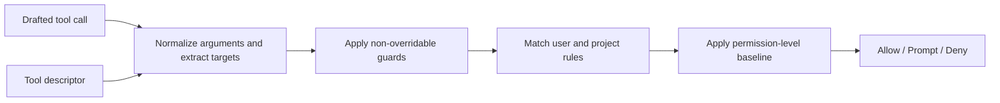
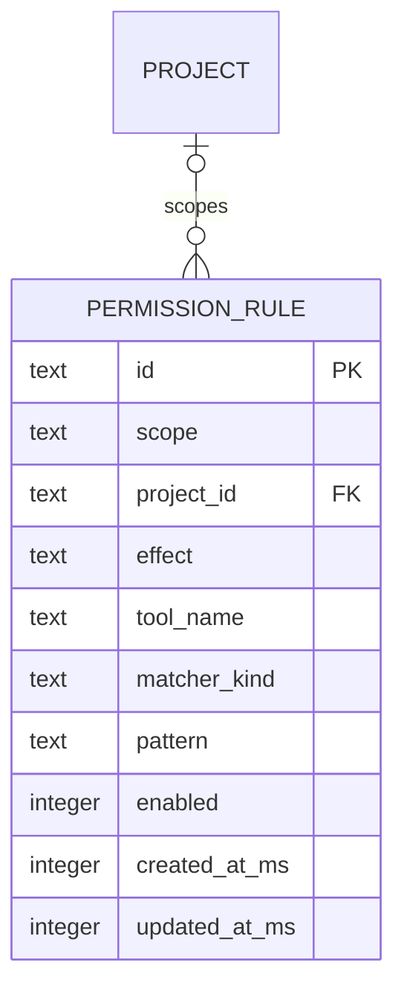
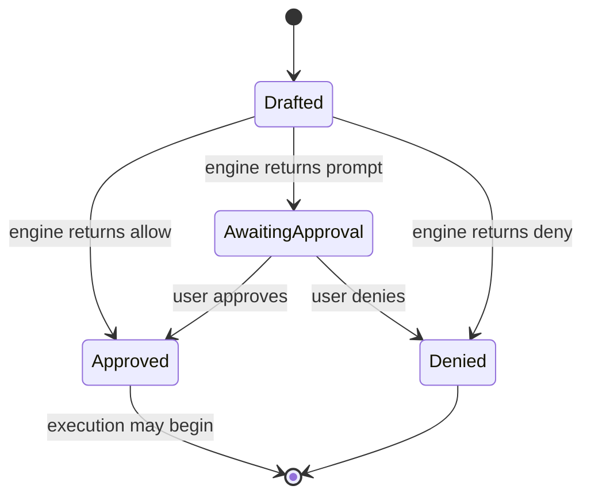

# Tool supervision engine

> **Status:** Superseded, non-normative design brainstorm retained for historical context. The authoritative target requirements are in [`permission-rule-sets.md`](./permission-rule-sets.md).

## Principle

The supervision engine is a pure, deterministic policy evaluator. It does not execute tools and does not own storage. It receives a drafted tool call plus an immutable policy snapshot and returns one explainable decision.



## Input and output

```text
SupervisionInput
  tool name
  normalized arguments
  agent mode and permission level
  project/workspace context
  tool descriptor
  effective user and project rules

SupervisionDecision
  decision: allow | prompt | deny
  effective risk
  reason
  normalized targets
  matched rule IDs
  policy snapshot hash
  suggested durable rules
```

The decision and its evidence are stored in the durable `tool_call` record before execution. This preserves why a call was allowed, prompted, or denied even if policies later change.

## Tool descriptors

Static tool characteristics belong to the tool catalog rather than the database:

```text
ToolDescriptor
  name
  base risk
  traits
  execution kind
  argument risk classifier, when applicable
  permission target extractor
  durable allow capability
```

```text
DurableAllowCapability
  never | whole_tool | target

PermissionTargetKind
  path | command_segment | url | whole_tool
```

Examples:

- Read, write, edit, grep, find, and list tools extract normalized path targets.
- Bash extracts every command segment and relevant redirection target.
- Web fetch extracts a normalized URL target and re-evaluates redirects.
- Python is not safely pattern-matchable and uses `durableAllow = never`.
- A tool may raise its effective risk based on arguments, but argument classification must never lower a non-overridable catalog risk.

## Decision order

Evaluation is fail-closed and follows one fixed order:

1. Validate and normalize arguments.
2. Apply non-overridable constraints such as planning-mode restrictions, workspace boundaries, malformed targets, and read-only restrictions.
3. Apply matching deny rules. A deny always wins.
4. Apply the permission-level baseline.
5. Apply matching allow rules only when the descriptor permits durable approval for that target and risk.
6. Otherwise request user approval.

### Permission-level baseline

| Permission level | Baseline                                                                                                                                              |
| ---------------- | ----------------------------------------------------------------------------------------------------------------------------------------------------- |
| `read_only`      | Allow safe local reads and user interaction; deny commands, mutations, secrets, deployment, and network operations not explicitly classified as safe. |
| `supervised`     | Automatically allow safe reads; apply explicit rules; prompt for unmatched higher-risk calls.                                                         |
| `autonomous`     | Allow calls unless a non-overridable guard or explicit deny rule blocks them.                                                                         |

Interaction tools are allowed to execute because their execution is the human-in-the-loop UI itself. This is separate from pre-execution supervision.

## Permission rules

Rules are small configuration records in the same canonical SQLite database. A separate database would add backup, migration, and consistency complexity without a meaningful scaling benefit.



```text
RuleScope
  user | project

RuleEffect
  allow | deny

RuleMatcherKind
  whole_tool | path_glob | command_glob | url_glob
```

- User rules apply across projects.
- Project rules apply only to one project.
- Matching deny rules override all matching allows, regardless of scope.
- `single_call` approval is stored only on that tool call.
- Run-scoped approval, if supported, belongs to the durable run record and expires with the run.
- “Always for project” and “always for user” create durable permission rules.
- Rules reference open tool names so historical rules survive catalog evolution; unknown or disabled tools never execute.

## Target safety

Auto-approval is only as safe as target normalization:

- **Paths:** resolve against the project root, use project-relative POSIX forms for matching, reject traversal, and enforce the resolved workspace boundary again immediately before execution. Symlink-sensitive writes require execution-time validation.
- **Commands:** parse compound commands into segments. Every executable segment and relevant redirection must be covered. Ambiguous or unsupported shell syntax cannot be automatically approved by a command rule.
- **URLs:** normalize scheme, host, port, and path. Redirect destinations are new targets and must be evaluated before following them.
- **Python:** arbitrary scripts are not matched by content patterns. Supervised execution prompts unless a future sandbox provides a stronger safety boundary.

## Supervision lifecycle



The engine only decides supervision. Human input requested after execution begins is part of the tool execution state machine documented in [`conversation-storage-erd.md`](./conversation-storage-erd.md).

## Durability and concurrency

- The drafted tool payload, policy decision, matched rule IDs, and policy hash commit atomically.
- Execution starts only after the approved decision is durable.
- User approval uses the expected tool revision so stale dialogs cannot approve a changed draft.
- A durable rule created from an approval affects future calls, not sibling drafts already evaluated against another policy snapshot unless they are explicitly re-evaluated.
- Parallel tool calls are evaluated independently. Batch UI may commit several approval decisions atomically without changing their individual evidence.

## Relationship to the current implementation

The existing implementation already has the main ingredients: catalog base risks and traits, argument-sensitive risk classification, path/command/URL targets, user and project exceptions, deny precedence, supervised safe-read defaults, and `never`/tool/target durable-allow capabilities.

The simplified direction is to make these concepts one explicit supervision engine with:

- one deterministic decision order;
- one rule representation;
- one normalized target model;
- one explainable decision object persisted with the tool call;
- the same SQLite store as other canonical application data.
