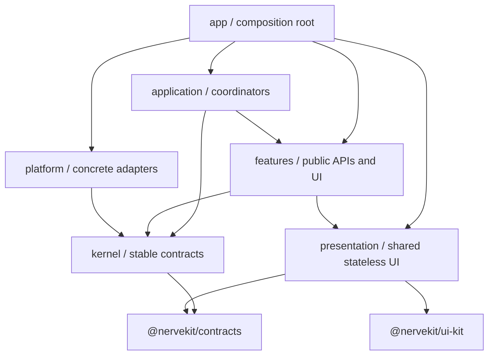

# Workbench module ownership

The Workbench frontend uses vertical feature slices around a small dependency-inverted application kernel. Folder names describe ownership; the import graph is enforced by `scripts/check-package-boundaries.mjs`.

## Dependency direction

Arrows mean “may import or call.” The composition root is the only place allowed to know all concrete implementations.

## Directories

### `app/`

The executable composition layer.

- `composition/` wires concrete features, center-view loaders, panel views, and feature event registrations.
- `shell/` owns generic docks, editor framing, titlebar, status bar, and layout rendering.
- `providers/` owns the mounted Workbench lifecycle.
- `onboarding/` is app-level guidance because it coordinates multiple features and shell surfaces.

A shell module must use feature public barrels. Private feature wiring and lazy component imports belong in `app/composition/`.

### `kernel/`

Stable leaf contracts and pure Workbench-wide primitives:

- event dispatch contracts;
- navigation/view keys;
- capability types;
- shortcut definitions;
- pure path/project helpers.

Kernel modules may not import app, application, platform, features, presentation, or the Workbench aggregate `api.ts` barrel.

### `platform/`

Concrete browser/Electron/infrastructure adapters:

- desktop bridge and clipboard;
- appearance and browser zoom;
- query client;
- logging, PWA, and credential crypto.

Platform may implement kernel contracts but may not depend on product features or application coordinators.

### `application/`

Cross-feature workflows and runtime coordination:

- `startup/` owns startup sequencing and the Workbench client lifecycle;
- `event-routing/` owns stream cursor coordination;
- `workspace/` owns global selection, center-tab navigation, workspace hydration, and its server adapter;
- `commands/` owns app-wide shortcut handling;
- `notifications/` owns cross-cutting in-app/native notification policy;
- `settings/`, `preferences/`, and `usage/` expose cross-feature commands/read models without leaking feature stores;
- `conversations/` and `git/` own workflows and effects spanning those feature boundaries.

If a workflow mutates or queries several features, it belongs here or in `app/composition`, not inside one of the participating features.

### `features/`

Product capabilities such as conversations, filesystem, Git, projects, settings, and tasks. A feature owns its API adapters, domain/state, use cases, and feature-specific UI. Large feature slices may use `domain/`, `application/`, `infrastructure/`, and `ui/`; small slices should not create empty ceremonial folders.

Each feature’s `index.ts` is its public surface for app/application composition. Prefer explicit command, query, type, event-registration, and view exports. Do not expose mutable state merely as an import shortcut. A feature may not import any other feature, even through that public surface; use kernel contracts, application coordinators, or app composition instead.

Git and task presentation/controllers are feature-owned under `features/git/ui` and `features/tasks/ui`. A state/effect adapter that only connects one feature remains with that feature; a host that connects several features belongs in `app/composition`.

### `presentation/`

Cross-feature, stateless product UI only: shell framing, panels, item collections, code rendering, settings primitives, and reusable conversation/tool rendering surfaces. It is deliberately isolated from app state and infrastructure and may depend only on presentation-local modules, `@nervekit/contracts`, and `@nervekit/ui-kit`.

Generic shadcn/browser primitives belong in `@nervekit/ui-kit`. Shared protocol and storage schemas belong in `@nervekit/contracts`.

### `api.ts`

The package’s external API barrel. It is not an internal service locator. Internal modules should import the owning feature, kernel contract, or platform adapter directly.

## Composition and persistence rules

- Center view component loaders live in `app/composition/center-views.ts`, preserving feature code splitting.
- Panel descriptors live in `app/composition/panel-views.ts`.
- Persisted center-tab and panel ids are compatibility-sensitive and must remain stable.
- Unknown persisted panel ids are dropped; new panel descriptors join their default dock automatically.
- Restored inactive tabs remain metadata-only during startup. The active conversation is critical; other active-tab loaders are progressive.
- Feature event handlers are exported from feature public barrels and registered once by `app/composition/register-feature-events.ts`.

## Component naming

- `*Host` owns state/effects, injects capabilities, or hosts a registered center/panel surface.
- `*View` is a rendered feature screen driven by props and callbacks.
- `*Panel` is rendered dock content; `*Pane` is a bounded subregion.
- `*Frame` and the rare `*Shell` name global or generic layout structure.
- `*Adapter` is reserved for reusable translation bridges, not used as a synonym for host.
- Svelte component filenames use PascalCase.

## Source conventions

- Cross-component UI signals stay with their owning feature.
- Prefer files below roughly 400 lines; split by responsibility rather than generic `helpers` dumping grounds.
- Keep tests adjacent to the pure policy, projection, or coordinator they validate.
- Do not add a new top-level `core`, `stores`, `events`, `hooks`, or `utils` directory.
